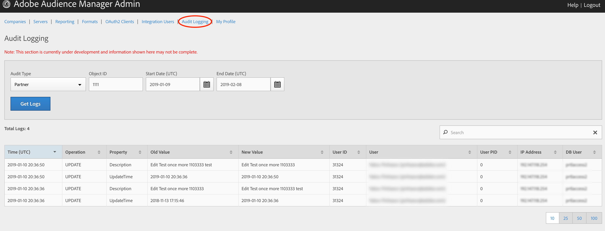

# Audit Logging{#audit-logging}

Use Audit Logging as a first place to go when debugging customer issues. 

> [!NOTE]
> 
>Audit Logging is currently under development and subject to changes. Please log any issues you encounter in JIRA (UI team)

In the **Audit Type** drop-down selector, choose between:

* Partner
* User
* Group
* Datasource Summary
* General Datasource
* Merge Rule Datasource
* Data Feed
* Data Feed Subscription
* Trait Summary
* Trait Rule
* Segment Summary
* Destination Summary
* Server to Server Destination
* Derived Signal
* Model
* Segment Test Group

The **Object ID** is the ID of the item you're researching. See the table below for which ID corresponds to the Object ID in each case:

Audit Type | Object ID |
---------|----------|
 Partner | Partner ID - PID |
 User | User ID |
 Group | B3 |
  Datasource Summary | Data Source ID |
 General Datasource | Data Source ID |
 Merge Rule Datasource | Data Source ID |
  Data Feed | Data Feed ID |
 Data Feed Subscription | Data Feed ID |
 Trait Summary | SID (trait) |
  Trait Rule | SID (trait) |
 Segment Summary |  |
 Destination Summary |  |
 Server-to-Server Destination| N/A |
  Derived Signal | N/A |
 Model | N/A |
 Segment Test Group | N/A |

 Use Start Date (UTC) and End Date (UTC) to narrow down the time interval of the logs

