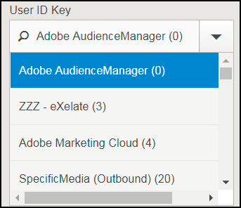
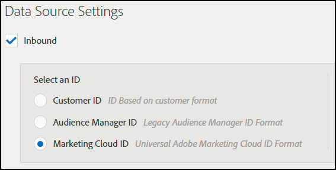
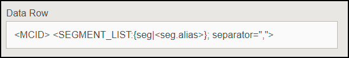

# Destination Setup Troubleshooting{#destination-setup-troubleshooting}

Information to help you set up destinations in Audience Manager and avoid common problems.

## Destination Setup Troubleshooting {#concept_AE1FA69F83614AF993A537900F13AFDB}

Information to help you set up destinations in [!DNL Audience Manager] and avoid common problems.

## I set up a destination, but I don't see any files. Where are they? {#section_DF13A455B19E43AAAA06051474CC7DFA}

<!-- 

c_dest_tshooting.xml

 -->

Common destination configuration problems include the following issues:

**Misconfigured Destination**

* **Incorrect UserID Key: **The UserID key is the MasterDPID of this destination and is the basis for the ID values that will be outbounded. Even if a UserID key is selectable via the drop-down list, it doesn't necessarily mean that there are IDs/traits/segments mapped to this value. If the Outbound process (which runs after destinations are created) does not find any users mapped to this UserID key, no data will be outbounded. 
* **No In File Data Sources Selected: **When choosing any destination type other than [!UICONTROL S2S], a section appears at the bottom of the screen labeled [!UICONTROL Configure Data Sources]. When this section first appears, no values are selected. If you forget to click the [!UICONTROL All First Party] checkbox or individually select data sources from the [!UICONTROL Available Data Sources] window, no data will be outbounded.

**Misconfigured Format **

When selecting a format for your outbounded data, it's best, if possible, to re-use an existing format. Using an already-proven format ensures that your outbound data will be generated successfully. To see exactly how an existing format is formatted, click the [!UICONTROL Formats] option in the menu bar and search for your format either by name or by ID number. Malformed formats or macros used in formats will provide incorrectly formatted output or will prevent information from being output entirely.

For more information on setting up formats and using macros, see [File Format Macros](formats/file-formats.md#concept_A867101505074418A58DE325949E5089) and [HTTP Format Macros](formats/web-formats.md#reference_C392124A5F3F42E49F8AADDBA601ADFE).

**Misconfigured Server**

* **FTP **

    * **Domain**

        * Do not enter any prefixes for hostnames. If you're given an account [!DNL ftp://hello.com], simply enter [!DNL hello.com] in this field.

    * **Port/Type Combination**

        * For an FTP transfer, the preferred transfer type is SFTP. 
        * When selecting the SFTP type, the port is almost always 22. 
        * When selecting the FTPs/TLS type, the port is almost always 21. 
        * The FTPs/TLS type is not the same as a regular FTP transfer. We do not support regular (unsecured) FTP transfers.

    * **Remote Path**

        * When choosing a remote subpath, it should be entered with no leading slash. 
        * If your transferred file is supposed to be placed in the [!DNL (root)/inbound] subfolder, simply add [!DNL inbound] for the remote path, not [!DNL /inbound]. 
        
        * If you send your files multiple directories down the path, enter slashes in between each directory. If you're given the location of [!DNL /inbound/subdirectory1/subdirectory2], you should enter [!DNL inbound/subdirectory1/subdirectory2] in this field. 
        
        * If your file should be placed in the directory automatically routed to by the external server, you can leave this space blank. Do not enter a period ( . ), slash ( / ), or anything else.

* **S3**

    * S3 is the preferred transfer protocol (over FTP or HTTP). 
    * ** Bucket **

        * The bucket name should be listed with no slashes, prefixes, suffixes, etc. If you're given the address [!DNL s3://your-bucket] you should simply add [!DNL your-bucket] to this field.

    * **Directory**

        * Leave this field blank unless you're specifically given a subdirectory into which the data should be placed. If you're given the address [!DNL s3://your-bucket/your-subdirectory], enter [!DNL your-bucket] in the [!UICONTROL Bucket] field and [!DNL your-subdirectory] should be added into the [!UICONTROL Directory] field. Do not add preceding slashes. 
        
        * If you have to travel multiple directories down the path, only then should you use slashes as separators. So a location of [!DNL s3://your-bucket/your-subdirectory1/your-subdirectory2] would have [!DNL your-bucket] in the [!UICONTROL Bucket] field and [!DNL your-subdirectory1/your-subdirectory2] entered into the [!UICONTROL Directory] field.

    * **Access / Secret Keys**

        * When TechOps creates a bucket and provides access/secret keys to a consultant, those credentials are usually READ-ONLY credentials that are meant to be handed off to the client. These credentials should not be entered into the [!UICONTROL Access / Secret Key] fields, because this will cause the transfer to fail (because those credentials are read-only, not writable). In the case where TechOps creates a bucket and provides credentials, the consultant should also request an Adobe key pair - NOT TO BE GIVEN TO THE CLIENT - that will allow for writing files to this bucket. That key should be added into these fields.

* **HTTP**

    * **Domain**

        * Do enter prefix information for HTTP entries. If you're given an account [!DNL https://superduper.com], enter [!DNL https://superduper.com] in this field.

    * **URL Prefix**

        * When adding a URL prefix, leave the preceding slash off. An address of [!DNL https://hello.com/r/x/y/z] should have [!DNL https://hello.com] entered in the [!UICONTROL Domain] field and [!DNL r/x/y/z] entered here in the [!UICONTROL URL Prefix] field. 
        
        * If a URL Prefix is not needed, leave this value blank.

    * **Authentication - SSH Key**

        * Enter the full SSH PRIVATE key value in this box, including headers, footers, and line breaks to ensure accurate encryption/key storage.

** Not Enough Time for Outbound Generation**

* The outbounding process runs twice daily, and multiple processes (outbounding, publishing, pushing to external locations, etc.) must run before a file is pushed to its final destination. A good rule of thumb is that a destination should be fully configured at least 24 hours before you can expect data to be pushed to an external location.

## How to Set Up Your Destinations to Export Experience Cloud IDs, Customer IDs or Audience Manager IDs in Outbound Data Files {#topic_3A72A8CBD8424D8390CF94C3C78BE182}

This page shows you how to set up destinations to export data keyed off the ID type you want in Outbound Data Files.

<!-- 

set-up-destinations-mcid-aamid.xml

 -->

Destinations allow our customers to activate their data across any number of digital channels. For example, they can export audience data to other [!DNL Adobe Experience Cloud] solutions ( [!DNL Target], [!DNL Campaign], etc.). Or, they could send data to [!UICONTROL DSP]s, [!UICONTROL SSP]s, or any platform that is integrated with Audience Manager. We keep a list of partners we work with on our [Integrations Wiki page](https://wiki.corp.adobe.com/display/MCPI).

>[!NOTE]
>
>For a detailed walkthrough on creating destinations in the Admin UI, look to the [Create or Edit Company Destinations](companies/admin-manage-company-destinations.md#concept_E7BBEF3FB7954C1492701ADF55626C7A) article.

Your customers want to export different ID types, depending on destination. The configuration chart below shows the options you should select to export profile information related to different ID types. We recommend you also refer to the [Index of IDs in Audience Manager](https://marketing.adobe.com/resources/help/en_US/aam/ids-in-aam.html). There are three important settings to consider, the **User ID Key**, the **Data Source Type** and the **Format**. We detail all of them below.

**User ID Key**. In the Admin UI, go to **[!UICONTROL Companies]**. Search for your customer's company and click to select it. Look for the **[!UICONTROL Destinations]** tab and press **[!UICONTROL Add Destination]**. In the **[!UICONTROL Add Destination]** workflow, select the User ID Key. The User ID Key will filter the incoming IDs from the target data source and only allow the IDs to pass.

**Data Source Type**. Select this when creating a destination in the Audience Manager UI. First of all, select Inbound, then select the ID type you want. The options are:

**Format**. This option determines the file format you will export. In the **[!UICONTROL Add Destination]** workflow, under **[!UICONTROL Batch Data]**, select the format.

To inspect a format, go to ****[!UICONTROL Admin UI > Formats]**** and look for the Data Row element. This element contains a macro of the file format, <MCID> in the example below.

<table id="table_DAEE5BC75DCB4FC690C4BAE41F627DEC"> 
 <thead> 
  <tr> 
   <th colname="col01" class="entry"> Configuration No. </th> 
   <th colname="col1" class="entry"> 
User Key 
 </th> 
   <th colname="col2" class="entry"> 
Data Source Type 
 </th> 
   <th colname="col3" class="entry"> 
Format 
 </th> 
   <th colname="col4" class="entry"> 
Exported ID Type 
 </th> 
  </tr>
 </thead>
 <tbody> 
  <tr> 
   <td colname="col01"> 1 </td> 
   <td colname="col1"> 
Adobe Audience Manager (0) 
 </td> 
   <td colname="col2"> 
Experience Cloud ID 
 </td> 
   <td colname="col3"> 
&lt;DP_UUID&gt; 
 </td> 
   <td colname="col4"> 
Experience Cloud ID 
 </td> 
  </tr> 
  <tr> 
   <td colname="col01"> 2 </td> 
   <td colname="col1"> 
Adobe Audience Manager (0) 
 </td> 
   <td colname="col2"> 
Experience Cloud ID 
 </td> 
   <td colname="col3"> 
MCID 
 </td> 
   <td colname="col4"> 
Audience Manager UUID 
 </td> 
  </tr> 
  <tr> 
   <td colname="col01"> 3 </td> 
   <td colname="col1"> 
Adobe Audience Manager (0) 
 </td> 
   <td colname="col2"> 
Experience Cloud ID 
 </td> 
   <td colname="col3"> 
UUID 
 </td> 
   <td colname="col4"> 
Experience Cloud ID 
 </td> 
  </tr> 
  <tr> 
   <td colname="col01"> 4 </td> 
   <td colname="col1"> 
Adobe Audience Manager (0) 
 </td> 
   <td colname="col2"> 
Audience Manager ID 
 </td> 
   <td colname="col3"> 
&lt;DP_UUID&gt; 
 </td> 
   <td colname="col4"> 
Audience Manager UUID 
 </td> 
  </tr> 
  <tr> 
   <td colname="col01"> 5 </td> 
   <td colname="col1"> 
Adobe Audience Manager (0) 
 </td> 
   <td colname="col2"> 
Audience Manager ID 
 </td> 
   <td colname="col3"> 
MCID 
 </td> 
   <td colname="col4"> 
Experience Cloud ID 
 </td> 
  </tr> 
  <tr> 
   <td colname="col01"> 6 </td> 
   <td colname="col1"> 
Adobe Audience Manager (0) 
 </td> 
   <td colname="col2"> 
Audience Manager ID 
 </td> 
   <td colname="col3"> 
UUID 
 </td> 
   <td colname="col4"> 
Audience Manager UUID 
 </td> 
  </tr> 
  <tr> 
   <td colname="col01"> 7 </td> 
   <td colname="col1"> 
DPID (Any data source that the company has access to) 
 </td> 
   <td colname="col2"> 
Customer ID 
 </td> 
   <td colname="col3"> 
&lt;DP_UUID&gt; 
 </td> 
   <td colname="col4"> 
Customer ID (DPUUID) 
 </td> 
  </tr> 
  <tr> 
   <td colname="col01"> 8 </td> 
   <td colname="col1"> 
DPID (Any data source that the company has access to) 
 </td> 
   <td colname="col2"> 
Customer ID 
 </td> 
   <td colname="col3"> 
MCID 
 </td> 
   <td colname="col4"> 
Experience Cloud ID 
 </td> 
  </tr> 
  <tr> 
   <td colname="col01"> 9 </td> 
   <td colname="col1"> 
DPID (Any data source that the company has access to) 
 </td> 
   <td colname="col2"> 
Customer ID 
 </td> 
   <td colname="col3"> 
UUID 
 </td> 
   <td colname="col4"> 
Audience Manager UUID 
 </td> 
  </tr> 
  <tr> 
   <td colname="col01"> 10 </td> 
   <td colname="col1"> 
DPID (Any data source that the company has access to) 
 </td> 
   <td colname="col2"> 
Audience Manager ID 
 </td> 
   <td colname="col3"> 
&lt;DP_UUID&gt; 
 </td> 
   <td colname="col4"> 
Audience Manager UUID 
 </td> 
  </tr> 
  <tr> 
   <td colname="col01"> 11 </td> 
   <td colname="col1"> 
DPID (Any data source that the company has access to) 
 </td> 
   <td colname="col2"> 
Audience Manager ID 
 </td> 
   <td colname="col3"> 
MCID 
 </td> 
   <td colname="col4"> 
Experience Cloud ID 
 </td> 
  </tr> 
  <tr> 
   <td colname="col01"> 12 </td> 
   <td colname="col1"> 
DPID (Any data source that the company has access to) 
 </td> 
   <td colname="col2"> 
Audience Manager ID 
 </td> 
   <td colname="col3"> 
UUID 
 </td> 
   <td colname="col4"> 
Audience Manager UUID 
 </td> 
  </tr> 
 </tbody> 
</table>

**Use Cases**

Let's say you use Audience Manager and [!DNL Campaign]. In order to make the customer data actionable in [!DNL Campaign], you want to export [!UICONTROL Experience Cloud IDs]. You should use configuration number 3 in this case.

