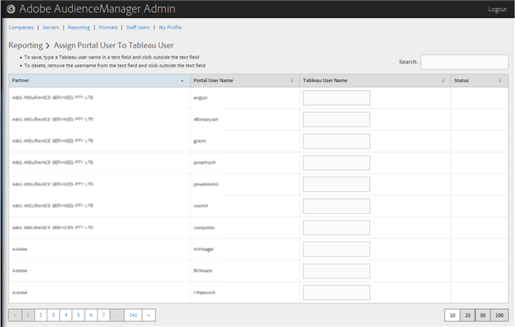

# Assign a Portal User to Tableau User{#assign-a-portal-user-to-tableau-user}

Use the Reporting page to make a portal user a Tableau user. This lets users view Tableau reports in Audience Manager.

1. 

   <!-- 

t_tabeau.xml

 -->

   Click **[!UICONTROL Reporting]** > **[!UICONTROL Assign Portal User to Tableau User]**.

   

1. To assign a user, in the desired partner row, type a [!DNL Tableau] username in the text field, then click outside the text field.

   Or

   To delete an assignment, in the desired partner row, remove the username from the text field, then click outside the text field. 
