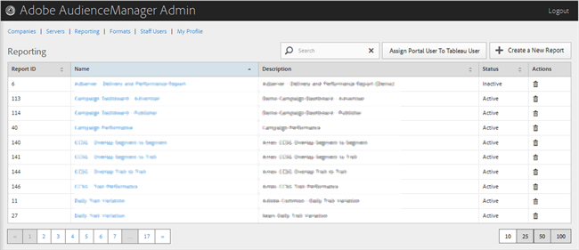

# Reporting{#reporting}

Manage Audience Manager reports by creating new reports or by editing or deleting existing reports. You can also assign a portal user as a Tableau user.

<!-- 

c_reporting.xml

 -->

You can sort each column in ascending or descending order by clicking the desired column's header.

Use the [!UICONTROL Search] box or the pagination controls at the bottom of the list to find the desired report. 
