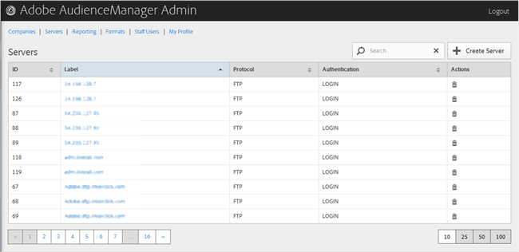

# Servers Overview{#servers-overview}

Use the Servers page to view a list of servers in your Audience Manager configuration. You can edit or delete existing servers or create new servers, providing that you have the appropriate user roles assigned.

<!-- 

c_servers.xml

 -->

You can sort each column in ascending or descending order by clicking the desired column's header.

Use the [!UICONTROL Search] box or the pagination controls at the bottom of the list to find the desired server.

The following sections contain more information: 
