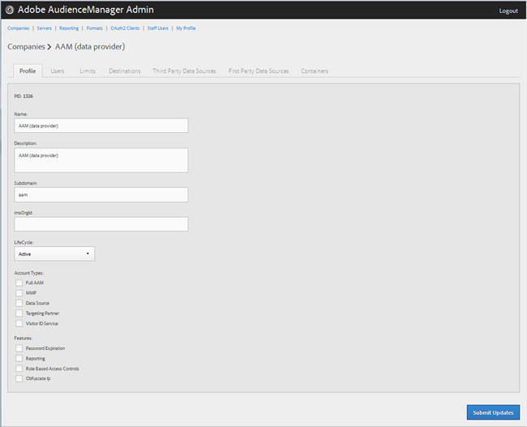

# Edit a Company Profile

>1. Click **[!UICONTROL  Companies]**, then locate and click the desired company to display its [!UICONTROL  Profile] page.

>       Use the [!UICONTROL  Search] box or the pagination controls at the bottom of the list to find the desired company. You can sort each column in ascending or descending order by clicking the desired column's header. 

>        
>1. Edit the fields as necessary:

>       **Name: **Edit the name of the company. This is a required field. 

>       **Description: **Edit the description of the company. This is a required field. 

>       **Subdomain: **(Required) Specify the company's subdomain. The text you enter is what shows as the subdomain of the event call. This can't be changed. It must be a string of URL-valid characters. 

>       For example, if your company was named AcmeCorp, the subdomain would be [!DNL  acmecorp]. 

>       Audience Manager uses the subdomain for the Data Collection Server (DCS). In the previous example, if your company's full URL in DCS would be [!DNL  acmecorp.demdex.net]. 

>       **imsOrgld: ** (Identity Management System Organization ID) This ID lets you connect your company with the Adobe Experience Cloud. 

>       **Lifecyle: **Specify the desired stage for the company: 

>    
>    * **Active: **Specify that the company will be an active Audience Manager client. An Active account means a paying customer, not just for consulting, but for the Audience Manager SKU. 

>    * **Demo: **Specify that the company will be for demo purposes only. Reporting data will be automatically faked. 

>    * **Prospect: **Specify that the company is a prospective Audience Manager client, such as a company being given a free POC or an account setup for a sales demo. 

>    * **Test: **Specify that the company will be for internal testing purposes only. 

>       **Account Types: **Specify the full set of account types for this company. No account type is mutually exclusive with any other type. 
>    
>    * **Full AAM: **Specify that the company will have a full Adobe Audience Manager account and users will have login access. 

>    * **MMP: **Specify that the company has been enabled to use the Master Marketing Profile (MMP) capabilities. 

>      If you select this account type, [!UICONTROL  Visitor ID Service] is also automatically selected. 

>      For more information, see [ Audiences Services - Master Marketing Profile](https://marketing.adobe.com/resources/help/en_US/mcloud/audiences.html). For more information about integrating Audience Manager and MMP, see [ Master Marketing Profile Integration](http://microsite.omniture.com/t2/help/en_US/demdex/c_mmp.html). 

>    * **Data Source: **Specify that the company is a third-party data provider within Audience Manager. 

>    * **Targeting Partner: **Specify that the company acts as a targeting platform for Audience Manager customers. 

>    * **Visitor ID Service: **Specify that the company has been enabled to use the Experience Cloud Visitor ID Service. 

>      The Experience Cloud Visitor ID service provides a universal visitor ID across Experience Cloud solutions. For more information, see the [ Experience Cloud Visitor ID Service user guide](http://microsite.omniture.com/t2/help/en_US/mcvid/mcvid_service.html). 

>    * **Agency: **Specify that the company will have an Agency account. 

>       **Features: **Select the desired options: 
>    
>    * **Password Expiration: **Sets all user passwords within this company to expire after 90 days to increase Audience Manager security. 

>    * **Reporting: **Enables Audience Manager reporting for this company. 

>    * **Role Based Access Controls: **Enable role-based access controls for this company. Role-based access controls let you create user groups with different access permissions. Individual users within these groups can then access only specific features in Audience Manager. 

>1. Click **[!UICONTROL  Submit Updates]**.
