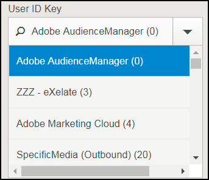
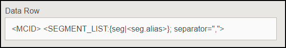

# How to Set Up Your Destinations to Export Experience Cloud IDs, Customer IDs or Audience Manager IDs in Outbound Data Files

## How to Set Up Your Destinations to Export Experience Cloud IDs, Customer IDs or Audience Manager IDs in Outbound Data Files {#topic_3A72A8CBD8424D8390CF94C3C78BE182}
>This page shows you how to set up destinations to export data keyed off the ID type you want in Outbound Data Files.Destinations allow our customers to activate their data across any number of digital channels. For example, they can export audience data to other Adobe Experience Cloud solutions (Target, Campaign, etc.). Or, they could send data to DSPs, SSPs, or any platform that is integrated with Audience Manager. We keep a list of partners we work with on our [ Integrations Wiki page ](https://wiki.corp.adobe.com/display/MCPI). 

>[!NOTE]
>
>For a detailed walkthrough on creating destinations in the Admin UI, look to the[ Create or Edit Company Destinations ](../c_companies/t_company_destinations/create-edit-company-destinations.md#concept_E7BBEF3FB7954C1492701ADF55626C7A) article. 

Your customers want to export different ID types, depending on destination. The configuration chart below shows the options you should select to export profile information related to different ID types. We recommend you also refer to the [ Index of IDs in Audience Manager ](https://marketing.adobe.com/resources/help/en_US/aam/ids-in-aam.html). There are three important settings to consider, the **User ID Key**, the **Data Source Type** and the **Format**. We detail all of them below. 

**User ID Key**. In the Admin UI, go to **[!UICONTROL  Companies]**. Search for your customer's company and click to select it. Look for the **[!UICONTROL  Destinations]** tab and press **[!UICONTROL  Add Destination]**. In the **[!UICONTROL  Add Destination]** workflow, select the User ID Key. The User ID Key will filter the incoming IDs from the target data source and only allow the IDs to pass. 

 

**Data Source Type**. Select this when creating a destination in the Audience Manager UI. First of all, select Inbound, then select the ID type you want. The options are: 

 

**Format**. This option determines the file format you will export. In the **[!UICONTROL  Add Destination]** workflow, under **[!UICONTROL  Batch Data]**, select the format. 

To inspect a format, go to ** **[!UICONTROL  Admin UI > Formats]**** and look for the Data Row element. This element contains a macro of the file format, &lt;MCID&gt; in the example below. 

 

<table id="table_DAEE5BC75DCB4FC690C4BAE41F627DEC"> 
 <thead> 
  <tr> 
   <th colname="col01" class="entry"> Configuration No. </th> 
   <th colname="col1" class="entry"> 
User Key 
 </th> 
   <th colname="col2" class="entry"> 
Data Source Type 
 </th> 
   <th colname="col3" class="entry"> 
Format 
 </th> 
   <th colname="col4" class="entry"> 
Exported ID Type 
 </th> 
  </tr> 
 </thead>
 <tbody> 
  <tr> 
   <td colname="col01"> 1 </td> 
   <td colname="col1"> 
Adobe Audience Manager (0) 
 </td> 
   <td colname="col2"> 
Experience Cloud ID 
 </td> 
   <td colname="col3"> 
&amp;lt;DP_UUID&amp;gt; 
 </td> 
   <td colname="col4"> 
Experience Cloud ID 
 </td> 
  </tr> 
  <tr> 
   <td colname="col01"> 2 </td> 
   <td colname="col1"> 
Adobe Audience Manager (0) 
 </td> 
   <td colname="col2"> 
Experience Cloud ID 
 </td> 
   <td colname="col3"> 
MCID 
 </td> 
   <td colname="col4"> 
Audience Manager UUID 
 </td> 
  </tr> 
  <tr> 
   <td colname="col01"> 3 </td> 
   <td colname="col1"> 
Adobe Audience Manager (0) 
 </td> 
   <td colname="col2"> 
Experience Cloud ID 
 </td> 
   <td colname="col3"> 
UUID 
 </td> 
   <td colname="col4"> 
Experience Cloud ID 
 </td> 
  </tr> 
  <tr> 
   <td colname="col01"> 4 </td> 
   <td colname="col1"> 
Adobe Audience Manager (0) 
 </td> 
   <td colname="col2"> 
Audience Manager ID 
 </td> 
   <td colname="col3"> 
&amp;lt;DP_UUID&amp;gt; 
 </td> 
   <td colname="col4"> 
Audience Manager UUID 
 </td> 
  </tr> 
  <tr> 
   <td colname="col01"> 5 </td> 
   <td colname="col1"> 
Adobe Audience Manager (0) 
 </td> 
   <td colname="col2"> 
Audience Manager ID 
 </td> 
   <td colname="col3"> 
MCID 
 </td> 
   <td colname="col4"> 
Experience Cloud ID 
 </td> 
  </tr> 
  <tr> 
   <td colname="col01"> 6 </td> 
   <td colname="col1"> 
Adobe Audience Manager (0) 
 </td> 
   <td colname="col2"> 
Audience Manager ID 
 </td> 
   <td colname="col3"> 
UUID 
 </td> 
   <td colname="col4"> 
Audience Manager UUID 
 </td> 
  </tr> 
  <tr> 
   <td colname="col01"> 7 </td> 
   <td colname="col1"> 
DPID (Any data source that the company has access to) 
 </td> 
   <td colname="col2"> 
Customer ID 
 </td> 
   <td colname="col3"> 
&amp;lt;DP_UUID&amp;gt; 
 </td> 
   <td colname="col4"> 
Customer ID (DPUUID) 
 </td> 
  </tr> 
  <tr> 
   <td colname="col01"> 8 </td> 
   <td colname="col1"> 
DPID (Any data source that the company has access to) 
 </td> 
   <td colname="col2"> 
Customer ID 
 </td> 
   <td colname="col3"> 
MCID 
 </td> 
   <td colname="col4"> 
Experience Cloud ID 
 </td> 
  </tr> 
  <tr> 
   <td colname="col01"> 9 </td> 
   <td colname="col1"> 
DPID (Any data source that the company has access to) 
 </td> 
   <td colname="col2"> 
Customer ID 
 </td> 
   <td colname="col3"> 
UUID 
 </td> 
   <td colname="col4"> 
Audience Manager UUID 
 </td> 
  </tr> 
  <tr> 
   <td colname="col01"> 10 </td> 
   <td colname="col1"> 
DPID (Any data source that the company has access to) 
 </td> 
   <td colname="col2"> 
Audience Manager ID 
 </td> 
   <td colname="col3"> 
&amp;lt;DP_UUID&amp;gt; 
 </td> 
   <td colname="col4"> 
Audience Manager UUID 
 </td> 
  </tr> 
  <tr> 
   <td colname="col01"> 11 </td> 
   <td colname="col1"> 
DPID (Any data source that the company has access to) 
 </td> 
   <td colname="col2"> 
Audience Manager ID 
 </td> 
   <td colname="col3"> 
MCID 
 </td> 
   <td colname="col4"> 
Experience Cloud ID 
 </td> 
  </tr> 
  <tr> 
   <td colname="col01"> 12 </td> 
   <td colname="col1"> 
DPID (Any data source that the company has access to) 
 </td> 
   <td colname="col2"> 
Audience Manager ID 
 </td> 
   <td colname="col3"> 
UUID 
 </td> 
   <td colname="col4"> 
Audience Manager UUID 
 </td> 
  </tr> 
 </tbody> 
</table>

**Use Cases** 

Let's say you use Audience Manager and Campaign. In order to make the customer data actionable in Campaign, you want to export Experience Cloud IDs. You should use configuration number 3 in this case. 

