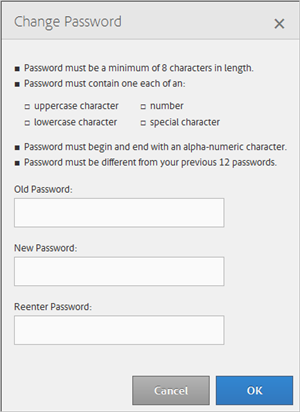

# Change Password

>1. Click **[!UICONTROL  My Profile]**.
>1. Click **[!UICONTROL  Change Password]**.

>        

>       Your Audience Manager password must be: 
>    
>    * At least eight characters in length 

>    * Contain at lease one uppercase character 

>    * Contain at least one lowercase character 

>    * Contain at least one number 

>    * Contain at least one special character 

>    * Begin and end with an alpha-numeric character 

>    * Begin and end with an alpha-numeric character 

>1. Specify your old password.
>1. Specify your new password, then confirm the new password.
>1. Click **[!UICONTROL  OK]**.
