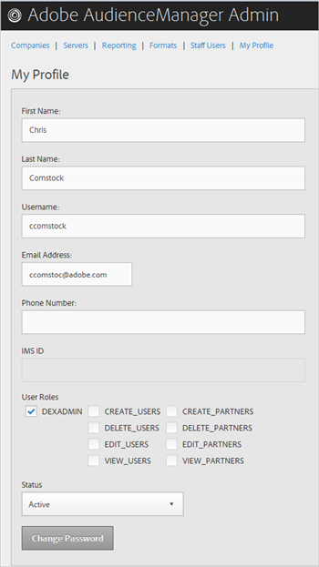

# Edit Profile

>1. Click **[!UICONTROL  My Profile]**.

>        
>1. Fill in the fields:

>       **First Name: **(Required) Specify your first name. 

>       **Last Name: **(Required) Specify your last name. 

>       **Username: **(Required) Specify your first username. 

>       **Email Address: **(Required) Specify your email address. 

>       **Phone Number: **Specify your phone number. 

>       **IMS ID: **Specify your Internet Messaging Service ID. 

>       **User Roles: **Select the desired user roles: 

>    
>    * **DEXADMIN: **Provides administrator access to perform tasks in the Audience Manager Admin tool. If you do not select this option, you can choose individual roles. These roles let users perform tasks using API calls, but not in the Admin tool. 

>    * **CREATE_USERS: **Lets users create new users using an API call. 

>    * **DELETE_USERS: **Lets users delete existing users using an API call. 

>    * **EDIT_USERS: **Lets users edit existing users using an API call. 

>    * **VIEW_USERS: **Lets users view other users in your Audience Manager configuration using an API call. 

>    * **CREATE_PARTNERS: **Lets users create Audience Manager partners using an API call. 

>    * **DELETE_PARTNERS: **Lets users delete Audience Manager partners using an API call. 

>    * **EDIT_PARTNERS: **Lets users edit Audience Manager partners using an API call. 

>    * **VIEW_PARNTERS: **Lets users view Audience Manager partners using an API call. 

>       **Status: **Select the desired status: 

>    
>    * **Active: **Specifies that this user in an active Audience Manager user. 

>    * **Deactivated: **Specifies that this user is a deactivated user in Audience Management. 

>    * **Expired: **Specifies that this user's account in Audience Manager has expired. 

>    * **Locked Out: **Specifies that this user's account in Audience Manager is locked. 

>1. Click **[!UICONTROL  Submit]**.
