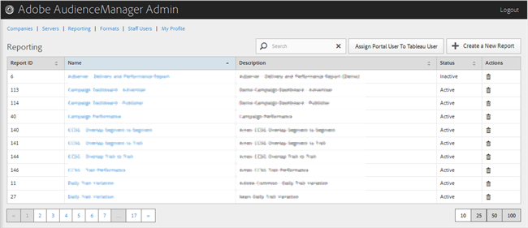

# Reporting

 

You can sort each column in ascending or descending order by clicking the desired column's header. 

Use the [!UICONTROL  Search] box or the pagination controls at the bottom of the list to find the desired report. 

The following sections contain more information: 
