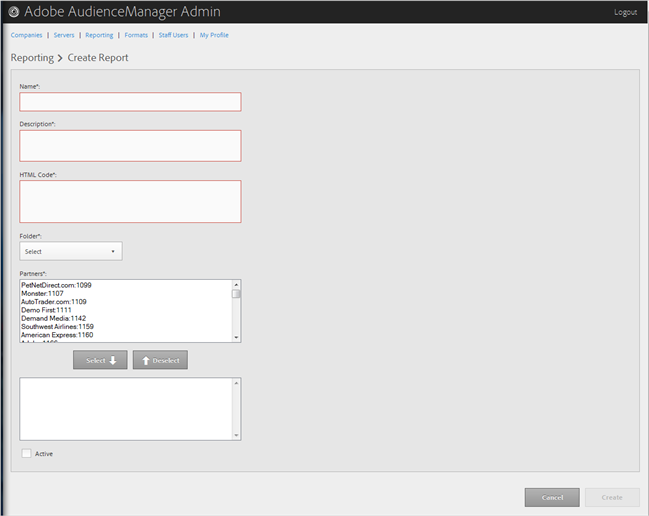

# Create or Edit a Report

>1. To create a new report, click **[!UICONTROL  Reporting]** > **[!UICONTROL  Create a New Report]**.

>       Or 

>       To edit an existing report, click the desired report in the **[!UICONTROL  Name]** column. 

>        
>1. Fill in the fields:

>       **Name: **(Required) Provide a descriptive name for the report. 

>       **Description: **(Required) Specify descriptive information about this report. 

>       **HTML Code: **(Required) Specify or paste your report's HTML code into the box. 

>       **Folder: **Select the desired folder for this report: 

>    
>    * Audience Reports
>    * Delivery Reports
>    * Overlap Reports
>    * Other Reports

>       Depending on your selection, this report displays in Audience Management under the corresponding menu item. 

>       **Partners: ** Move partners from the top list (available partners) to the bottom list (selected partners) by selecting the desired partners, then clicking the **[!UICONTROL  Select]** or **[!UICONTROL  Deselect]** buttons as necessary. 

>       **Active: **Make this an active Audience Manager report. If this option is not selected, the report is created but does not display in the Audience Management UI. 
>1. Click **[!UICONTROL  Create]** if you are creating a new report.
>   Or 

>   Click **[!UICONTROL  Update]** if you are editing an existing report. 
>
