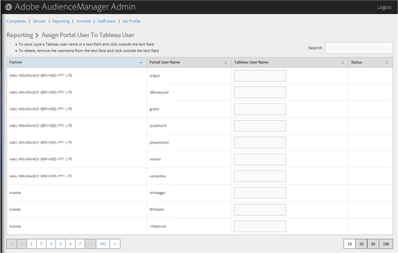

# Assign a Portal User to Tableau User

>1. Click **[!UICONTROL  Reporting]** > **[!UICONTROL  Assign Portal User to Tableau User]**.

>        
>1. To assign a user, in the desired partner row, type a Tableau username in the text field, then click outside the text field.

>       Or 

>       To delete an assignment, in the desired partner row, remove the username from the text field, then click outside the text field. 
