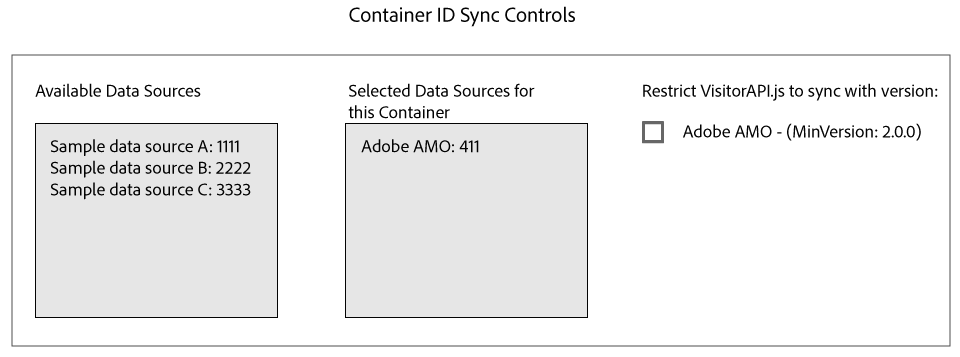

# ID Syncing with Media Optimizer{#id-syncing-with-media-optimizer}

By default, all companies sync data with Adobe Media Optimizer (AMO). In the Admin UI, each company container has a data source that manages this process. This data source is Adobe AMO (ID 411). Click a container row (under the Containers tab) for a selected company to disable this default sync or to add and remove other data sources to the AMO sync process.

 

**ID Sync Status**

The following table describes the sync status of a data source.

<table id="table_78361E703C5C49418BCDED97B6DD6C9C"> 
 <thead> 
  <tr> 
   <th colname="col1" class="entry"> Status </th> 
   <th colname="col2" class="entry"> Description </th> 
  </tr>
 </thead>
 <tbody> 
  <tr> 
   <td colname="col1"> 
Off 
 </td> 
   <td colname="col2"> 
Remove all the data sources from  Selected Data Sources for this Container to disable ID syncs with  AMO. 
 </td> 
  </tr> 
  <tr> 
   <td colname="col1"> 
On (regardless of ID service version) 
 </td> 
   <td colname="col2"> 
A data source syncs with  AMO regardless of  ID service version when: 
 
 
     <ul id="ul_811BE850EA444863B5D7D6685E6F003B"> 
      <li id="li_3F19C941F93B489FA5764B0C55E1C518">The data source appears in the  Selected Data Sources list. </li> 
      <li id="li_E0BD3723C9A244F191F46BCEC141E0ED">The  Adobe AMO check box <i>is not </i> selected. </li> 
     </ul> 
 </td> 
  </tr> 
  <tr> 
   <td colname="col1"> 
On (restrict to ID service version &gt; = 2.0) 
 </td> 
   <td colname="col2"> 
A data source will sync with  AMO with  ID service version 2.0 (or greater) when: 
 
    <ul id="ul_CAC8EAF7E0DA4B1ABEEF04F0AA6A31AC"> 
     <li id="li_88FB4F4E9DE14A099EFDB0315DD24DC7">The data source appears in the  Selected Data Sources list. </li> 
     <li id="li_45B1667ED6184163B476ED083DA088A0">The  Adobe AMO check box <i>is</i> selected. </li> 
    </ul> </td> 
  </tr> 
 </tbody> 
</table>

>[!MORE_LIKE_THIS]
>
>* [Manage Containers](../companies/admin-manage-containers.md#task_61DB5CEECC5049DD8D059C642AC3F967)
