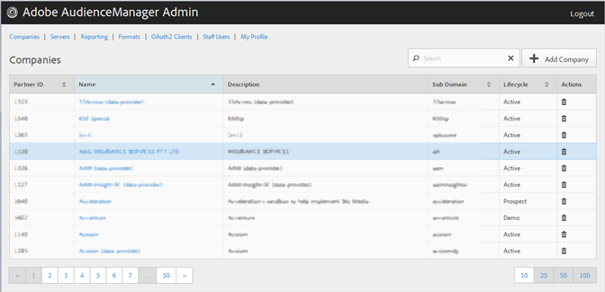

# Companies{#companies}

Use the Companies page to view a list of companies in your Audience Manager configuration. You can edit or delete existing companies or create new companies, providing that you have the appropriate user roles assigned.

 

You can sort each column in ascending or descending order by clicking the desired column's header.

Use the [!UICONTROL Search] box or the pagination controls at the bottom of the list to find the desired company. 
