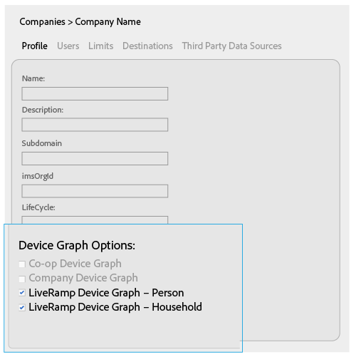
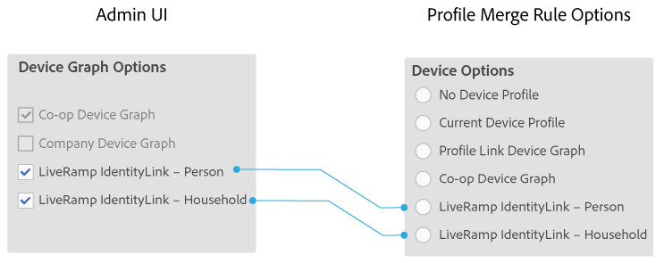

# Device Graph Options for Companies{#device-graph-options-for-companies}

The Device Graph Options are available to companies that participate in the Adobe Experience Cloud Device Co-op. If a customer also has a contractual relationship with a third-party device graph provider that is integrated with Audience Manager, this section will show options for that device graph. These options are located in Companies > company name > Profile > Device Graph Options.

 

This illustration uses generic names for the third-party device graph options. In production, these names come from the device graph provider and can vary from what's shown here. For example, the [!DNL LiveRamp] options usually (but not always):

* Start with " [!DNL LiveRamp]" 
* Contain a middle name that varies 
* End with "- Household" or "-Person"

## Device Graph Options Defined {#section_4EFE04843CFB4915B1D890C6FD3AC093}

The device graph options you select here expose or hide the [!UICONTROL Device Options] choices available to an [!DNL Audience Manager] customer when they create a [!UICONTROL Profile Merge Rule].

**[!UICONTROL Co-op Device Graph]**

Customers who participate in the [Adobe Experience Cloud Device Co-op](https://marketing.adobe.com/resources/help/en_US/mcdc/) use these options to create a [!UICONTROL Profile Merge Rule] with [deterministic and probabilistic data](https://marketing.adobe.com/resources/help/en_US/mcdc/mcdc-links.html). The [!DNL Corporate Provisioning Team] activates and deactivates this option via a back-end API call. You cannot check or clear these boxes in the [!DNL Admin UI]. Also, the **[!UICONTROL Co-op Device Graph]** and **[!UICONTROL Company Device Graph]** options are mutually exclusive. Customers can ask us to activate one or the other, but not both. When checked, this exposes the **[!UICONTROL Co-op Device Graph]** control in the [!UICONTROL Device Options] settings for a [!UICONTROL Profile Merge Rule].

**[!UICONTROL Company Device Graph]**

This option is for [!DNL Analytics] customers who use the [!UICONTROL People] metric in their [!DNL Analytics] report suite. The [!DNL Corporate Provisioning Team] activates and deactivates this option via a back-end API call. You cannot check or clear these boxes in the [!DNL Admin UI]. Also, the **[!UICONTROL Company Device Graph]** and **[!UICONTROL Co-op Device Graph]** options are mutually exclusive. Customers can ask us to activate one or the other, but not both. When checked:

* This device graph uses deterministic data that belongs to the company you're configuring (no probabilistic data). 
* [!DNL Audience Manager] automatically creates a [!UICONTROL Data Source] called ` *`partner name`*-Company Device Graph-Person`. In the [!UICONTROL Data Source] details page, [!DNL Audience Manager] customers can change the partner name, description, and apply [Data Export Controls](https://marketing.adobe.com/resources/help/en_US/aam/c_dec.html) to this data source. 

* [!DNL Audience Manager] customers *do not* see a new setting in the [!UICONTROL Device Options] section for a [!UICONTROL Profile Merge Rule].

**[!UICONTROL [!DNL LiveRamp] Device Graph]** (Person or Household)

These check boxes are enabled in the [!DNL Admin UI] when a partner creates a [!UICONTROL Data Source] and selects **[!UICONTROL Use as an Authenticated Profile]** and/or **[!UICONTROL Use as a Device Graph]**. The names for these settings are determined by the third-party device graph provider (e.g., [!DNL LiveRamp], [!DNL TapAd], etc.). When checked, this means the company you're configuring is going to use data provided by these device graphs.

>[!MORE_LIKE_THIS]
>
>* [Profile Merge Rule Options Defined](https://marketing.adobe.com/resources/help/en_US/aam/merge-rule-definitions.html)
>* [Data Source Settings and Menu Options](https://marketing.adobe.com/resources/help/en_US/aam/datasource-settings-definitions.html)
