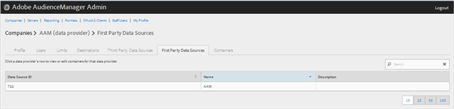
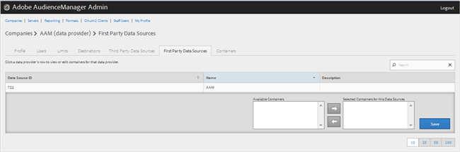

# Manage First Party Data Providers{#manage-first-party-data-providers}

View or edit containers and mappings for first-party data providers.

1. 

   <!-- 

t_first_party_providers.xml

 -->

   Click **[!UICONTROL Companies]**, then locate and click the desired company to display its [!UICONTROL Profile] page.

   Use the [!UICONTROL Search] box or the pagination controls at the bottom of the list to find the desired company. You can sort each column in ascending or descending order by clicking the desired column's header. 
1. Click the **[!UICONTROL First Party Data Providers]** tab.

   

1. Click a data provider's row to view or edit containers and mappings for that data provider.

   

1. Move containers from the **[!UICONTROL Available Containers]** and **[!UICONTROL Selected Containers for This Data Provider]** lists by selecting the desired containers, then clicking the right or left arrows as necessary.
1. Click **[!UICONTROL Save]** if you made changes.
