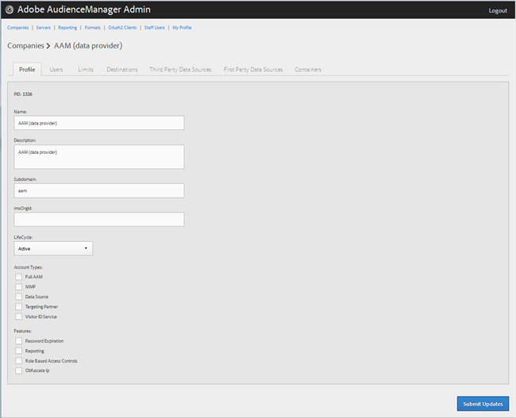

# Create a Company Profile{#create-a-company-profile}

Use the Companies page in the Audience Manager Admin tool to create a new company.

## Create a Company Profile {#task_CD3BB7E64CB840C2A354300E38168100}

Use the [!UICONTROL Companies] page in the Audience Manager Admin tool to create a new company.

<!-- 

t_create_company.xml

 -->

>[!NOTE]
>
>You must have the **[!UICONTROL DEXADMIN]** role in order to create new companies.

1. Click **[!UICONTROL Companies]** > **[!UICONTROL Add Company]**.

1. Fill in the fields:

   **[!UICONTROL Name]**: (Required) Specify the name of the company.

   **[!UICONTROL Description]**: (Required) Provide descriptive information about the company, such as industry or its full name.

   **[!UICONTROL Subdomain]**: (Required) Specify the company's subdomain. The text you enter is what shows as the subdomain of the event call. This can't be changed. It must be a string of URL-valid characters.

   For example, if your company was named AcmeCorp, the subdomain would be [!DNL acmecorp].

   Audience Manager uses the subdomain for the [!UICONTROL Data Collection Server] ( [!UICONTROL DCS]). In the previous example, if your company's full URL in [!UICONTROL DCS] would be [!DNL acmecorp.demdex.net].

   **[!UICONTROL Lifecyle]**: Specify the desired stage for the company:

* **[!UICONTROL Active]**: Specify that the company will be an active Audience Manager client. An [!UICONTROL Active] account means a paying customer, not just for consulting, but for the Audience Manager SKU. 
* **[!UICONTROL Demo]**: Specify that the company will be for demo purposes only. Reporting data will be automatically faked. 
* **[!UICONTROL Prospect]**: Specify that the company is a prospective Audience Manager client, such as a company being given a free [!DNL POC] or an account setup for a sales demo. 
* **[!UICONTROL Test]**: Specify that the company will be for internal testing purposes only.

   **[!UICONTROL Account Types]**: Specify the full set of account types for this company. No account type is mutually exclusive with any other type.

* **[!UICONTROL Full AAM]**: Specify that the company will have a full Adobe Audience Manager account and users will have login access. 
* **[!UICONTROL MMP]**: Specify that the company has been enabled to use the [!UICONTROL Master Marketing Profile] ( [!UICONTROL MMP]) capabilities. The [!UICONTROL MMP] allows audiences to be shared across the Experience Cloud using an [!UICONTROL Experience Cloud ID] ( [!DNL MCID]) that is assigned to every visitor and then used by Audience Manager.

  If you select this account type, the [!UICONTROL Experience Cloud ID Service] is also automatically selected.

  For more information, see [Audiences Services - Master Marketing Profile](https://marketing.adobe.com/resources/help/en_US/mcloud/audience_library.html). 

* **[!UICONTROL Data Source]**: Specify that the company is a third-party data provider within Audience Manager. 
* **[!UICONTROL Targeting Partner]**: Specify that the company acts as a targeting platform for Audience Manager customers. 
* **[!UICONTROL Visitor ID Service]**: Specify that the company has been enabled to use the [!UICONTROL Experience Cloud Visitor ID Service].

  The [!UICONTROL Experience Cloud Visitor ID Service] provides a universal visitor ID across Experience Cloud solutions. For more information, see the [Experience Cloud Visitor ID Service user guide](https://marketing.adobe.com/resources/help/en_US/mcvid/mcvid-overview.html). 

* **[!UICONTROL Agency]**: Specify that the company will have an [!UICONTROL Agency] account.

1. Click **[!UICONTROL Create]**.

   Continue with the instructions in [Edit a Company Profile](../companies/admin-manage-company-profiles.md#task_22ACB8FA260A4EDEBFDF0AB50DEB26FE).

## Edit a Company Profile {#task_22ACB8FA260A4EDEBFDF0AB50DEB26FE}

Edit a company's profile, including its name, description, subdomain, lifecycle, and more.

1. 

   <!-- 

t_edit_company_profile.xml

 -->

   Click **[!UICONTROL Companies]**, then locate and click the desired company to display its [!UICONTROL Profile] page.

   Use the [!UICONTROL Search] box or the pagination controls at the bottom of the list to find the desired company. You can sort each column in ascending or descending order by clicking the desired column's header.

   

1. Edit the fields as necessary:

   **[!UICONTROL Name]**: Edit the name of the company. This is a required field.

   **[!UICONTROL Description]**: Edit the description of the company. This is a required field.

   **[!UICONTROL Subdomain]**: (Required) Specify the company's subdomain. The text you enter is what shows as the subdomain of the event call. This can't be changed. It must be a string of URL-valid characters.

   For example, if your company was named [!DNL AcmeCorp], the subdomain would be [!DNL acmecorp].

   Audience Manager uses the subdomain for the [!UICONTROL Data Collection Server] ( [!UICONTROL DCS]). In the previous example, if your company's full URL in [!UICONTROL DCS] would be [!DNL acmecorp.demdex.net].

   **[!UICONTROL imsOrgld]**: ( [!UICONTROL Identity Management System Organization ID]) This ID lets you connect your company with the Adobe Experience Cloud.

   **[!UICONTROL Lifecyle]**: Specify the desired stage for the company:

* **[!UICONTROL Active]**: Specify that the company will be an active Audience Manager client. An Active account means a paying customer, not just for consulting, but for the Audience Manager SKU. 
* **[!UICONTROL Demo]**: Specify that the company will be for demo purposes only. Reporting data will be automatically faked. 
* **[!UICONTROL Prospect]**: Specify that the company is a prospective Audience Manager client, such as a company being given a free POC or an account setup for a sales demo. 
* **[!UICONTROL Test]**: Specify that the company will be for internal testing purposes only.

   **[!UICONTROL Account Types]**: Specify the full set of account types for this company. No account type is mutually exclusive with any other type.

* **[!UICONTROL Full AAM]**: Specify that the company will have a full Adobe Audience Manager account and users will have login access. 
* **[!UICONTROL MMP]**: Specify that the company has been enabled to use the Master Marketing Profile (MMP) capabilities.

  If you select this account type, **[!UICONTROL Visitor ID Service]** is also automatically selected.

  For more information, see [Audiences Services - Master Marketing Profile](https://marketing.adobe.com/resources/help/en_US/mcloud/audiences.html). For more information about integrating Audience Manager and MMP, see [Master Marketing Profile Integration](http://microsite.omniture.com/t2/help/en_US/demdex/c_mmp.html). 

* **[!UICONTROL Data Source]**: Specify that the company is a third-party data provider within Audience Manager. 
* **[!UICONTROL Targeting Partner]**: Specify that the company acts as a targeting platform for Audience Manager customers. 
* **[!UICONTROL Visitor ID Service]**: Specify that the company has been enabled to use the Experience Cloud Visitor ID Service.

  The Experience Cloud Visitor ID service provides a universal visitor ID across Experience Cloud solutions. For more information, see the [Experience Cloud Visitor ID Service user guide](http://microsite.omniture.com/t2/help/en_US/mcvid/mcvid_service.html). 

* **[!UICONTROL Agency]**: Specify that the company will have an Agency account.

   **[!UICONTROL Features]**: Select the desired options:

* **[!UICONTROL Password Expiration]**: Sets all user passwords within this company to expire after 90 days to increase Audience Manager security. 
* **[!UICONTROL Reporting]**: Enables Audience Manager reporting for this company.  
* **[!UICONTROL Role Based Access Controls]**: Enable role-based access controls for this company. Role-based access controls let you create user groups with different access permissions. Individual users within these groups can then access only specific features in Audience Manager.

1. Click **[!UICONTROL Submit Updates]**.

## Delete a Company Profile {#task_5F4B7F9ED3E547968ABD875E658E969F}

Use the [!UICONTROL Companies] page in the Audience Manager [!UICONTROL Admin] tool to delete an existing company.

<!-- 

t_delete_company.xml

 -->

>[!NOTE]
>
>You must have the [!UICONTROL DEXADMIN] role in order to delete existing companies.

1. To delete an existing company, click **[!UICONTROL Companies]**.

   

1. Click   in the **[!UICONTROL Actions]** column of the desired company.
1. Click **[!UICONTROL OK]** to confirm the deletion.
