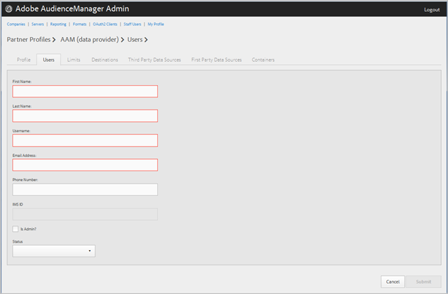

# Manage Company Users{#manage-company-users}

Create new Audience Manager users or edit and delete existing users.

1. 

   <!-- 

t_manage_company_users.xml

 -->

   Click **[!UICONTROL Companies]**, then locate and click the desired company to display its [!UICONTROL Profile] page.

   Use the [!UICONTROL Search] box or the pagination controls at the bottom of the list to find the desired company. You can sort each column in ascending or descending order by clicking the desired column's header. 
1. Click the **[!UICONTROL Users]** tab.
1. To create a new user, click **[!UICONTROL Create a New User]**.

   Or

   To edit an existing user, locate and click the desired user the **[!UICONTROL Username]** column.

   

1. Fill in the fields:

   First Name: (Required) Specify the user's first name.

   **[!UICONTROL Last Name]**: (Required) Specify the user's last name.

   **[!UICONTROL Username]**: (Required) Specify the user's Audience Manager username. Usernames must be unique.

   **[!UICONTROL Email Address]**: (Required) Specify the user's email address.

   **[!UICONTROL Phone Number]**: Specify the user's phone number.

   **[!UICONTROL IMS ID]**: The user's [!UICONTROL Identity Management System ID]. This ID lets the user link to Adobe solutions to the Adobe Experience Cloud.

   **[!UICONTROL Is Admin]**: Make this user an Audience Manager administrative user.

   An administrator has all Audience Manager user roles for this partner.

   **[!UICONTROL Status]**: While creating a new user, this field initially displays as **[!UICONTROL Pending]** until the user logs in and resets the temporary password.

   If you are editing an existing user, you can select from the following statuses:

* **[!UICONTROL Active]**: Specifies that this user is an active Audience Manager user. 
* **[!UICONTROL Deactivated]**: Specifies that this user is a deactivated Audience Manager user. 
* **[!UICONTROL Expired]**: Specifies that this user is an expired user. 
* **[!UICONTROL Locked Out]**: Specifies that this user is a locked-out user.

1. Click **[!UICONTROL Submit]**.
**To delete a user:**

1. Click **[!UICONTROL Companies]**, locate and click the desired company, then click the **[!UICONTROL Users]** tab. 
1. Click   in the **[!UICONTROL Actions]** column of the desired user. 
1. Click **[!UICONTROL OK]** to confirm the deletion.

