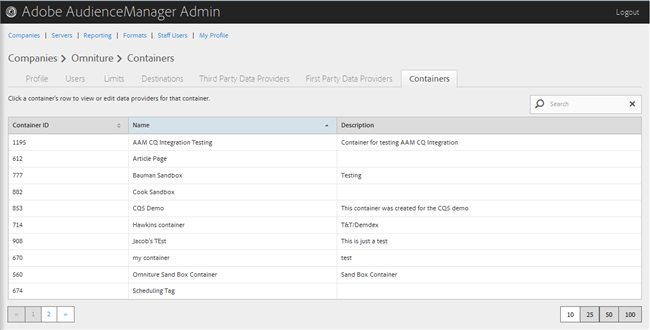
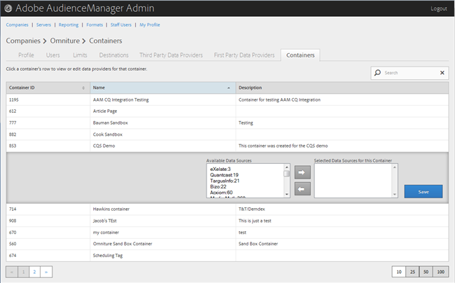

# Manage Containers{#manage-containers}

View or edit data providers for containers.

<!-- 

t_containers.xml

 -->

>[!NOTE]
>
>By default, companies are created with one container. You can create further containers for a company in the user interface, in **[!UICONTROL Manage Data > Tags]**.

1. Click **[!UICONTROL Companies]**, then locate and click the desired company to display its [!UICONTROL Profile] page.

   Use the [!UICONTROL Search] box or the pagination controls at the bottom of the list to find the desired company. You can sort each column in ascending or descending order by clicking the desired column's header. 
1. Click the **[!UICONTROL Containers]** tab.

   

1. Click a container's row to view or edit data providers for that container.

   

1. Move data sources from the **[!UICONTROL Available Data Sources]** and **[!UICONTROL Selected Data Sources for This Container]** lists by selecting the desired data sources, then clicking the right or left arrows as necessary.

   You can also perform this task from the [Third Party Data Providers](../companies/admin-third-party-providers.md#task_E942DD674D794BA6B8EFD52FD866E689)page. 
1. Click **[!UICONTROL Save]** if you made changes.

>[!MORE_LIKE_THIS]
>
>* [ID Syncing with Media Optimizer](admin-amo-sync.md#concept_2B5537233DAA4860B3503B344F937D83)
