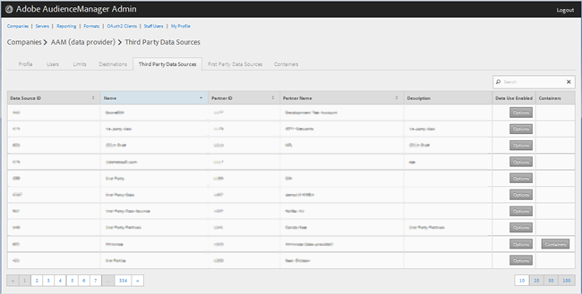
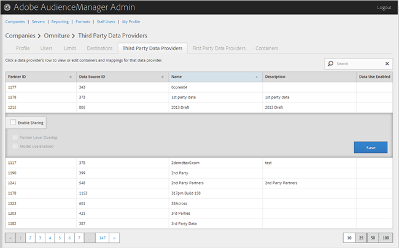

# Manage Third-Party Data Providers{#manage-third-party-data-providers}

View or edit containers and mappings for third-party data providers. You can also enable sharing with different data providers.

1. Click **[!UICONTROL Companies]**, then locate and click the desired company to display its [!UICONTROL Profile] page.

   Use the [!UICONTROL Search] box or the pagination controls at the bottom of the list to find the desired company. You can sort each column in ascending or descending order by clicking the desired column's header. 
1. Click the **[!UICONTROL Third Party Data Providers]** tab.

   

1. Click a data provider's row to view or edit containers and mappings for that data provider.

   

1. Select **[!UICONTROL Enable Sharing]** to enable the following options:

   **Partner Level Overlap: **

   **Model Use Enabled: **Lets this company to use this data provider when creating algorithmic models.

   When you enable sharing, you get access to traits from this data provider. 
1. (Conditional) If the container is enabled for this provider, you can select containers for this data provider by moving the desired containers from the available list to the selected list.

   You can also perform this task from the [Containers](../companies/admin-manage-containers.md#task_61DB5CEECC5049DD8D059C642AC3F967) page. 
1. Click **[!UICONTROL Save]** if you made changes.
