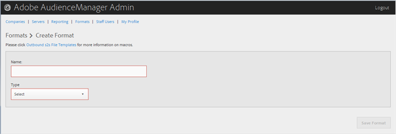

# Create or Edit a Format{#create-or-edit-a-format}

Use the Formats page in the Audience Manager Admin tool to create a new format or to edit an existing format.

<!-- 

t_create_format.xml

 -->

>[!TIP]
>
>When selecting a format for your outbounded data, it's best, if possible, to re-use an existing format. Using an already-proven format ensures that your outbound data will be generated successfully. To see exactly how an existing format is formatted, click the [!UICONTROL Formats] option in the menu bar and search for your format either by name or by ID number. Malformed formats or macros used in formats will provide incorrectly formatted output or will prevent information from being output entirely.

1. To create a new format, click **[!UICONTROL Formats]** > **[!UICONTROL Add Format]**.

   Or

   To edit an existing format, click the desired format in the **[!UICONTROL Name]** column.

   

1. Fill in the fields:

   **Name:** (Required) Provide a descriptive name for the format.

   **Type:** (Required) Select the desired format:

* **[!UICONTROL File]**: Sends data via FTP files. 
* **[!UICONTROL HTTP]**: Encloses data in a JSON wrapper.

1. (Conditional) If you chose **[!UICONTROL File]**, fill in the fields:

   >[!NOTE]
   >
   >For a list of available macros, see [File Format Macros](../formats/file-formats.md#concept_A867101505074418A58DE325949E5089) and [HTTP Format Macros](../formats/web-formats.md#reference_C392124A5F3F42E49F8AADDBA601ADFE).

   **File Name:** Specify the file name for the data-transfer file.

   **Header:** Specify the text that appears in the first row of the data-transfer file.

   **Data Row:** Specify the text that appears in each outbounded row of the file.

   **Maximum File Size (In MB):** Specify the maximum file size for data-transfer files. Compressed files must be smaller than 100 MB. There is no limit on uncompressed file size.

   **Compression:** Select the desired compression type: gz or zip for your data files. For delivery to [!UICONTROL AWS S3], you must use .gz or uncompressed files.

   **.info Receipt:** Specifies that a transfer-control ( [!DNL .info]) file is generated. The [!DNL .info] file provides metadata information about file transfers so that partners can verify that Audience Manager handled file transfers correctly. For more information, see [Transfer-Control Files for Log File Transfers](https://marketing.adobe.com/resources/help/en_US/aam/c_s2s_add_transfer_control_files.html).

   **MD5 Checksum Receipt:** Specifies that an MD5 checksum receipt is generated. The MD5 checksum receipt so that partners can verify that Audience Manager handled the full transfer correctly. 
1. (Conditional) If you chose **[!UICONTROL HTTP]**, fill in the fields:

   **Method:** Choose the API method you want to use for your transfer process:

* **POST:** If you select POST, select the content type (XML or JSON), then specify the request body. 
* **GET:** If you select GET, specify the query parameters.

1. Click **[!UICONTROL Create]** if you are creating a new format.

   Or

   Click **[!UICONTROL Save Updates]** if you are editing an existing format. 

**To delete a format:**

1. Click **[!UICONTROL Formats]**. 
1. Click   in the **[!UICONTROL Actions]** column of the desired format. 
1. Click **[!UICONTROL OK]** to confirm the deletion.
