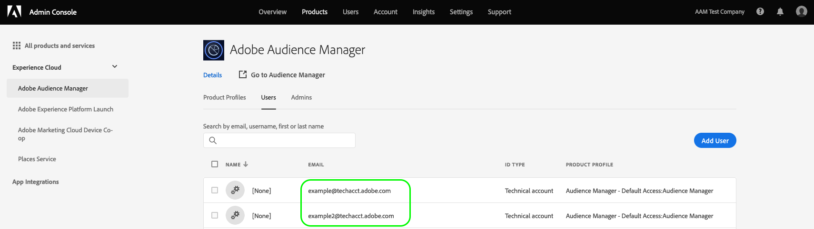

# Getting Started with [!DNL REST] [!DNL APIs] {#getting-started-with-rest-apis} 

Information about general requirements, authentication, optional query parameters, request [!DNL URLs], and other references.

## API Requirements and Recommendations {#api-requirements-recommendations}

Note the following when working with [Audience Manager API](https://bank.demdex.com/portal/swagger/index.html#/) code:

* **Request parameters:** all request parameters are required unless specified otherwise.
* **Request headers**: when using [Adobe Developer](https://www.adobe.io/) tokens, you must provide the `x-api-key` header. You can get your [!DNL API] key by following the instructions in the [Service Account Integration](https://www.adobe.io/authentication/auth-methods.html#!AdobeDocs/adobeio-auth/master/AuthenticationOverview/ServiceAccountIntegration.md) page.
* **[!DNL JSON] content type:** Specify `content-type: application/json`  *and*  `accept: application/json` in your code.
* **Requests and responses:** Send requests as a properly formatted [!DNL JSON] object. [!DNL Audience Manager] responds with [!DNL JSON] formatted data. Server responses can contain requested data, a status code, or both.
* **Access:** Your [!DNL Audience Manager] consultant will provide you with a client ID and key that lets you make [!DNL API] requests.
* **Documentation and code samples:** Text in *italics* represents a variable that you provide or pass in when making or receiving [!DNL API] data. Replace *italicised* text with your own code, parameters, or other required information.

## Authentication {#authentication}

The [!DNL Audience Manager] [!DNL REST APIs] support three authentication methods.

* **Recommended**: [OAuth Server-to-Server Authentication](https://developer.adobe.com/developer-console/docs/guides/authentication/ServerToServerAuthentication/implementation/) using [Adobe Developer Console](https://www.adobe.io/). [!DNL Adobe Developer] is Adobe's developer ecosystem and community. It includes [APIs for all Adobe products](https://developer.adobe.com/apis/). This is the recommended way of setting up and using [!DNL Adobe] [!DNL APIs]. 
* **Deprecated**: [JWT (Service Account) Authentication](#jwt) using [Adobe Developer](https://www.adobe.io/). [!DNL Adobe Developer] is Adobe's developer ecosystem and community. It includes [APIs for all Adobe products](https://developer.adobe.com/apis/).
* **Deprecated** [Legacy OAuth Authentication](#oauth). While this method is deprecated, customers with existing [!DNL OAuth] integrations can continue using this method.

>[!IMPORTANT]
>
>Depending on your authentication method, you need to adjust your request [!DNL URLs] accordingly. See the [Environments](#environments) section for details about the hostnames that you should use.

## OAuth Server-to-Server Authentication using Adobe Developer {#oauth-adobe-developer}

This section covers how to gather the required credentials to authenticate Audience Manager API calls, as outlined in the flowchart below. You can gather most of the required credentials in the initial one-time setup. The access token, however, must be refreshed every 24-hours.


### Adobe Developer Overview {#developer-overview}

[!DNL Adobe Developer] is Adobe's developer ecosystem and community. It includes [APIs for all Adobe products](https://developer.adobe.com/apis).

This is the recommended way of setting up and using [!DNL Adobe] [!DNL APIs].

### Prerequisites {#prerequisites-server-to-server}

Before you can configure [!DNL OAuth Server-to-Server] authentication, make sure you have access to the [Adobe Developer Console](https://developer.adobe.com/console/home) in [Adobe Developer](https://developer.adobe.com/). Contact your organization administrator for access requests.

### Authentication {#oauth}

Follow the steps below to configure [!DNL OAuth Server-to-Server] authentication using [!DNL Adobe Developer]:

1. Log in to the [Adobe Developer Console](https://developer.adobe.com/console/home).
1. Follow the steps in the [OAuth Server-to-Server credential implementation guide](https://developer.adobe.com/developer-console/docs/guides/authentication/ServerToServerAuthentication/implementation/).
   * During [Step 2: Add an API to your project using Service Account authentication](https://www.adobe.io/authentication/auth-methods.html#!AdobeDocs/adobeio-auth/master/AuthenticationOverview/ServiceAccountIntegration.md), choose the [!DNL Audience Manager] [!DNL API] option.
1. Try out the connection by making your first [!DNL API] call based on the instructions from [Step 3](https://www.adobe.io/authentication/auth-methods.html#!AdobeDocs/adobeio-auth/master/AuthenticationOverview/ServiceAccountIntegration.md).

>[!NOTE]
>
>To configure and work with the [!DNL Audience Manager] [!DNL REST APIs] in an automated manner, you can rotate client secrets programmatically. See [the developer documentation](https://developer.adobe.com/developer-console/docs/guides/authentication/ServerToServerAuthentication/implementation/#rotating-client-secrets-programmatically) for detailed instructions.

### Add Audience Manager API to a project {#add-aam-api-to-project}

Go to [Adobe Developer Console](https://www.adobe.com/go/devs_console_ui) and sign in with your Adobe ID. Next, follow the steps outlined in the tutorial on [creating an empty project](https://developer.adobe.com/developer-console/docs/guides/projects/projects-empty/) in the Adobe Developer Console documentation.

Once you have created a new project, select **[!UICONTROL Add API]** on the **[!UICONTROL Project Overview]** screen.

>[!TIP]
>
>If you are provisioned for several organizations, use the organization selector in the upper right corner of the interface to make sure that you are in the organization you need.


The **[!UICONTROL Add an API]** screen appears. Select the product icon for Adobe Experience Cloud, then choose **[!UICONTROL Audience Manager API]** before selecting **[!UICONTROL Next]**.


>[!TIP]
>
>Select the **[!UICONTROL View docs]** option to navigate in a separate browser window to the complete [Audience Manager API reference documentation](https://bank.demdex.com/portal/swagger/index.html#).

### Select the OAuth Server-to-Server authentication type {#select-oauth-server-to-server}

Next, select the authentication type to generate access tokens and access the Audience Manager API.

>[!IMPORTANT]
>
>Select the **[!UICONTROL OAuth Server-to-Server]** method as this will be the only method supported moving forward. The **[!UICONTROL Service Account (JWT)]** method is deprecated. While integrations using the JWT authentication method will continue to work until January 1st, 2025, Adobe strongly recommends that you migrate existing integrations to the new OAuth Server-to-Server method before that date.


### Select the product profiles for your integration {#select-product-profiles}

In the **[!UICONTROL Configure API]** screen, select the desired product profiles. Your integration's service account will gain access to granular features through the product profiles selected here.


Select **[!UICONTROL Save configured API]** when you are ready.

### Gather credentials {#gather-credentials}

Once the API has been added to the project, the **[!UICONTROL Audience Manager API]** page for the project displays the following credentials that are required in all calls to Audience Manager APIs:


* `{API_KEY}` ([!UICONTROL Client ID])
* `{ORG_ID}` ([!UICONTROL Organization ID])

## Generate an access token {#generate-access-token}

The next step is to generate an `{ACCESS_TOKEN}` credential for use in Audience Manager API calls. Unlike the values for `{API_KEY}` and `{ORG_ID}`, a new token must be generated every 24 hours to continue using Audience Manager APIs. Select **[!UICONTROL Generate access token]**, as shown below.


+++ View information about the deprecated [!DNL JWT] ([!DNL Service Account]) method of obtaining authentication tokens.

## [!DNL JWT] ([!DNL Service Account]) Authentication using Adobe Developer {#jwt}

### Adobe Developer Overview {#adobeio}

[!DNL Adobe Developer] is Adobe's developer ecosystem and community. It includes [APIs for all Adobe products](https://www.adobe.io/apis.html).

This is the recommended way of setting up and using [!DNL Adobe] [!DNL APIs].

### Prerequisites {#prerequisites}

Before you can configure [!DNL JWT] authentication, make sure you have access to the [Adobe Developer Console](https://console.adobe.io/) in [Adobe Developer](https://www.adobe.io/). Contact your organization administrator for access requests.

### Authentication {#auth}

Follow the steps below to configure [!DNL JWT (Service Account)] authentication using [!DNL Adobe Developer]:

1. Log in to the [Adobe Developer Console](https://console.adobe.io/).
1. Follow the steps in [Service Account Connection](https://www.adobe.io/authentication/auth-methods.html#!AdobeDocs/adobeio-auth/master/AuthenticationOverview/ServiceAccountIntegration.md).
   * During [Step 2: Add an API to your project using Service Account authentication](https://www.adobe.io/authentication/auth-methods.html#!AdobeDocs/adobeio-auth/master/AuthenticationOverview/ServiceAccountIntegration.md), choose the [!DNL Audience Manager] [!DNL API] option.
1. Try out the connection by making your first [!DNL API] call based on the instructions from [Step 3](https://www.adobe.io/authentication/auth-methods.html#!AdobeDocs/adobeio-auth/master/AuthenticationOverview/ServiceAccountIntegration.md).

>[!NOTE]
>
>To configure and work with the [!DNL Audience Manager] [!DNL REST APIs] in an automated manner, you can generate the [!DNL JWT] programatically. See [JWT (Service Account) Authentication](https://www.adobe.io/authentication/auth-methods.html#!AdobeDocs/adobeio-auth/master/JWT/JWT.md) for detailed instructions.

### Technical account RBAC permissions

If your Audience Manager account uses [Role-based Access Control](../../features/administration/administration-overview.md), you must create an Audience Manager technical user account and add it to the Audience Manager RBAC group that will make the API calls.

Follow the steps below to create a technical user account and add it to an RBAC group:

1. Make a `GET` call to `https://aam.adobe.io/v1/users/self`. The call will create a technical user account that you can see in the [!UICONTROL Admin Console], in the [!UICONTROL Users] page.
  
    

1. Log in to your Audience Manager account and [add the technical user account](../../features/administration/administration-overview.md#create-group) to the user group that will make the API calls.

+++

+++ View information about the deprecated legacy [!DNL OAuth] Authentication method of obtaining authentication tokens.

## [!DNL OAuth] Authentication (Deprecated) {#oauth}

>[!WARNING]
> [!DNL Audience Manager] [!UICONTROL REST API] token authentication and renewal via [!DNL OAuth 2.0] is now deprecated.
>
> Please use [JWT (Service Account) Authentication](#jwt-service-account-authentication-jwt) instead.

The [!DNL Audience Manager] [!UICONTROL REST API] follows [!DNL OAuth 2.0] standards for token authentication and renewal. The sections below describe how to authenticate and start working with the [!DNL API]s.

### Create a Generic [!DNL API] User {#requirements}

We recommend you create a separate, technical user account for working with the [!DNL Audience Manager] [!DNL API]s. This is a generic account that is not tied to or associated with a specific user in your organization. This type of [!DNL API] user account helps you accomplish 2 things:

* Identify what service is calling the [!DNL API] (e.g., calls from your apps that use our [!DNL API]s or from other tools that make [!DNL API] requests).
* Provide uninterrupted access to the [!DNL API]s. An account tied to a specific person may be deleted when they leave your company. This will prevent you from working with the available [!DNL API] code. A generic account that's not tied to a particular employee helps you avoid this problem.

As an example or use case for this type of account, let's say you want to change a lot of segments at once with the [Bulk Management Tools](../../reference/bulk-management-tools/bulk-management-intro.md). Well, to do this, your user account needs [!DNL API] access. Rather than add permissions to a specific user, create a non-specific, [!DNL API] user account that has the appropriate credentials, key, and secret to make [!DNL API] calls. This is also useful if you develop your own applications that use the [!DNL Audience Manager] [!DNL API]s.

Work with your [!DNL Audience Manager] consultant to set up a generic, [!DNL API]-only user account.

### Password Authentication Workflow {#password-authentication-workflow}

Password authentication secure access our [!DNL REST API]. The steps below outline the workflow for password authentication from a [!DNL JSON] client in your browser.

>[!TIP]
>
>Encrypt access and refresh tokens if you store them in a database.

#### Step 1: Request [!DNL API] Access

Contact your Partner Solutions manager. They will provide you with an [!DNL API] client ID and secret. The ID and secret authenticate you to the [!DNL API].

Note: If you'd like to receive a refresh token, specify that when you request [!DNL API] access.

#### Step 2: Request the Token

Pass in a token request with your preferred [!DNL JSON] client. When you build the request:

* Use a `POST` method to call `https://api.demdex.com/oauth/token`.
* Convert your client ID and secret to a base-64 encoded string. Separate the ID and secret with a colon during the conversion process. For example, the credentials `testId : testSecret` convert to `dGVzdElkOnRlc3RTZWNyZXQ=`.
* Pass in the [!DNL HTTP] [!DNL headers] `Authorization:Basic <base-64 clientID:clientSecret>` and `Content-Type: application/x-www-form-urlencoded` . For example, your header could look like this: <br/>`Authorization: Basic dGVzdElkOnRlc3RTZWNyZXQ=` <br/>`Content-Type: application/x-www-form-urlencoded`
* Set up the request body as follows:
  <br/> `grant_type=password&username=<your-AudienceManager-user-name>&password=<your-AudienceManager-password>`

#### Step 3: Receive the Token

The [!DNL JSON] response contains your access token. The response should look like this:

```json
{
    "access_token": "28fed402-eafd-456c-9341-ac753f25bbbc",
    "token_type": "bearer",
    "refresh_token": "b27122c0-b0c7-4b39-a71b-1547a3b3b88e",
    "expires_in": 21922,
    "scope": "read write"
}
```

The `expires_in` key represents the number of seconds until the access token expires. As best practice, use short expiration times to limit exposure if the token is ever exposed.

### Refresh Token {#refresh-token}

Refresh tokens renew [!DNL API] access after the original token expires. If requested, the response [!DNL JSON] in the password workflow includes a refresh token. If you don't receive a refresh token, create a new one through the password authentication process.

You can also use a refresh token to generate a new token before the existing access token expires.

If your access token has expired, you receive a `401 Status Code` and the following header in the response:

`WWW-Authenticate: Bearer realm="oauth", error="invalid_token", error_description="Access token expired: <token>"`

The following steps outline the workflow for using a refresh token to create a new access token from a [!DNL JSON] client in your browser.

#### Step 1: Request the New Token

Pass in a refresh token request with your preferred [!DNL JSON] client. When you build the request:

* Use a `POST` method to call `https://api.demdex.com/oauth/token`.
* Convert your client ID and secret to a base-64 encoded string. Separate the ID and secret with a colon during the conversion process. For example, the credentials `testId : testSecret` convert to `dGVzdElkOnRlc3RTZWNyZXQ=`.
* Pass in the HTTP headers `Authorization:Basic <base-64 clientID:clientSecret>` and `Content-Type: application/x-www-form-urlencoded`. For example, your header could look like this: <br> `Authorization: Basic dGVzdElkOnRlc3RTZWNyZXQ=` <br> `Content-Type: application/x-www-form-urlencoded`
* In the request body, specify the `grant_type:refresh_token` and pass in the refresh token you received in your previous access request. The request should look like this: <br> `grant_type=refresh_token&refresh_token=b27122c0-b0c7-4b39-a71b-1547a3b3b88e`

#### Step 2: Receive the New Token

The [!DNL JSON] response contains your new access token. The response should look like this:

```json
{
    "access_token": "4fdfc261-2ffc-4fb7-8dbd-64221714c45f",
    "token_type": "bearer",
    "refresh_token": "295fa487-1825-4caa-a715-80b81ac17dae",
    "expires_in": 21922,
    "scope": "read write"
}
```

### Authorization Code and Implicit Authentication {#authentication-code-implicit}

The [!DNL Audience Manager] [!UICONTROL REST API] supports authorization code and implicit authentication. To use these access methods, your users need to log in to `https://api.demdex.com/oauth/authorize` to get access and refresh tokens.

+++

## Test an API call {#test-api-call}

After getting your authentication bearer token, perform an API call to test that you can now access Audience Manager APIs.

1. Navigate to the [API reference documentation](https://bank.demdex.com/portal/swagger/index.html#/Data%20Source%20API/get_datasources_).
2. Select **[!UICONTROL Authorize]** and paste the access token that you obtained in the [generate access token](#generate-access-token) step.
   
   

3. Perform a GET call to the `/datasources` API endpoint to retrieve a list of all globally available datasources, as indicated in the [API reference documentation](https://bank.demdex.com/portal/swagger/index.html#/Data%20Source%20API/get_datasources_). Select **[!UICONTROL Try it out]**, followed by **[!UICONTROL Execute]**, as shown below.

   


>[!BEGINSHADEBOX]

>[!BEGINTABS]

>[!TAB API request]

```shell

curl -X 'GET' \
  'https://api.demdex.com/v1/datasources/' \
  -H 'accept: application/json' \
  -H 'Authorization: Bearer your-access-token'

```


>[!TAB API response in case of using the correct bearer token]


When using a working access token, the API endpoint returns a 200 response, along with a response body that includes all global datasources that your organization has access to. 

```json

[
  {
    "pid": 1794,
    "name": "testdatasource1",
    "description": "Test data source",
    "status": "ACTIVE",
    "integrationCode": "test_ds1",
    "dataExportRestrictions": [],
    "updateTime": 1595340792000,
    "crUID": 0,
    "upUID": 15910,
    "linkNamespace": false,
    "type": "GENERAL",
    "subIdType": "CROSS_DEVICE_PERSON",
    "inboundS2S": true,
    "outboundS2S": true,
    "useAudienceManagerVisitorID": false,
    "allowDataSharing": true,
    "masterDataSourceIdProvider": true,
    "uniqueTraitIntegrationCodes": false,
    "uniqueSegmentIntegrationCodes": false,
    "marketingCloudVisitorIdVersion": 0,
    "idType": "CROSS_DEVICE",
    "samplingEndTime": 1596550392825,
    "allowDeviceGraphSharing": false,
    "supportsAuthenticatedProfile": true,
    "deviceGraph": false,
    "authenticatedProfileName": "testdatasource1",
    "deviceGraphName": "",
    "customNamespaceId": 29769,
    "customNamespaceCode": "silviu_ds1",
    "customerProfileDataRetention": 62208000,
    "samplingStartTime": 1595340792825,
    "dataSourceId": 29769,
    "containerIds": [],
    "samplingEnabled": false
  },
  {
    "pid": 1794,
    "name": "AAM Test Company Audiences",
    "description": "Automatically generated trait data source",
    "status": "ACTIVE",
    "integrationCode": "adobe-provided",
    "dataExportRestrictions": [
      "PII"
    ],

    [...]

```

>[!ENDTABS]

>[!ENDSHADEBOX]

## Make Authenticated [!DNL API] Requests {#authenticated-api-requests}

Requirements for calling [!DNL API] methods after you receive an authentication token.

To make calls against the available [!DNL API] methods:

* In the `HTTP` header, set `Authorization: Bearer <token>`.
* When using [JWT (Service Account) Authentication](#jwt), you need to provide the `x-api-key` header, which will be the same as your `client_id`. You can get your `client_id` from the [Adobe Developer integration](https://www.adobe.io/authentication/auth-methods.html#!AdobeDocs/adobeio-auth/master/AuthenticationOverview/ServiceAccountIntegration.md) page.
* Call the required [!DNL API] method.

## Optional [!DNL API] Query Parameters {#optional-api-query-parameters}

Set the optional parameters available to methods that return all properties for an object.

You can use these optional parameters with [!DNL API] methods that return *all* properties for an object. Set these options in the request string when passing that query in to the [!DNL API].

| Parameter | Description |
|--- |--- |
|`page`|Returns results by page number. Numbering starts at 0.|
|`pageSize`|Sets the number of response results returned by the request (10 is default).|
|`sortBy`|Sorts and returns results according to the specified [!DNL JSON] property.|
|`descending`|Sorts and returns results in descending order. `ascending` is default.|
|`search`|Returns results based on the specified string you want to use as a search parameter. For example, let's say you want to find results for all models that have the word "Test" in any of the value fields for that item. Your sample request could look like this:   `GET https://aam.adobe.io/v1/models/?search=Test`.  You can search on any value returned by a "[!DNL get all]" method.|
|`folderId`|Returns all the IDs for [!UICONTROL traits] inside the specified folder. Not available to all methods.|
|`permissions`|Returns a list of segments based on the specified permission. `READ` is default. Permissions include:<ul><li>`READ` : Return and view information about a segment.</li><li>`WRITE` : Use  `PUT`  to update a segment.</li><li>`CREATE` : Use  `POST`  to create a segment.</li><li>`DELETE` : Delete a segment. Requires access to underlying traits, if any. For example, you'll need rights to delete the traits that belong to a segment if you want to remove it.</li></ul><br>Specify multiple permissions with separate key-value pairs. For example, to return a list of segments with  `READ`  and  `WRITE`  permissions only, pass in  `"permissions":"READ"`, `"permissions":"WRITE"` .|
|`includePermissions`|([!DNL Boolean]) Set to `true` to return your permissions for the segment. Default is `false`.|

### A Note About Page Options

When page information *is not* specified, the request returns plain [!DNL JSON] results in an array. If page information *is* specified, then the returned list is wrapped in a [!DNL JSON] object that contains information about the total result and current page. Your sample request using page options could look similar to this:

```
GET https://aam.adobe.io/v1/models/?page=1&pageSize=2&search=Test
```

## [!DNL API URLs] {#api-urls}

[!DNL URLs] for requests, staging and production environments, and versions.

## Request [!DNL URLs] {#request-urls}

The following table lists the request [!DNL URLs] used to pass in [!DNL API] requests, by method.

Depending on the authentication method that you use, you need to adjust your request [!DNL URLs] according to the tables below.

### Request [!DNL URLs] for [!DNL JWT] Authentication {#request-urls-jwt}

| [!DNL API] Methods | Request [!DNL URL] |
|--- |--- |
|[!DNL Algorithmic Modeling]|`https://aam.adobe.io/v1/models/`|
|[!DNL Data Source]|`https://aam.adobe.io/v1/datasources/`|
|[!DNL Derived Signals]|`https://aam.adobe.io/v1/signals/derived/`|
|[!DNL Destinations]|`https://aam.adobe.io/v1/destinations/`|
|[!DNL Domains]|`https://aam.adobe.io/v1/partner-sites/`|
|[!DNL Folders]|Traits:  `https://aam.adobe.io/v1/folders/traits /`<br>Segments:  `https://aam.adobe.io/v1/folders/segments /`|
|[!DNL Schema]|`https://aam.adobe.io/v1/schemas/`|
|[!DNL Segments]|`https://aam.adobe.io/v1/segments/`|
|[!DNL Traits]|`https://aam.adobe.io/v1/traits/`|
|[!DNL Trait Types]|`https://aam.adobe.io/v1/customer-trait-types`|
|[!DNL Taxonomy]|`https://aam.adobe.io/v1/taxonomies/0/`|

### Request [!DNL URLs] for [!DNL OAuth] Authentication (Deprecated) {#request-urls-oauth}

| [!DNL API] Methods | Request [!DNL URL] |
|--- |--- |
|[!DNL Algorithmic Modeling]|`https://api.demdex.com/v1/models/`|
|[!DNL Data Source]|`https://api.demdex.com/v1/datasources/`|
|[!DNL Derived Signals]|`https://api.demdex.com/v1/signals/derived/`|
|[!DNL Destinations]|`https://api.demdex.com/v1/destinations/`|
|[!DNL Domains]|`https://api.demdex.com/v1/partner-sites/`|
|[!DNL Folders]|Traits:  `https://api.demdex.com/v1/folders/traits /`<br>Segments:  `https://api.demdex.com/v1/folders/segments /`|
|[!DNL Schema]|`https://api.demdex.com/v1/schemas/`|
|[!DNL Segments]|`https://api.demdex.com/v1/segments/`|
|[!DNL Traits]|`https://api.demdex.com/v1/traits/`|
|[!DNL Trait Types]|`https://api.demdex.com/v1/customer-trait-types`|
|[!DNL Taxonomy]|`https://api.demdex.com/v1/taxonomies/0/`|

## Environments {#environments}

The [!DNL Audience Manager] [!DNL API]s provide access to different working environments. These environments help you test code against separate databases without affecting live, production data. The following table lists the available [!DNL API] environments and corresponding resource hostnames.

Depending on the authentication method that you use, you need to adjust your environment [!DNL URLs] according to the table below.

|  Environment  | Hostname for [!DNL JWT] authentication  | Hostname for [!DNL OAuth] authentication|
|---|---|---|
|  **Production** |`https://aam.adobe.io/...`| `https://api.demdex.com/...`  |
|  **Beta**  |`https://aam-beta.adobe.io/...`|`https://api-beta.demdex.com/...` |

>[!NOTE]
>
>The [!DNL Audience Manager] beta environment is a smaller-scale, standalone version of the production environment. All the data that you want to test must be entered and collected in this environment.

## Versions {#versions}

New versions of these [!DNL API]s are released on a regular schedule. A new release increments the [!DNL API] version number. The version number is referenced in the request [!DNL URL] as `v<version number>` as shown in the following example:

`https://<host>/v1/...`

## Response Codes Defined {#response-codes-defined}

`HTTP` status codes and response text returned by the [!DNL Audience Manager] [!UICONTROL REST API].

|  Response code ID  | Response text  | Definition  |
|---|---|---|
|  `200`  | `OK`  | The request processed successfully. Will return expected content or data if required.  |
|  `201`  | `Created`  | The resource was created. Returns for `PUT` and `POST` requests.  |
|  `204`  | `No Content`  | The resource has been deleted. The response body will be blank.  |
|  `400`  | `Bad Request`  | The server did not understand the request. Usually due to malformed syntax. Check your request and try again.  |
|  `403`  | `Forbidden`  | You do not have access to the resource.  |
|  `404`  | `Not Found`  | The resource could not be found for the specified path.  |
|  `409`  | `Conflict`  | The request could not be completed due to a conflict with the state of the resource.  |
|  `500`  | `Server Error`  | The server encountered an unexpected error that prevented it from fulfilling the request.  |

>[!MORELIKETHIS]
>
>* [JWT (Service Account) Authentication](https://www.adobe.io/authentication/auth-methods.html#!AdobeDocs/adobeio-auth/master/JWT/JWT.md)
>* [OAuth Authentication](../../api/rest-api-main/aam-api-getting-started.md#oauth)
>* [OAuth 2.0](https://oauth.net/2/)
>* [OAuth 2 Simplified](https://aaronparecki.com/articles/2012/07/29/1/oauth2-simplified#browser-based-apps)
