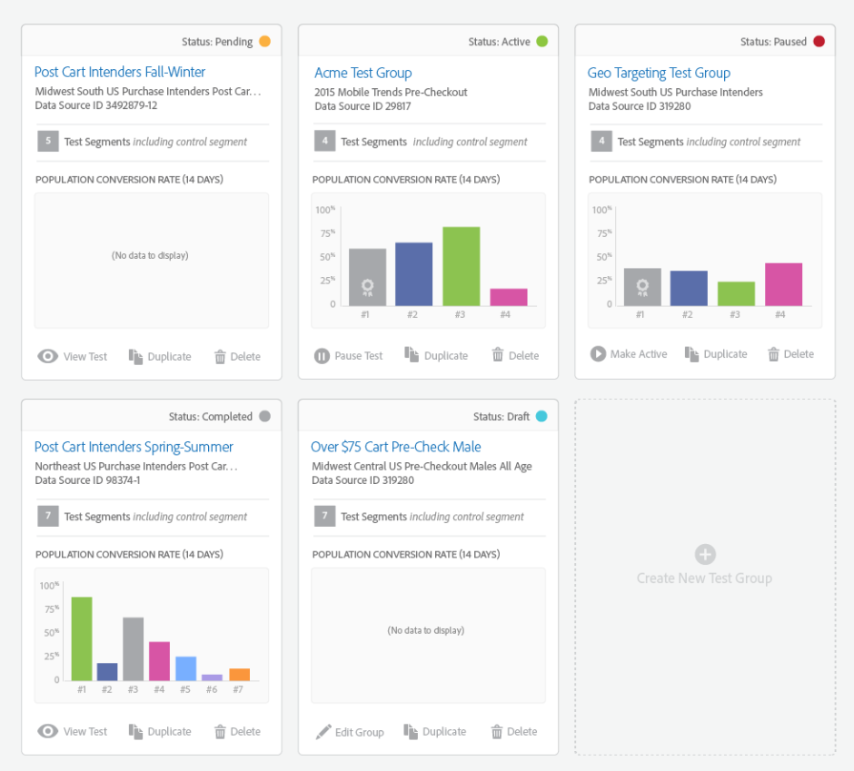
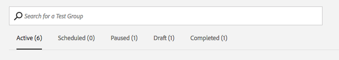

# [!UICONTROL Audience Lab] {#audience-lab}

Create mutually exclusive test segments in [!UICONTROL Segment Test Groups] to compare and measure effectiveness of different destinations. You can set aside a control group and divide your segment into percentages of a whole, in order to test efficacy.

## Overview {#section_A9160978EA0A47149876315F374202D1}

[!UICONTROL Audience Lab] uses [Profile Link](../../c-features/profile-merge-rules/merge-rules-overview.md#concept_5FCB08A53C4D4C2B82800BC9FD2B8EC9) to power cross-device testing. This helps ensure a user qualifies for the same test segment and receives the same treatment across devices. The test segments in test groups will inherit the [Profile Merge Rule](../../c-features/profile-merge-rules/merge-rules-dashboard.md#concept_0D5FDF17A17B400598B787099A48F865) the base segment has assigned to it.

The [!UICONTROL Audience Lab] default view displays a card for each of the test groups. Click a card to access the **[!UICONTROL Test Group]** view. This view includes the following information:

* **[Test Group Information](../../c-features/audience-lab/audience-lab-information-view.md#concept_C8A8844639CE41E9AE9D6886D829B8E0)**
* **[Test Group Reporting](../../c-features/audience-lab/audience-lab-reporting-view.md#concept_C8A089E2B1C54D268C4F6475C4D5C9D6)**

You are able to create **up to 10 test groups**, each one with **up to 15 test segments**.

## Search and Filter Test Groups {#section_92FC799944D5438FA411B84E0D56075E}

Once you start creating multiple test groups with multiple test segments, it may be easier to use the search box to find a specific test group. You can search for a test group by:

* The name of the test group;
* The name of any of the test segments in your test group;
* The description of the test group.

You can also filter your test groups by status. All available statuses are described in the [Status](../../c-features/audience-lab/audience-lab.md#section_4A6E6FC7095B4F13A8CEC8E2EBC01EBF) section below.

## Status {#section_4A6E6FC7095B4F13A8CEC8E2EBC01EBF}

The status of a test group can be active, scheduled, paused, draft, or completed. More information on each of them in the table below:

<table id="table_7A0388BA02E045AC971C06A22DAC2C63"> 
 <thead> 
  <tr> 
   <th colname="col1" class="entry"> Status </th> 
   <th colname="col2" class="entry"> Description </th> 
  </tr> 
 </thead>
 <tbody> 
  <tr> 
   <td colname="col1"> 
  Active  
 </td> 
   <td colname="col2"> 
An <i>active</i> test group means that data is currently being sent to destinations. Press  Pause Test  in the  Test Group  card to suspend sending data to destinations. 
 </td> 
  </tr> 
  <tr> 
   <td colname="col1"> 
  Scheduled  
 </td> 
   <td colname="col2"> 
A <i>scheduled</i> test group is not yet active but cannot be edited anymore. It will become active at the start date you selected in the <b>Create Test Groups</b> wizard. 
 </td> 
  </tr> 
  <tr> 
   <td colname="col1"> 
  Paused  
 </td> 
   <td colname="col2"> 
A <i>paused</i> test group does not currently send data to destinations. Press  Make Active  in the  Test Group  card to resume sending traits. 
 </td> 
  </tr> 
  <tr> 
   <td colname="col1"> 
  Draft  
 </td> 
   <td colname="col2"> 
A <i>draft</i> test group is not yet active and can still be edited. It does not yet send data to the mapped destinations. 
 </td> 
  </tr> 
  <tr> 
   <td colname="col1"> 
  Completed  
 </td> 
   <td colname="col2"> 
A <i>completed</i> test group has reached the end date you selected in the  Create Test Groups  wizard and has stopped sending reporting data. 
 </td>
  </tr>
 </tbody>
</table>

## Actions {#section_7548C5D56B004377AB330399746F79F7}

<table id="table_481A411E2D2F4FE891595D00E775CF60"> 
 <thead> 
  <tr> 
   <th colname="col1" class="entry"> Actions </th> 
   <th colname="col2" class="entry"> Description </th>
  </tr>
 </thead>
 <tbody> 
  <tr> 
   <td colname="col1"> 
  Edit  
 </td>
   <td colname="col2"> 
Available <b>only</b> for draft test groups. Allows you to resume the  Create New Test Group  wizard. 
 </td>
  </tr>
  <tr> 
   <td colname="col1"> 
  Pause  
 </td>
   <td colname="col2"> 
Available for active test groups. Allows you to pause sending the test segments to destinations. 
 </td>
  </tr>
  <tr> 
   <td colname="col1"> 
  Make Active  
 </td>
   <td colname="col2"> 
Available for paused test groups. Allows you to resume sending the test segments to destinations. 
 </td>
  </tr>
  <tr> 
   <td colname="col1"> 
  View  
 </td>
   <td colname="col2"> 
Available for completed test groups. Allows you to view the reporting information the test has generated. 
 </td>
  </tr>
  <tr> 
   <td colname="col1"> 
  Duplicate  
 </td>
   <td colname="col2"> 
Allows you to create a new test group with the same configuration as the one you are duplicating. 
 </td>
  </tr>
  <tr> 
   <td colname="col1"> 
  Delete  
 </td>
   <td colname="col2"> 
Allows you to delete a test group. The test segments will be unmapped from the destinations, the baseline segment and conversion traits associated to the test group are fully editable. An alert will prompt you to download the CSV file when you delete a test group to save the reporting if you wish. 
 </td>
  </tr>
 </tbody>
</table>