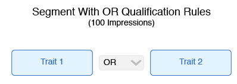
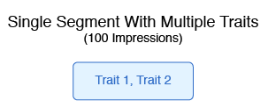
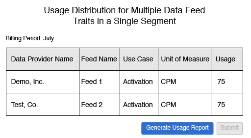

# Billing for Data Feed Buyers{#billing-for-data-feed-buyers}

Audience Marketplace data buyers agree to report all ad impressions served using traits contained in the data feed priced on a cost per thousand ad impressions (CPM) basis. CPM usage is due on the 5th day of each calendar month and includes data for previous month. Flat fee subscribers do not need to report usage.

## How to Report CPM Usage {#task_22D86C3A39544CA8A4BC2360DC115877}

[!UICONTROL Audience Marketplace] data buyers agree to report all ad impressions served using traits contained in the data feed priced on a cost per thousand ad impressions (CPM) basis. CPM usage is due on the 5 day of each calendar month and includes data for previous month. Flat fee subscribers do not need to report usage.

<!-- 
t_marketplace_report_cpm_usage.xml
-->

To report CPM usage:

1. Go to **[!UICONTROL Audience Marketplace > Payables]**.
1. Enter the CPM usage amount in the [!UICONTROL Usage] column and click **[!UICONTROL Submit]**.
1. Review the usage in the confirmation window and click **[!UICONTROL Yes]**.

**CPM Reporting Best Practices**

<table id="table_E68FA2130D1C495FAB8982DFB6A31FD9"> 
 <thead> 
  <tr> 
   <th colname="col1" class="entry"> Recommendations </th> 
   <th colname="col2" class="entry"> Description </th> 
  </tr>
 </thead>
 <tbody> 
  <tr> 
   <td colname="col1"> 
<b>How do I Increment Amounts in CPM Reports</b> 
 </td> 
   <td colname="col2"> 
For CPM impression totals: 
 
 
     <ul id="ul_A80B43E1A94842018280494D1DF729FE"> 
      <li id="li_E694BB3F66514D7992A4587DBBEBDC0A">Report the total number of ad impressions in units of one. </li> 
      <li id="li_AEBD157C5766443199AF677C55DEFF06">Do not enter the total number of ad impressions in units of a thousand. </li> 
     </ul> 
 
 For example, if 1,234,567 ad impressions are allocated to a data feed, then report 1,234,567. Do not report this as 1,234.6. 
 
Traits used to optimize your web or app content (Content Optimization) using tools such as  Adobe Target or an <a href="../../../c-features/destinations/manage-destinations.md#concept_7B7BC8B8D3AF4AFC884F8632EC5719B8"> Analytics destination</a> do not contribute to the Usage totals for CPM plans. Data providers are typically compensated for Content Optimization using flat fee plans. 
 
See <a href="../../../c-features/audience-marketplace/marketplace-data-buyers/marketplace-buyer-billing.md#concept_E757985A4850400288F1DD9A02B755D5"> Billing and Impression Allocation for CPM Data Feeds</a> for more information. 
 </td> 
  </tr> 
  <tr> 
   <td colname="col1"> 
<b>How do I Report CPM Usage After the Monthly Deadline</b> 
 </td> 
   <td colname="col2"> 
The report system closes after the 10th. If you fail to report CPM usage by the 10th, then you must add that amount to the report for the following month. For example, say you use 1000 impressions in October, miss the October reporting deadline, and use 1000 impressions in November. In this case, you report the October and November total (2000) in December, between 1st and 5th. 
 
 
Tip:  
Customers should always try to report CPM usage for the previous month between the 1st and 5th days of the new month. 
 
You can report CPM usage as late as the 10th of the new calendar month, but this is not recommended. Reporting CPM usage by the 5th of each month gives  Audience Manager time to check and process the data. 
 
 
 </td> 
  </tr> 
 </tbody> 
</table>

>[!MORE_LIKE_THIS]
>
>* [Billing and Impression Allocation for Flat Fee Data Feeds](../../../c-features/audience-marketplace/marketplace-data-buyers/marketplace-buyer-billing.md#concept_FE781C4C5C044C1F986F1AB6BA4E328F)

## Billing and Impression Allocation for CPM Data Feeds {#concept_E757985A4850400288F1DD9A02B755D5}

In [!UICONTROL Audience Marketplace] you must manually submit impression amounts each month. Also, if you build segments from data feed traits, impressions must be allocated proportionally according to the qualification rules you apply to those traits in [!UICONTROL Segment Builder].

<!--
marketplace_cpm_billing.xml
-->

Contents:

<ul class="simplelist"> 
 <li> <a href="../../../c-features/audience-marketplace/marketplace-data-buyers/marketplace-buyer-billing.md#section_E49C2B4663DB4016B594DB596B66E4E1"> Billing Summary </a> </li> 
 <li> <a href="../../../c-features/audience-marketplace/marketplace-data-buyers/marketplace-buyer-billing.md#section_F457C3B07044474CAE3DCEB339D8E120"> Assign Impressions Based on Trait Qualification Rules or Type </a> </li> 
 <li> <a href="../../../c-features/audience-marketplace/marketplace-data-buyers/marketplace-buyer-billing.md#section_61B684C354944A5CA3BE1A01007B9577"> Billing Examples </a> </li> 
</ul>

## Billing Summary {#section_E49C2B4663DB4016B594DB596B66E4E1}

For a CPM data feed, you must submit impression amounts by the 5 day of each calendar month. To do this properly, you must:

* Compile all advertising impressions delivered for each feed in the previous calendar month.
* Report CPM usage in **[!UICONTROL Audience Marketplace > Payables]**. See [How to Report CPM Usage](../../../c-features/audience-marketplace/marketplace-data-buyers/marketplace-buyer-billing.md#task_22D86C3A39544CA8A4BC2360DC115877) for instructions.

After you report CPM number for the previous calendar month, [!DNL Adobe] will do the following:

* Create an invoice and bill you based on the CPM rate for each subscribed data feed.
* Pay data providers (sellers) fees owed based on your reported CPM use.

>[!IMPORTANT]
>
>As a buyer, all reported impression totals must be true and accurate. If you fail to report impression totals by the 5 day of each month, you must include totals for the unreported month in the following month.

## Assign Impressions Based on Trait Qualification Rules or Type {#section_F457C3B07044474CAE3DCEB339D8E120}

The Activation use case lets you use traits in the corresponding data feed to create segments in [Segment Builder](../../../c-features/c-segments/segment-builder.md#topic_E166819D26B94A868376BA54E10E4B74) and map those segments to a destination. The Boolean operators [!UICONTROL AND], [!UICONTROL OR], and [!UICONTROL NOT] let you set the conditions for trait and segment qualification. For billing purposes, you must allocate impression proportionally for segments that use data feed traits. Proportional distribution depends on the Boolean operators you use to create qualification rules. The following table lists how to properly allocate impressions by Boolean rule or trait type.

<table id="table_BF00FE6740D2459DAFA62F2478492586"> 
 <thead> 
  <tr> 
   <th colname="col1" class="entry"> Rule Qualification Logic or Type </th> 
   <th colname="col2" class="entry"> Billing Distribution </th> 
  </tr> 
 </thead>
 <tbody> 
  <tr> 
   <td colname="col1"> 
 AND 
 </td> 
   <td colname="col2"> 
Apply 100% of the delivered impression totals to all the provider feeds in a rules-based segment that uses a Boolean  AND condition. 
 </td> 
  </tr> 
  <tr> 
   <td colname="col1"> 
 OR 
 </td> 
   <td colname="col2"> 
Apply 75% of the delivered impression totals to all of the providers feeds in a rules-based segment that uses a Boolean  OR condition. 
 
 
Note:   Audience Marketplace reports impressions at the  Data Feed level, not the trait level. Segments built from traits with a Boolean  OR from multiple traits from different feeds, allocate 75% of impressions to each feed in the segment, not each Trait. See the <a href="../../../c-features/audience-marketplace/marketplace-data-buyers/marketplace-buyer-billing.md#section_61B684C354944A5CA3BE1A01007B9577"> billing examples</a> below. 
 
 </td> 
  </tr>
  <tr> 
   <td colname="col1"> 
 NOT 
 </td> 
   <td colname="col2"> 
Apply 100% of the delivered impression totals to all the provider feeds in a rules-based segment that uses a Boolean  NOT condition. 
 </td> 
  </tr> 
  <tr> 
   <td colname="col1"> 
Algorithmic segments 
 </td> 
   <td colname="col2"> 
Apply 100% of the delivered impression totals to all the provider feeds in an algorithmic segment. 
 </td> 
  </tr>
 </tbody>
</table>

## Billing Examples {#section_61B684C354944A5CA3BE1A01007B9577}

These example can help you understand how to allocate impressions when you create segments from traits in a data feed. For simplicity, each example assumes 100 impressions for a one month billing period.

**Case 1: Segments With [!UICONTROL AND] Qualification Rules**

This segment contains 2 traits from separate data providers. Because segment qualification is based on an [!UICONTROL AND] condition, visitors have to realize the traits from both feeds to qualify for the segment.

With an [!UICONTROL AND] condition, you must assign 100% of the impressions received during the month to both data providers. In the [!UICONTROL Audience Marketplace] [!UICONTROL Payables] section, you credit each provider with 100 impressions.

This example applies to segments that use Boolean [!UICONTROL NOT] operators or for segments that contain algorithmic traits.

**Case 2: Segments With [!UICONTROL OR] Qualification Rules**

This segment contains 2 traits from separate data providers. Because segment qualification is based on an [!UICONTROL OR] condition, visitors have to realize either Trait 1 or Trait 2 to qualify for the segment.

We cannot tell which trait is responsible for an impression because qualification is based on an [!UICONTROL OR] condition. As a result, in the [!UICONTROL Audience Marketplace] [!UICONTROL Payables] section you credit each provider with 75% of the total impressions.

**Case 3: Single Segment With Multiple Traits**

In this example, we have a single segment that contains 2 traits from separate data providers. Segment qualification in this case is based on an implied Boolean [!UICONTROL OR] condition. The [!UICONTROL OR] is not set explicitly by a menu option selection when you create the segment. Because segment qualification is an implied [!UICONTROL OR] condition, visitors have to realize either Trait 1 or Trait 2 to qualify for the segment.

The bill result in this case is identical to example 2 above. We cannot tell which trait is responsible for an impression because qualification is based on an implied [!UICONTROL OR] condition. As a result, in the [!UICONTROL Audience Marketplace] [!UICONTROL Payables] section you credit each provider with 75% of the total impressions.

>[!MORE_LIKE_THIS]
>
>* [Billing and Impression Allocation for Flat Fee Data Feeds](../../../c-features/audience-marketplace/marketplace-data-buyers/marketplace-buyer-billing.md#concept_FE781C4C5C044C1F986F1AB6BA4E328F)

## Billing and Impression Allocation for Flat Fee Data Feeds {#concept_FE781C4C5C044C1F986F1AB6BA4E328F}

A flat fee data feed bills you a fixed amount each month, regardless of when the subscription starts or how many impressions you use. Fees are not prorated for partial month usage or intervals. As with CPM billing, [!DNL Adobe] will generate an invoice and bill you at the monthly, flat fee rate for your subscribed data feeds.

<!--
marketplace_flat_billing.xml
-->

For example, let's say you decided to turn on certain traits in a feed in the middle of the month. You will still be billed at the full, monthly rate regardless of when you started the subscription or activated specific traits. 

>[!MORE_LIKE_THIS]
>
>* [Billing and Impression Allocation for CPM Data Feeds](../../../c-features/audience-marketplace/marketplace-data-buyers/marketplace-buyer-billing.md#concept_E757985A4850400288F1DD9A02B755D5)
>* [How to Report CPM Usage](../../../c-features/audience-marketplace/marketplace-data-buyers/marketplace-buyer-billing.md#task_22D86C3A39544CA8A4BC2360DC115877)
