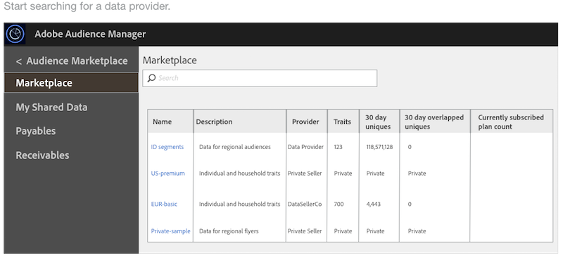
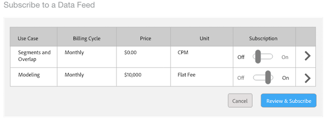
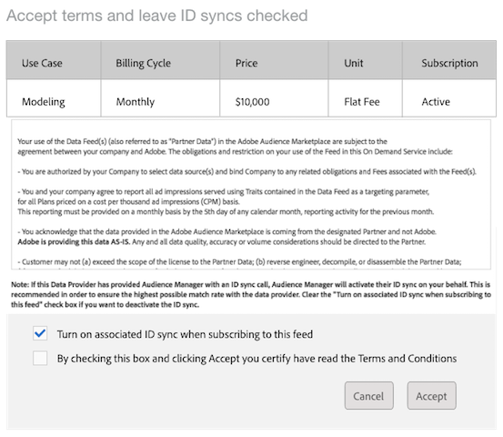

# Manage Data Feed Subscriptions {#manage-data-feed-subscriptions}

The Marketplace is where data buyers go to research and subscribe to public and private data feeds. Follow these steps to subscribe to a public data feed.

## Subscribe to a Public Data Feed {#task_F0E25DBC6326475497D5A086EF9B3182}

The [!UICONTROL Marketplace] is where data buyers go to research and subscribe to public and private data feeds. Follow these steps to subscribe to a public data feed.

<!--
t_subscribe_feed.xml
-->

To subscribe to a public data feed:

1. Go to **[!UICONTROL Audience Marketplace > Marketplace]**. Use the search feature or browse through the list to find a data feed.

   

1. Click the name of the data feed you want to use. This opens the [plan details page](../../../c-features/audience-marketplace/marketplace-data-buyers/marketplace-manage-subscriptions.md#concept_61D21E5C524940FCA28FB5D515C3065D) for the selected feed.

   

1. Choose a use case from the subscriptions table and:
    * Move the **[!UICONTROL Subscription]** slider to **[!UICONTROL On]**.
    * Click **[!UICONTROL Review & Subscribe]**. This opens the [!UICONTROL Terms and Conditions] window.

   

1. In the [!UICONTROL Terms and Conditions] window:

    * **Important:** Leave the **[!UICONTROL ID sync]** check box checked. This setting helps improve match rates with your data provider.
    * Check the terms and conditions box and click **[!UICONTROL Accept]** to complete the subscription process.

   

**Next Steps**

After you subscribe to a data feed:

* Verify the subscription by checking your [!UICONTROL Traits] folder. See [Storage for Subscribed Data Feeds](../../../c-features/audience-marketplace/marketplace-data-buyers/marketplace-manage-subscriptions.md#concept_49FA1D5234784B4A8C5C0D49164714DC).

* Review the billing and payment documentation. See the related links below.

>[!MORE_LIKE_THIS]
>
>* [Billing and Impression Allocation for CPM Data Feeds](../../../c-features/audience-marketplace/marketplace-data-buyers/marketplace-buyer-billing.md#concept_E757985A4850400288F1DD9A02B755D5)
>* [Billing and Impression Allocation for Flat Fee Data Feeds](../../../c-features/audience-marketplace/marketplace-data-buyers/marketplace-buyer-billing.md#concept_FE781C4C5C044C1F986F1AB6BA4E328F)
>* [How to Report CPM Usage](../../../c-features/audience-marketplace/marketplace-data-buyers/marketplace-buyer-billing.md#task_22D86C3A39544CA8A4BC2360DC115877)

## Subscribe to a Private Data Feed {#task_201526273485445EB6DB0FAD196259C5}

Buyers subscribe to private data feeds and plans in **[!UICONTROL Audience Marketplace > Marketplace]**.

<!--
t_private_feed.xml
-->

>[!TIP]
>
>Sometimes data providers may offer a discount on a private data feed. You might want to ask about a possible discount when submitting your subscription request.

To subscribe to a private data feed:

1. Click the data feed name in the [!UICONTROL Marketplace].
1. Click **[!UICONTROL Request Access]**.

   This opens the request dialog box. 1. In the request dialog box, write the provider a note expressing your interest in their data feed and click **[!UICONTROL Send]**. The seller will review your message and approve or reject your request. While waiting for approval, "Requested" appears in the [!UICONTROL Marketplace] list for that data feed.

    * **Request approved**: The status in the [!UICONTROL Marketplace] list changes to "Access Granted" and you'll receive an automated notification. At this point you can subscribe to the feed. See [Subscribe to a Public Data Feed](../../../c-features/audience-marketplace/marketplace-data-buyers/marketplace-manage-subscriptions.md#task_F0E25DBC6326475497D5A086EF9B3182) for instructions.
    * **Request denied**: The "Requested" text is removed from the [!UICONTROL Marketplace] list for the feed. You can try to subscribe again or choose a different feed.

>[!MORE_LIKE_THIS]
>
>* [Subscribe to a Public Data Feed](../../../c-features/audience-marketplace/marketplace-data-buyers/marketplace-manage-subscriptions.md#task_F0E25DBC6326475497D5A086EF9B3182)
>* [Discounts for Data Buyers](../../../c-features/audience-marketplace/marketplace-data-buyers/marketplace-manage-subscriptions.md#concept_DB7031710F254277A5297D98A13EFEC9)

## Data Feed Discounts for Buyers {#concept_DB7031710F254277A5297D98A13EFEC9}

In [!UICONTROL Audience Marketplace], providers can offer buyers a discount on the published price of a CPM or flat rate data feed. However, discount amounts aren't visible to buyers in the [!DNL Marketplace] feed list. But, you can also ask for a discount when you subscribe to a private data feed or when requesting more information about a particular feed.

## Request a Discount {#section_E9E2E37B81D043FABA24AB4FD0E9A1E1}

<!-- 

marketplace-buyer-discounts.xml

 -->

<table id="table_3C6E58F593BA48EC89ACBD9A26E4E74F"> 
 <thead> 
  <tr> 
   <th colname="col1" class="entry"> Buyer Status </th> 
   <th colname="col2" class="entry"> Description </th> 
  </tr> 
 </thead>
 <tbody> 
  <tr> 
   <td colname="col1"> 
 <b>Current Subscribers</b> 
 </td> 
   <td colname="col2"> 
If you're already subscribed to a private data feed and want to request a discount: 
 
    <ol id="ol_A58D419EBB9349E9B1225202535130F6"> 
     <li id="li_D0DDC8AC6E9C4675AA4630D63FE8F071"> <a href="../../../c-features/audience-marketplace/marketplace-data-buyers/marketplace-manage-subscriptions.md#task_10D0EA04E9C34F78A69A71AFA25BD40E"> Unsubscribe</a> from the data feed. </li> 
     <li id="li_05A5379F2A944FB28AB39C196DDE3A1D">Contact the data provider and request a discounted price. </li> 
     <li id="li_B1B5AA6F6CC64512A02D5E8861A5F266">If the provider gives you a discount, re-subscribe to the feed on the 1st day of the next month. </li> 
    </ol> </td> 
  </tr> 
  <tr> 
   <td colname="col1"> 
 <b>New Private Data Feed Subscribers</b> 
 </td> 
   <td colname="col2"> 
Ask for a discount in your subscription request. See <a href="../../../c-features/audience-marketplace/marketplace-data-buyers/marketplace-manage-subscriptions.md#task_201526273485445EB6DB0FAD196259C5"> Subscribe to a Private Data Feed</a>. 
 </td>
  </tr> 
  <tr> 
   <td colname="col1"> 
 <b>Potential Subscribers</b> 
 </td> 
   <td colname="col2"> 
A <a href="../../../c-features/audience-marketplace/marketplace-private-feeds.md#concept_68EDE94B558C4B88BBCC994B67726FD2"> potential subscriber</a> is a data buyer who has requested access to a private data feed, received seller approval, but has not subscribed to the feed. To request a discount as a potential subscriber: 
 
    <ol id="ol_9CECDA92E7894B20AC8A777D78962188"> 
     <li id="li_618B64160CF24549AFCA73E006DCA35A">Go to  Audience Marketplace &gt; Marketplace. </li> 
     <li id="li_FE52A06B30FC4858B48AF81954365FE9">Click the name of the feed you've been approved for. </li> 
     <li id="li_763C050AC9464BE380D00F6085B6E540">Click  Request More Details. Ask for a discount in your details request to the seller. </li> 
    </ol> </td> 
  </tr> 
 </tbody> 
</table>

## Review Discounted Feeds {#section_2D0DBBCB217748CBA33A9B087A936095}

To review your discounted feeds:

1. Go to **[!UICONTROL Audience Marketplace > Marketplace]**.
1. Click the name of a feed you're already subscribed to.
1. Look at the [!UICONTROL Price] and [!UICONTROL Your Price] columns in the [!UICONTROL Plan Details] table. If the feed is discounted:

    * The original price is marked with a red line.
    * The fee in the [!UICONTROL Your Price] column will be lower than the fee in the [!UICONTROL Price] column.

In the example, the buyer gets a 10% discount on the [!UICONTROL Segments and Overlap] plan in the **[!UICONTROL Software Audience Feed]**.

>[!MORE_LIKE_THIS]
>
>* [The Marketplace: About](../../../c-features/audience-marketplace/marketplace-data-buyers/marketplace-data-buyers.md#concept_47C5946409634F8F8DF885977A705B8C)

## Finding Subscribed Feed Data {#concept_49FA1D5234784B4A8C5C0D49164714DC}

The data (traits) for your data feeds appears in their own trait storage folders. Go to **[!UICONTROL Audience Data > Traits]** and expand the **[!UICONTROL 3rd-Party Data]** folder to view and work with the traits in your subscribed feeds. Look for the sub-folder named after your data provider. Those contain folders named after the individual data feed and list traits provided by the feed.

<!--
marketplace-feed-storage.xml
-->

>[!MORE_LIKE_THIS]
>
>* [Subscribe to a Public Data Feed](../../../c-features/audience-marketplace/marketplace-data-buyers/marketplace-manage-subscriptions.md#task_F0E25DBC6326475497D5A086EF9B3182)

## Unsubscribe from a Data Feed {#task_10D0EA04E9C34F78A69A71AFA25BD40E}

Data buyers unsubscribe from data feeds and plans in **[!UICONTROL Audience Marketplace > Marketplace]**.

<!--
t_unsubscribe_feed.xml
-->

To unsubscribe from a data feed:

1. Click the data feed name in the [!UICONTROL Marketplace].
1. In the [!UICONTROL Use Case] section find the plan you want to use and move the **[!UICONTROL Subscription]** slider to **[!UICONTROL Off]**.

## Data Feed Deactivation: Why It Happens and How to Respond {#concept_DE8E36D2B96B484482C317DAD20E7F61}

In [!UICONTROL Audience Marketplace], data providers can revoke access to your subscribed data feeds. Don't be alarmed if this happens to you. We've got you covered. Review this section for processes and procedures related to data feed deactivations.

## Common Reasons for Data Feed Deactivation {#section_D35C33B3D1AE467FBC22AFB7B1982EB9}

<!--
marketplace-subscriber-deactivated.xml
-->

It may be puzzling or even upsetting if a feed you subscribe to is shut off. However, data providers can deactivate a data feed for a variety of reasons. Some common reasons include:

* **Billing:** Data providers will deactivate a feed if you're consistently late with fee payments or if you fail to pay your fees.
* **Feed Updates:** Data providers need to deactivate feeds when they update their feed taxonomy or cost structures.
* **Inactive Buyers:** Data providers reserve the right to deactivate feeds if subscribers show no spending over an extended period of time. 
* **Inactive Sellers:** Data providers who leave [!UICONTROL Audience Marketplace] will deactivate and delete all their data feeds.

>[!TIP]
>
>Contact your data provider directly if you believe a data feed was deactivated by mistake. Your [!DNL Adobe] consultant can help you with contact information or additional support.

## Deactivation Email {#section_B195EA48C18B4F978070F7F198995CB5}

When a data provider deactivates one of your data feeds, [!DNL Audience Manager] sends an email to the users in your company who have Administrator permissions. Sometimes email filters classify this message as spam. As a result, you may miss this important notification. To help you identify the deactivation message, this email contains the following elements:

* **From:** The deactivation email comes from `aam-noreply@adobe.com`. Pro-tip: Don't reply to this email.

* **Subject line:** Subscription to *name of data feed here* is Cancelled. 

* **Attachments:**The email includes an attachment titled, " `list-of-affected-entities-by-feed-revocation.csv`." That is a convoluted way of saying the attachment lists all the traits included in the cancelled feed. As a data buyer, you should review this attachment. It will help you find and remove deactivated traits from your segments and [algorithmic models](../../../c-features/algorithmic-models/understanding-models.md#concept_49FB2DBD4AD041A4ABAAEE9D83BB996E).

## Deactivated Trait List {#section_36CECC9A202A43AD94202EE03B8FA5FC}

The list that accompanies a deactivation email contains the fields as shown below.

<table id="table_5C3800F9D8AA43EFAB4690959A721F63"> 
 <thead> 
  <tr> 
   <th colname="col1" class="entry"> Field </th> 
   <th colname="col2" class="entry"> Description </th> 
  </tr> 
 </thead>
 <tbody> 
  <tr> 
   <td colname="col1"> 
 Data Feed ID 
 </td> 
   <td colname="col2"> 
ID of the deactivated data feed. 
 </td> 
  </tr> 
  <tr> 
   <td colname="col1"> 
 Data Feed Name 
 </td> 
   <td colname="col2"> 
Name of the deactivated data feed. 
 </td> 
  </tr> 
  <tr> 
   <td colname="col1"> 
 Trait SID 
 </td> 
   <td colname="col2"> 
Deactivated trait IDs. 
 </td> 
  </tr> 
  <tr> 
   <td colname="col1"> 
 Trait Name 
 </td> 
   <td colname="col2"> 
Deactivated trait names. 
 </td> 
  </tr> 
  <tr> 
   <td colname="col1"> 
 Segment SID 
 </td> 
   <td colname="col2"> 
ID of the segment that contains deactivated traits. 
 </td> 
  </tr> 
  <tr> 
   <td colname="col1"> 
 Segment Name 
 </td> 
   <td colname="col2"> 
Name of the segment that contains deactivated traits. 
 </td> 
  </tr> 
  <tr> 
   <td colname="col1"> 
 Algo Model ID 
 </td> 
   <td colname="col2"> 
The ID of the algorithmic model that contain deactivated traits. 
 </td> 
  </tr> 
  <tr> 
   <td colname="col1"> 
 Algo Model Name 
 </td> 
   <td colname="col2"> 
The names of algorithmic models that contain deactivated traits. 
 </td> 
  </tr> 
 </tbody> 
</table>

## Remove Deactivated Traits {#section_69CBB45889874E1182E4A8A92D1BE709}

As a data buyer, you're responsible for removing the traits in a cancelled feed from all your active/in-use or inactive segments. Removal options include:

* Bulk removal with the [REST APIs](../../../c-api/c-rest-api-main/c-rest-api-main.md#concept_B512E6C3410A4304A672588A60A792B1) or the [Bulk Management Tools](../../../reference/bulk-management-tools/bulk-management-intro.md). 

* Manually search for affected segments and remove deactivated traits using [!UICONTROL Segment Builder]. See [Remove Traits from a Segment](../../../c-features/c-segments/segment-builder.md#task_D165E279D55A43C7952D936B207FD78A).

>[!NOTE]
>
>Removing traits from active algorithmic models or destinations affects scale and targeting accuracy. Try to replace revoked traits with new, active traits if possible.

[Unsubscribe from the deactivated data feed](../../../c-features/audience-marketplace/marketplace-data-buyers/marketplace-manage-subscriptions.md#task_10D0EA04E9C34F78A69A71AFA25BD40E) after you remove all the revoked traits from your account. If this is a temporary deactivation, you can re-subscribe after the data provider finishes making their required changes and reactivates the feed. As with most things, good communication with your partners (the data provider and [!DNL Adobe]) can help you work through this process. 

## Understanding the Plan Details Page in Audience Marketplace {#concept_61D21E5C524940FCA28FB5D515C3065D}

When you click the name of a data plan in the [!UICONTROL Marketplace], [!DNL Audience Manager] provides information that can help you make informed choices about subscribing to a data feed.

<!-- 

marketplace-buyer-details.xml

 -->

Refer to the following table for details about different elements of the plan details page.

<table id="table_033AC2632FEC45AFAA28D9B0B36A45A2"> 
 <thead> 
  <tr> 
   <th colname="col1" class="entry"> Page Element </th> 
   <th colname="col2" class="entry"> Description </th> 
  </tr> 
 </thead>
 <tbody> 
  <tr> 
   <td colname="col1"> 
Basic Plan Information 
 </td> 
   <td colname="col2"> 
This includes feed information such as the: 
 
 
     <ul id="ul_DE020897DF9644599A12EAB28BEBB2F4"> 
      <li id="li_2708CCC5FFC642D7AC87EEDC6CD9A9BE">Data feed name. For example, as shown above, the name of this feed is "Cross Pixel - Demographics." </li> 
      <li id="li_A38FB0BA75D84324AD639F4DA9024417">The name of the data provider. </li> 
      <li id="li_8FD44C8DBD97451FB8A2248933DAD064">Feed ID </li> 
      <li id="li_8A054691D89441CAA1BCD7D1464DD12D">Description </li> 
      <li id="li_D37A8EA0FB134B83A9289260EAD2BA7D">Number of traits in the feed. </li> 
     </ul> 
 </td> 
  </tr> 
  <tr> 
   <td colname="col1"> 
Plan Information Buttons 
 </td> 
   <td colname="col2"> 
 
     <ul id="ul_ACDA08D3C7304CBDA0896C5E70A7FFD8"> 
      <li id="li_5FF34641C2364F90A80AEDD0ADB64BC9">Click  Explore All Traits to see details about all the traits in the selected data feed. </li> 
      <li id="li_3B3924ADA7B54979B3AE6E6522BB3761">Click  Request Details to ask the data provider questions about the selected data feed or to <a href="../../../c-features/audience-marketplace/marketplace-data-buyers/marketplace-manage-subscriptions.md#concept_DB7031710F254277A5297D98A13EFEC9"> request a discount</a>. This feature sends your comments and questions directly to the data provider. </li> 
     </ul> 
 </td> 
  </tr> 
  <tr> 
   <td colname="col1"> 
Data Feed Report Metrics 
 </td> 
   <td colname="col2"> 
The Venn diagram (and related metrics) shows you trait overlap data for the last 30-days. 
 </td> 
  </tr> 
  <tr> 
   <td colname="col1"> 
Use Case / Subscription Table 
 </td> 
   <td colname="col2"> 
See <a href="../../../c-features/audience-marketplace/marketplace-data-buyers/marketplace-manage-subscriptions.md#concept_BF17D148E9BA4A2FBCCA4576F00046C9"> Understanding Data Feed Use Cases</a>. 
 </td> 
  </tr> 
  <tr> 
   <td colname="col1"> 
Plan Action Buttons 
 </td> 
   <td colname="col2"> 
 
     <ul id="ul_114F013A38A54F1592CEA30CB06A6F58"> 
      <li id="li_37B60217EFBF447ABF136508BD483C7D">Click  Cancel to leave the page without making changes. </li> 
      <li id="li_7356FE918192433EAC42FAB398223F4D">Click  Review &amp; Subscribe to subscribe to a data feed. See also <a href="../../../c-features/audience-marketplace/marketplace-data-buyers/marketplace-manage-subscriptions.md#task_F0E25DBC6326475497D5A086EF9B3182"> Subscribe to a Public Data Feed</a> and <a href="../../../c-features/audience-marketplace/marketplace-data-buyers/marketplace-manage-subscriptions.md#task_201526273485445EB6DB0FAD196259C5"> Subscribe to a Private Data Feed</a>. </li> 
     </ul> 
 </td> 
  </tr> 
 </tbody> 
</table>

>[!MORE_LIKE_THIS]
>
>* [The Marketplace: About](../../../c-features/audience-marketplace/marketplace-data-buyers/marketplace-data-buyers.md#concept_47C5946409634F8F8DF885977A705B8C)

## Understanding Data Feed Use Cases {#concept_BF17D148E9BA4A2FBCCA4576F00046C9}

As an [!UICONTROL Audience Marketplace] data buyer, you can purchase data for overlap, modeling, and activation use cases. Each use case is designed for a specific purpose and limits what you can do with the data. These use case descriptions can help you make the right decision about which type of data plan to buy.

## Make Comparisons with Segments and Overlap Plans {#section_162755B0AF3E4604BF579920D364ECD9}

<!--
c_use_cases_for_buyers.xml
-->

**Segments and Overlap**

This use case lets you compare your traits with provider traits in a [trait-to-trait overlap report.](../../../reporting/dynamic-reports/trait-trait-overlap-report.md#concept_1FBAED029FFD4AA5A5C6E79F633D9A0D) Also, you can create or add provider traits to a segment and make additional comparisons with the [segment-to-trait](../../../reporting/dynamic-reports/segment-trait-overlap-report.md#concept_36186B1ABEA34A6AAC7F5CF938A122B7) and [segment-to-segment](../../../reporting/dynamic-reports/segment-segment-overlap-report.md#concept_25E40808056B451BA06502A9527A55AA) reports. Overlap comparisons can help you:

* **Extend audience reach:** Low overlap suggests your traits contain users you have not seen before. You may want these traits to try and reach new users. 
* **Enhance existing audiences:** High overlap suggests your traits are similar to those owned by the data provider. You may want these traits to help make targeted, incremental improvements to an already developed audience.

**Algorithmic Models**

This use case lets you evaluate supplier traits against your traits with [algorithmic modeling](../../../c-features/algorithmic-models/understanding-models.md#concept_441E566718B845929880B0823A9ECA9F). For example, our algorithmic modeling system uses one of your traits as a basis for comparison against a supplier trait. When the model runs, it can show if audiences in supplier traits share similar conversion attributes to your traits.

**Activation**

This use case lets you send data to a [destination](../../../c-features/destinations/destinations.md#concept_5BDA346C376C4B719EA394108AB2735A). In [!UICONTROL Audience Manager], a destination is any third-party system (ad server, DSP, DMP, exchange, etc.) that you want to share data with. However, with an [!UICONTROL Activation] use case, you cannot run overlap reports or test the data in an algorithmic model. 
