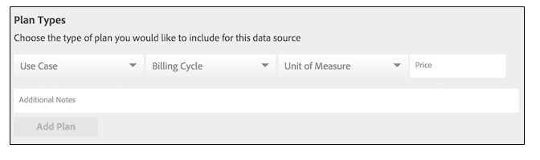
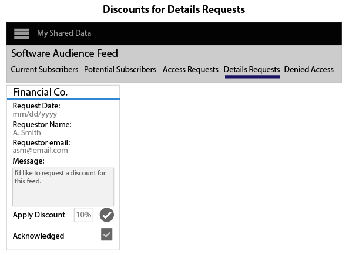

# Create, Price, and Manage Data Feeds{#create-price-and-manage-data-feeds}

A data feed requires a name, description, data source, and a plan type. Feeds are disabled until you save and activate the feed. Set up public or private data feeds in Audience Marketplace > My Shared Data. Available to data sellers only.

## Create a Public or Private Data Feed {#task_31BA4FB8FCD940588E6DCE2E7503DF4D}

A data feed requires a name, description, data source, and a plan type. Feeds are disabled until you save and activate the feed. Set up public or private data feeds in **[!UICONTROL Audience Marketplace > My Shared Data]**. Available to data sellers only.

<!-- 

t_data_feed.xml

 -->

You must have administrator rights to create a public or private data feed. 
To create a data feed: 

1. Click **[!UICONTROL New Data Feed]**.
1. Name the data feed.

   Data buyers can search for your feed based on the name. 1. Provide a brief description (255 characters maximum).

   A good description should describe your feed accurately. For example, you could include text for marketing categories, demographics, and geographic coverage (e.g., "US" or "North America). Description text is searchable and helps buyers find or evaluate your feed. A good description is an important part of attracting subscribers to your data feed. 1. Select a data source from the **[!UICONTROL Data Source]** options.

   >[!IMPORTANT]
   >
   >Any current and future traits belonging to this data source will be shared with your data buyers, as part of this feed.

1. In [!UICONTROL Plan Types], select the options you want to use and click **[!UICONTROL Add Plan]**.

   Feeds can contain multiple plans. Plans can contain multiple use cases. For details, see [Plan Types for Data Feeds](../../../c-features/audience-marketplace/marketplace-data-providers/marketplace-create-manage-feeds.md#concept_54DDE4186D0045F386F94BB8C56A5DEA). 1. Click **[!UICONTROL Save]** to save your data fee *without* activating it.
1. To save and activate a data feed:
   1. Move the **[!UICONTROL Availability]** slider to **[!UICONTROL Active]**.
   1. Click **[!UICONTROL Save]**.

   >[!NOTE]
   >
   >
   >
   >
   >* Saved and activated data feeds cannot be deleted. 
   >* Buyers see active feeds only. 
   >
   >

**Optional: Create a Private Data Feed**

In the [!UICONTROL Settings] section, move the slider to:

* **[!UICONTROL Private]** and **[!UICONTROL Branded]**: The buyer's [!UICONTROL Marketplace] list shows the seller's name in the provider column and all other data is hidden. 

* **[!UICONTROL Private]** and **[!UICONTROL Unbranded]**: The buyer's [!UICONTROL Marketplace] list shows the data feed name and description only. The data provider name appears as "Private Seller."

To see what a private feed looks like to buyers, see the buyers section in [Private Data Feeds](../../../c-features/audience-marketplace/marketplace-private-feeds.md#concept_68EDE94B558C4B88BBCC994B67726FD2). 

>[!MORE_LIKE_THIS]
>
>* [Private Data Feeds](../../../c-features/audience-marketplace/marketplace-private-feeds.md#concept_68EDE94B558C4B88BBCC994B67726FD2)

## Deactivate a Subscriber's Data Feed {#task_AC7B88F06D1149C39D895C9DFC197F2C}

As an [!UICONTROL Audience Marketplace] data provider, you can revoke buyer access to a subscribed data feed. You may want to remove a buyer from a feed for reasons such as late payment / non-payment of fees or if they use trait data improperly.

<!-- 

marketplace-deactivate-subscribers.xml

 -->

To revoke a subscriber: 

1. In [!UICONTROL My Shared Data], find the feed the subscriber is using.

   >[!NOTE]
   >
   >Data feeds with overdue accounts are flagged with a triangle/exclamation mark icon.

1. In the [!UICONTROL Subscribers] column, click the blue number that counts subscribers for that feed.

   This opens the subscription details page. 1. Move the **[!UICONTROL Subscription]** slider to **[!UICONTROL Off]**.

   This opens a confirmation dialog window. 1. In the [!UICONTROL Confirmation] pop, click **[!UICONTROL Yes]** to deactivate a subscription or **[!UICONTROL Cancel]** to quit without making subscription changes.
**What Happens After You Deactivate a Subscriber**

Revoking access to a data feed sends a notification email to all administrator users in the data buyer's account. The email includes an attachment that lists revoked traits. This list helps subscribers find and remove deactivated traits from their segments and models.

**Billing and Feed Deactivation**

After you remove access to a data feed, subscribers are responsible for fees for previous or current month, depending on when you deactivated the feed. 

## Plan Types for Data Feeds {#concept_54DDE4186D0045F386F94BB8C56A5DEA}

[!DNL Plan types] are essential components in an [!UICONTROL Audience Marketplace] data feed. As a data provider, they let you create multiple use cases and price options for your feeds. Furthermore, it can be a good strategy to create a few plans for each data feed. This gives buyers different options to choose from when they're looking for data to model or send to a destination. 

[Create a data feed](../../../c-features/audience-marketplace/marketplace-data-providers/marketplace-create-manage-feeds.md#task_31BA4FB8FCD940588E6DCE2E7503DF4D) to select [!UICONTROL Plan Types].

## Plan Types and Use Case Options {#section_2DDDBB94B8814B80AAF85CB2ABA4DF99}

<!-- 

c_feed_options.xml

 -->

The [!UICONTROL Use Case] settings let sellers control how buyers can use your data.

**Segments and Overlap**

A **[!UICONTROL Segments and Overlap]** use case creates a plan that lets buyers compare trait data in a [trait-to-trait overlap report](../../../reporting/dynamic-reports/trait-trait-overlap-report.md#concept_1FBAED029FFD4AA5A5C6E79F633D9A0D). Furthermore, buyers can add your data to segments and make comparisons with the [segment-to-trait](../../../reporting/dynamic-reports/segment-trait-overlap-report.md#concept_36186B1ABEA34A6AAC7F5CF938A122B7) and [segment-to-segment](../../../reporting/dynamic-reports/segment-segment-overlap-report.md#concept_25E40808056B451BA06502A9527A55AA) reports.

Each data feed must include at least 1 [!UICONTROL Segments and Overlap] use case. Buyers cannot subscribe to other plans in a data feed if the feed does not contain a [!UICONTROL Segments and Overlap] use case, either by itself or in combination with another use case.

Overlap comparisons can help buyers:

* **Extend audience reach:** Low overlap suggest your traits contain users the buyer has not seen before. As a result, buyers may want these traits to add new users to their audience segments. 
* **Enhance existing audiences:** High overlap suggests your traits contain users similar to those a buyer already knows about. As a result, buyers may want these traits to help make targeted, incremental improvements to developed audiences.

Price this use case as follows:

* Unit of Measure: Flat fee 
* Price: Free ($0.00)

**Modeling**

A **[!UICONTROL Modeling]** use case creates a plan that lets buyers compare your traits to theirs with [algorithmic modeling](../../../c-features/algorithmic-models/understanding-models.md#concept_441E566718B845929880B0823A9ECA9F). Buyers look at the model results to find new audiences in your data that share similar conversion attributes to their own. Price this use case as follows:

* Unit of Measure: Flat fee 
* Price: Discounted or market rate price

**Activation**

An **[!UICONTROL Activation]** use case lets buyers send data to a [destination](../../../c-features/destinations/destinations.md#concept_5BDA346C376C4B719EA394108AB2735A). With this use case, buyers cannot compare data with an overlap report or in an algorithmic model. Price this use case as follows:

* Unit of Measure: CPM 
* Price: CPM market rate

## Billing and Price Options {#section_FAD9EDF933A248D4B762DA1C5D4BF2EF}

The billing and price options control how buyers pay for your data.

<table id="table_CCEAAF24295942EA82F20753827D1A23"> 
 <thead> 
  <tr> 
   <th colname="col1" class="entry"> Option </th> 
   <th colname="col2" class="entry"> Description </th> 
  </tr> 
 </thead>
 <tbody> 
  <tr> 
   <td colname="col1">  Billing Cycle </td> 
   <td colname="col2">  Monthly in Arrears is the only option. The billing cycle ends on the 10th day of each month. </td> 
  </tr> 
  <tr> 
   <td colname="col1">  Unit of Measure </td> 
   <td colname="col2">Charge data buyers on a CPM rate or flat fee. 
    <ul id="ul_D5F125E0F7364C568D9F3107E090059D"> 
     <li id="li_A79F47FFC1DC4B9DADC014621A9C12A1"> With CPM pricing, data buyers are required to self-report usage. </li> 
     <li id="li_DFED3194854A492F9DD0E7BA1A655E96">Wit flat fee pricing, data buyers do not report usage because they're charged a fixed rate. </li> 
    </ul> </td> 
  </tr> 
  <tr> 
   <td colname="col1">  Price </td> 
   <td colname="col2"> The amount a seller charges the buyer as CPM rate or flat fee price, in dollars. </td> 
  </tr> 
 </tbody> 
</table>

## Plan Notes {#section_1DC56D7CCD574C1BAB1ABA033842E1CA}

In the **[!UICONTROL Additional Notes]** field, take some time to describe each data plan in a feed. A good, brief description helps buyers understand the content or purpose of each plan in a data feed. Buyers can read data feed and plan descriptions as they search for or evaluate new data sources. 

## Manage Private Data Feed Requests {#concept_4932D95774CF49FA92DE1E1BCDC0FDDA}

Provider workflows for managing private feed requests from buyers. 

To review, approve, or reject buyer requests, go to [!UICONTROL My Shared Data] and:

<!-- 

t_private_feed_workflows.xml

 -->

1. Click the name of the private data feed. 
1. Click **[!UICONTROL Access Requests]** to review all the buyers who want access to your data feed. 
1. In the [!UICONTROL Allow Access] section of each request box, click the check mark to approve a request or the X to deny access. 
1. Confirm or cancel your selected action in the confirmation pop up.

>[!MORE_LIKE_THIS]
>
>* [Private Data Feeds](../../../c-features/audience-marketplace/marketplace-private-feeds.md#concept_68EDE94B558C4B88BBCC994B67726FD2)

## Discounts for Data Providers {#concept_A31D926BBA0743BCB7160C7F571930FD}

In [!UICONTROL Audience Marketplace], discounts let you reduce the published price of a data feed for individual subscribers. You can offer discounts to subscribers who have submitted a subscription request or to subscribers who have requested details about a data feed. Discounts apply to CPM and flat rate feeds. Discounts can be helpful when you want to provide subscription incentives for new customers or to reward customer loyalty.

## Apply Discounts to a Data Feed {#section_78B92438EF424B328A4A339236F76D6A}

<!-- 

marketplace-seller-discounts.xml

 -->

To discount a feed, add a discount amount as a % to the discount field and confirm your changes. Data providers can discount a data feeds in [!UICONTROL Audience Marketplace] from either:

* **[!UICONTROL My Shared Data > Potential Subscribers]** 
* **[!UICONTROL My Shared Data > Details Requests]**

In these examples, the seller has added 10% discount to the Software Audience data feed.

## Review Discounted Feeds {#section_1E01A755F11F4824A3D294C2BF03B957}

Data providers can see all of their subscribers and discounted feeds in **[!UICONTROL Audience Marketplace > My Shared Data > Current Subscribers]**.

