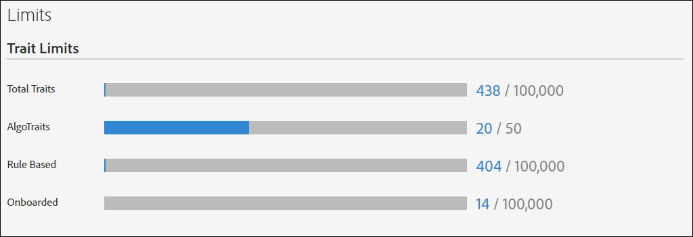

# Usage Limits{#usage-limits}

Audience Manager sets a maximum limit on the number of traits, segments, destinations, and algorithmic models that you can create for an account. Limits apply to these items whether created in the user interface or programmatically through API methods. Usage limits help protect Audience Manager from automated processes that may attempt to compromise our APIs or user interface.

Contents:

<ul class="simplelist"> 
 <li> <a href="../../c-features/c-administration/usage-limits.md#section_7181B0BBC194402BAC55E6846048D78F" format="dita" scope="local"> Item Limits </a> </li> 
 <li> <a href="../../c-features/c-administration/usage-limits.md#section_EBE3D23D14F54408911573211E2ED62D" format="dita" scope="local"> Monitor Usage </a> </li> 
 <li> <a href="../../c-features/c-administration/usage-limits.md#section_CAB5B9E4ED0D449A9DD97B04ECEF5838" format="dita" scope="local"> Increase Item Limits </a> </li> 
</ul>

## Item Limits {#section_7181B0BBC194402BAC55E6846048D78F}

The tables list the current limits by item type. You cannot create new traits, segments, destinations, or [!UICONTROL Algorithmic Models] if you reach a specific limit for one of these items. If you do reach a limit, you must delete an older item before you can create a new one.

**Trait Limits**

<table id="table_8870FECEDF774EB2BAB225269656EC6A"> 
 <thead> 
  <tr> 
   <th colname="col1" class="entry"> Trait Type </th> 
   <th colname="col2" class="entry"> Maximum Limit </th> 
  </tr> 
 </thead>
 <tbody> 
  <tr> 
   <td colname="col1"> 
 <b>Total Traits</b> 
 </td> 
   <td colname="col2"> 
100,000 
 </td> 
  </tr> 
  <tr> 
   <td colname="col1"> 
<b>Total Trait Qualifications</b> 
 </td> 
   <td colname="col2"> 
100,000. For more information on trait qualification, see the <a href="../../c-features/traits/trait-qualification-reference.md#concept_C27644821296475A84A7522847D92C9D" format="dita" scope="local"> Trait Qualifications Reference</a>. 
 </td> 
  </tr> 
  <tr> 
   <td colname="col1"> 
 <b>Algorithmic</b> 
 </td> 
   <td colname="col2"> 
50 
 </td> 
  </tr> 
  <tr> 
   <td colname="col1"> 
 <b>Rule Based</b> 
 </td> 
   <td colname="col2"> 
100,000 
 </td> 
  </tr> 
  <tr> 
   <td colname="col1"> 
 <b>Onboarded</b> 
 </td> 
   <td colname="col2"> 
100,000 
 </td> 
  </tr> 
  <tr> 
   <td colname="col1"> 
 <b>Folder Traits</b> 
 </td> 
   <td colname="col2"> 
2,000 
 </td> 
  </tr> 
 </tbody> 
</table>

**Segment Limits**

<table id="table_749EC62847C94855B624096F77850115"> 
 <thead> 
  <tr> 
   <th colname="col1" class="entry"> Segment Type </th> 
   <th colname="col2" class="entry"> Maximum Limit </th> 
  </tr> 
 </thead>
 <tbody> 
  <tr> 
   <td colname="col1"> 
 <b>Total Segments</b> 
 </td> 
   <td colname="col2"> 
20,000 
 </td> 
  </tr> 
 </tbody> 
</table>

**Destination Limits**

<table id="table_A1DA42251B04408E900DA36F2F3EE9DA"> 
 <thead> 
  <tr> 
   <th colname="col1" class="entry"> Destination Type </th> 
   <th colname="col2" class="entry"> Maximum Limit </th> 
  </tr> 
 </thead>
 <tbody> 
  <tr> 
   <td colname="col1"> 
 <b>Total Destinations</b> 
 </td> 
   <td colname="col2"> 
1,000 
 </td> 
  </tr> 
  <tr> 
   <td colname="col1"> 
 <b>Cookie</b> 
 </td> 
   <td colname="col2"> 
1,000 
 </td> 
  </tr> 
  <tr> 
   <td colname="col1"> 
 <b>URL</b> 
 </td> 
   <td colname="col2"> 
1,000 
 </td> 
  </tr> 
  <tr> 
   <td colname="col1"> 
 <b>S2S</b> 
 </td> 
   <td colname="col2"> 
100 
 </td> 
  </tr> 
  <tr> 
   <td colname="col1"> 
<b>Adobe Analytics</b> 
 </td> 
   <td colname="col2"> 
10 
 </td> 
  </tr> 
 </tbody> 
</table>

**Algorithmic Model Limits**

<table id="table_2FE310C0642444EAB0347EFA4A0B6C68"> 
 <thead> 
  <tr> 
   <th colname="col1" class="entry"> Item </th> 
   <th colname="col2" class="entry"> Maximum Limit </th> 
  </tr> 
 </thead>
 <tbody> 
  <tr> 
   <td colname="col1"> 
 <b>Total Algorithmic Models</b> 
 </td> 
   <td colname="col2"> 
20 
 </td> 
  </tr> 
  <tr> 
   <td colname="col1"> 
 <b> Algorithmic Models maximum audience size</b> 
 </td> 
   <td colname="col2"> 
25,000,000 
 Note that this limit cannot be increased. You can decrease audience sizes by selecting fewer data sources for the model or by selecting a shorter look-back window. </td> 
  </tr> 
  <tr> 
   <td colname="col1"> 
<b>Maximum number of excluded traits for a model</b> 
 </td> 
   <td colname="col2"> 
500 
 </td> 
  </tr> 
 </tbody> 
</table>

**Folder Limits**

<table id="table_444C721A9F46474B9891BB8AC50FDD2A"> 
 <thead> 
  <tr> 
   <th colname="col1" class="entry"> Item </th> 
   <th colname="col2" class="entry"> Maximum Limit </th> 
  </tr> 
 </thead>
 <tbody> 
  <tr> 
   <td colname="col1"> 
 <b>Trait Folders</b> 
 </td> 
   <td colname="col2"> 
2,000. 
 
Your folder structure can be maximum 5 levels deep. 
 </td> 
  </tr> 
 </tbody> 
</table>

**Derived Signals Limits**

<table id="table_CFF910496D984C77AF57702238F30AD5"> 
 <thead> 
  <tr> 
   <th colname="col1" class="entry"> Item </th> 
   <th colname="col2" class="entry"> Maximum Limit </th> 
  </tr> 
 </thead>
 <tbody> 
  <tr> 
   <td colname="col1"> 
 <b>Derived Signals</b> 
 </td> 
   <td colname="col2"> 
50,000. 
 </td> 
  </tr> 
 </tbody> 
</table>

**Company User Accounts Limit**

<table id="table_50ECCACCFA2C4F009276A6AEE280AF6C"> 
 <thead> 
  <tr> 
   <th colname="col1" class="entry"> Item </th> 
   <th colname="col2" class="entry"> Maximum Limit </th> 
  </tr> 
 </thead>
 <tbody> 
  <tr> 
   <td colname="col1"> 
 <b>Maximum number of user accounts for a company</b> 
 </td> 
   <td colname="col2"> 
1,000. 
 </td> 
  </tr> 
 </tbody> 
</table>

## Monitor Usage {#section_EBE3D23D14F54408911573211E2ED62D}

You can see usage and limits for your account by going to **[!UICONTROL Administration > Limits]**. Access requires administrator permissions.

## Increase Item Limits {#section_CAB5B9E4ED0D449A9DD97B04ECEF5838}

The default limits listed here should provide enough capacity for your business needs. If your organization consistently reaches these limits, contact your account representative to discuss an increase. 
