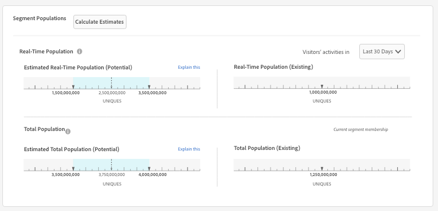

# Trait and Segment Population Data in Segment Builder{#trait-and-segment-population-data-in-segment-builder}

Add and remove traits in Segment Builder to see actual trait populations along with actual and estimated segment population data. The estimated population size data helps you build the right segment for your campaign.

## Trait Population Data {#section_FF2BA58491ED4BEDB112F6A482AFD716}

[!UICONTROL Segment Builder] shows you [!UICONTROL Total Trait Population] for the last day when you add a trait to a segment. This data appears in the blue field around your selected trait in the [!UICONTROL Basic View] section.

The following table defines the trait population metrics

<table id="table_9D837CF9ACA04D04BEE5925EC0B4A5D2"> 
 <thead> 
  <tr> 
   <th colname="col1" class="entry"> Metric </th> 
   <th colname="col2" class="entry"> Description </th> 
  </tr> 
 </thead>
 <tbody> 
  <tr> 
   <td colname="col1"> 
  Total Trait Population 
 </td> 
   <td colname="col2"> 
The number of unique IDs that have the selected trait in their profile. 
 </td> 
  </tr> 
 </tbody> 
</table>

## Calculating Real and Estimated Segment Populations {#section_9AE6ADE1934E42DDB10B63E2EB3C5DE6}

When you create a new segment, or change an existing segment, Audience Manager takes up to 24-hours to display results for actual real-time and total segment populations.

However, Audience Manager can immediately estimate the real-time and total population size of your segment. These estimates are based on sampled historical data and return results at the 95% confidence interval.

In [!UICONTROL Segment Builder], a blue bar on the estimated population graphs indicates the possible upper and lower ranges for segment size. Although past performance does not guarantee future results, the estimated data can help you understand the potential size of a new or edited segment.

## Segment Population Data Overview {#section_ED9F6B29E9D541499E3FC7C0A1753FCE}

[!UICONTROL Segment Builder] shows you segment population data as you create and edit segments.

* For estimated segment population data (real-time and total), [!UICONTROL Segment Builder] does not update the graphs automatically as you add or remove traits in a segment. Click **[!UICONTROL Calculate Estimates]** to see (or refresh) the estimated population numbers. 

* For actual (real) segment population data (real-time and total), [!UICONTROL Segment Builder] updates the segment graph automatically when you load an existing segment. For new segments, or when you add new traits to an existing segment, actual population data is not updated until 24-hours after the segment is created.

See the definitions below for more information about estimated and actual segment population data.

## Estimated Segment Population Data Defined {#section_EF725FC5D0A34C60B27A93E40EB820D1}

The following table defines the estimated population metrics.

<table id="table_B24503F372E34B6BBDF5204181701A59"> 
 <thead> 
  <tr> 
   <th colname="col1" class="entry"> Metric </th> 
   <th colname="col2" class="entry"> Description </th> 
  </tr>
 </thead>
 <tbody> 
  <tr> 
   <td colname="col1"> 
  Estimated Real-Time Population (Potential)  
 </td> 
   <td colname="col2"> 
The estimated number of unique visitors seen in real-time for the specified time range and who were qualified for the segment at the moment they were seen by Audience Manager. 
 
In  Segment Builder, the last 30-day populations for traits ( Total Trait Populations), can be different for traits and segments evaluated in real-times. 
 
 
     <ul id="ul_CAE803D09913462CAD413A665D85C1A2"> 
      <li id="li_3E64330D6F5B4D2F8F3456730A86894F">For traits, the last 30-day metric counts the number of unique users who qualified for that trait during the last 30-days. </li> 
      <li id="li_FF3CACD0B6C742CDB94D66200D77CE06">For segments evaluated in real-time, the last 30-day metric counts the number of users who have qualified for a trait (in that segment) at some point in the past and have been seen again by Audience Manager within the last 30-days. For example, say you have a user who qualified for a trait 60-days ago and was seen again 10-days ago. In the data, this user won't be added to the trait count because they first qualified for the trait more than 30-days ago. However, they will be included in the last 30-day count for the segments evaluated in real-time. This is because they've qualified for the segment within the 30-day time interval. </li> 
     </ul> 
 
 
Note: The  Estimated Real-Time Population metric does not include devices that have qualified for a segment based on connections provided by a  Profile Merge Rule that uses a <a href="../../c-features/profile-merge-rules/merge-rule-definitions.md#section_E83D68EC2ADA4030B1D0206AE6A6E8BF" format="dita" scope="local"> device graph option</a>. 
 
 </td> 
  </tr> 
  <tr> 
   <td colname="col1"> 
  Estimated Total Population (Potential) 
 </td> 
   <td colname="col2"> 
The estimated number of unique visitors who could be in your new or modified segment. As with almost any estimate, past performance does not guarantee future results, but you can use the estimated total to: 
 
 
     <ul id="ul_0490DD08C7C8493DADFB11B5872A73BC"> 
      <li id="li_AE38C8C8A4B24021BAC724B51A4799E2">See how many people a new or revised segment might reach as you build a segment. </li> 
      <li id="li_E830EC2B12DC46D4B0A4DD807A8936F6">Tune the segment depending on your goals. For example, large segments are useful for brand-awareness campaigns and smaller segments are useful for focused targeting or re-targeting campaigns. </li> 
     </ul> 
 
 
Note: The  Estimated Total Population metric does not include devices that have qualified for a segment based on connections provided by a  Profile Merge Rule that uses a <a href="../../c-features/profile-merge-rules/merge-rule-definitions.md#section_E83D68EC2ADA4030B1D0206AE6A6E8BF" format="dita" scope="local"> device graph option</a>. 
 
 </td> 
  </tr> 
 </tbody> 
</table>

## Existing (Actual) Segment Population Data Defined {#section_D837A7AE024D43FC977E118D753E548A}

[!UICONTROL Profile Merge Rules] affect the actual real-time and total population numbers. These totals vary depending on if the [!UICONTROL Profile Merge Rule] a segment belongs to uses a device graph option or not. See also, [Profile Merge Rule Options Defined](../../c-features/profile-merge-rules/merge-rule-definitions.md#concept_44FFF67CD9654DB2B43ECA13C2FD1CE0).

**Segment Population Data for Merge Rules Without a Device Graph Option**

The following table defines the actual real-time and total population metrics when your segments are used by a [!UICONTROL Profile Merge Rule] created without a device graph option. These are the device options settings **[!UICONTROL No Device Options]** and **[!UICONTROL Current Device Proflie]**.

<table id="table_A18C973855DB46A0B39B81F32E0E7540"> 
 <thead> 
  <tr> 
   <th colname="col1" class="entry"> Metric </th> 
   <th colname="col2" class="entry"> Description </th> 
  </tr> 
 </thead>
 <tbody> 
  <tr> 
   <td colname="col1"> 
  Real-Time Population (Existing) 
 </td> 
   <td colname="col2"> 
The actual number of unique visitors seen in real-time for the specified time range and who were qualified for the segment at the moment they were seen by Audience Manager. 
 
In  Segment Builder, the last 30-day populations for traits ( Total Trait Populations), can be different for traits and segments evaluated in real-time. 
 
 
     <ul id="ul_50D1528DDDF347858F17DA3C033B0E3F"> 
      <li id="li_ABA2BFE68FF4430DBB425C4661E1836A">For traits, the last 30-day metric counts the number of unique users who qualified for that trait during the last 30-days. </li> 
      <li id="li_1519068CBB1445E893657D12E8FE42AC">For segments evaluated in real-time, the last 30-day metric counts the number of users who have qualified for a trait (in that segment) at some point in the past and have been seen again by Audience Manager within the last 30-days. For example, say you have a user who qualified for a trait 60-days ago and was seen again 10-days ago. In the data, this user won't be added to the trait count because they first qualified for the trait more than 30-days ago. However, they will be included in the last 30-day count for the segments evaluated in real-time. This is because they've qualified for the segment within the 30-day time interval. </li> 
     </ul> 
 </td> 
  </tr> 
  <tr> 
   <td colname="col1"> 
  Total Population (Existing) 
 </td> 
   <td colname="col2"> 
The actual number of unique visitors who were qualified for the segment as of yesterday. 
 </td> 
  </tr> 
 </tbody> 
</table>

**Segment Population Data for Merge Rules With a Device Graph Option**

The following table defines the actual real-time and total population metrics when your segments are used by a [!UICONTROL Profile Merge Rule] created with a device graph option. These are the device options settings for the [!UICONTROL Profile Link Device Graph], the [!DNL Adobe] device graph, and other third-party device graph choices that are available to you.

<table id="table_157EC6E5B5C44EB899854CA10B090F60"> 
 <thead> 
  <tr> 
   <th colname="col1" class="entry"> Metric </th> 
   <th colname="col2" class="entry"> Description </th> 
  </tr> 
 </thead>
 <tbody> 
  <tr> 
   <td colname="col1"> 
  Real-Time Population (Existing) 
 </td> 
   <td colname="col2"> 
The actual number of devices seen in real-time with current profiles that, when merged with up to 3-other device profiles connected by the device graph, contains the traits to qualify for the segment the moment it was seen by  Audience Manager. 
 </td> 
  </tr> 
  <tr> 
   <td colname="col1"> 
  Total Population (Existing) 
 </td> 
   <td colname="col2"> 
The total number of devices with profiles that, when merged with up to 3-other device profiles connected by the device graph, were all qualified for the segment. 
 </td> 
  </tr> 
 </tbody> 
</table>

**Limitations due to Merge Rules When Estimating Segment Populations**

Presently, there is a known limitation because our segment size estimator does not account for profile merge rules. For example, look at segments with the "No Authenticated Profile + Current Device Profile" [merge rule](../../c-features/profile-merge-rules/merge-rule-definitions.md#concept_44FFF67CD9654DB2B43ECA13C2FD1CE0). Because of the way we currently compute the segment estimation numbers, the estimated populations will include authenticated profiles. However, the existing segment populations will correctly ignore authenticated profiles. 

>[!MORE_LIKE_THIS]
>
>* [Profile Merge Rules and Device Graph FAQ](faq-profile-merge.md#concept_C8E29A974E194B62B0BAC1CCDD0DF4FF)
>* [Profile Link](merge-rules-overview.md#concept_5FCB08A53C4D4C2B82800BC9FD2B8EC9)
