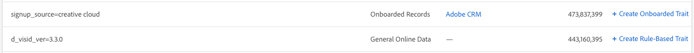

# Create Traits from [!UICONTROL Signal Dashboard] {#create-traits-from-signal-dashboard}

The Signal Dashboard allows you to create new traits from the Top Unused Signals , New Unused Signals, and your saved searches.

When you create a new trait, the trait type is pre-set based on the signal type:

* **Rule-based** traits for real-time signals, actionable log files and [!DNL Adobe Analytics] signals;

* **Onboarded** traits for onboarded signals.

To create new traits from the **[!UICONTROL Signal Dashboard]**, identify the signal that you want to use in the trait, then click the corresponding **[!UICONTROL Create Rule-Based Trait]** or **[!UICONTROL Create Onboarded Trait]** link.

You'll be redirected to the **[Trait Builder](../../../c-features/traits/about-trait-builder.md#concept_13D6537EE5D0459F870C58822AD5400A)** to create your new trait(s).

To create traits from multiple signals, use **[Signal Search](../../../c-features/data-explorer/data-explorer-create-trait/data-explorer-create-search.md#concept_D7D8B9F4A7844324952DD893DD9D851F)**.
