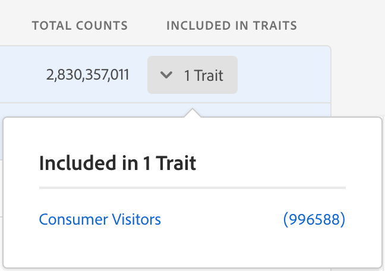

# Create Traits from Signal Search{#create-traits-from-signal-search}

Create traits based on used or unused signals that are not shown in the Signal Dashboard.

Search for specific signals and create rule-based or onboarded traits based on the results. Here's how to do this:

1. Go to **[!UICONTROL Audience Data > Signals > Search.]** 
1. Run a [Signals Search](../../../c-features/data-explorer/data-explorer-signals-search/data-explorer-signals-search.md#concept_B0C0DC44C3EC4CF8926847F9062F0EC0) based on the key-value pairs that you are looking for, or click **[!UICONTROL Search]**without entering any key-value pair to display all results. 

1. Identify the signal(s) that you want to use in the trait, in the results list.

    * To create a trait from one signal, click the corresponding **[!UICONTROL Create Rule-Based Trait]** or **[!UICONTROL Create Onboarded Trait]** link. 
    * To create a trait from multiple signals, click the corresponding check box of each signal, then click **[!UICONTROL Create Trait from Multiple Signals]**.

   >[!NOTE]
   >
   >You can only create traits from signals of the same type. You cannot create a trait based on a combination of a real-time signal and an onboarded one. 
   >
   >
   >   >
   >

   >
   >
   >You can create traits from used signals, too. Signals that are already used in traits have the number of traits displayed in the **[!UICONTROL Included in Traits]** column. Click the arrow to see the traits that include the signal. 
   >
   >
   >   >
   >

1. Use the ** [Trait Builder](../../../c-features/traits/about-trait-builder.md#concept_13D6537EE5D0459F870C58822AD5400A)** to create your new trait(s).

