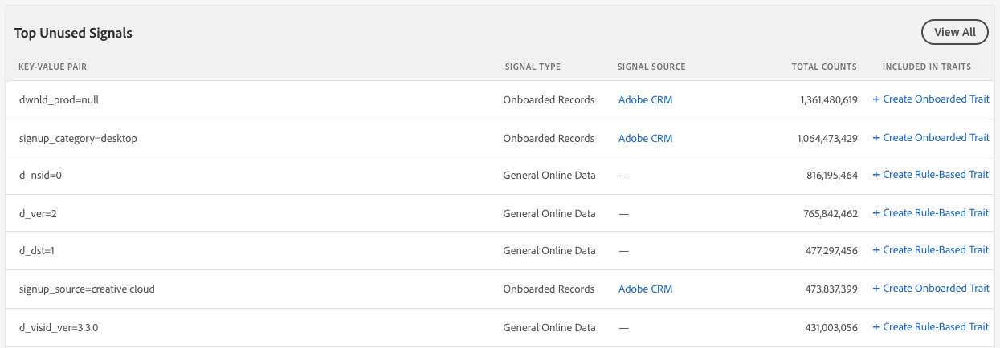

# Signals Dashboard {#signals-dashboard}

Get an overview of the unused signals received by Audience Manager in the past 7 days and identify potential new traits. Unused signals reach Audience Manager from your online properties, but are not used in any of your existing traits. To view the Signals Dashboard, go to Audience Data > Signals. The Signals Dashboard shows you actionable insights based on your most active unused signals.

>[!IMPORTANT]
>
>The **[!UICONTROL Top Unused Signals]** and **[!UICONTROL New Unused Signals]** sections only display records with more than **100 occurrences/hour**. Signals below that threshold are included in Signals Search.

## Top Unused Signals {#section_C77331736DC648BDB2B738DDAB8A2191}

This section shows you the top 50 unused signals (both new and old) sent to [!DNL Audience Manager] in the past 7 days, based on their total count. Depending on the data [!DNL Audience Manager] receives, this table can include some or all of the entries in the **New Unused Signals** table.

## New Unused Signals {#section_1D4BDFA0C07040B6B6E674BDC435F7B4}

This section shows you the top 50 new unused signals received in the past 7 days.

## Saved Searches {#section_F6E8033CDBE9496C90A6AAA7A4E92B35}

[!DNL Audience Manager] shows all your [saved searches](../../c-features/data-explorer/data-explorer-signals-search/data-explorer-save-search.md#task_F78A67C962D94C1D828B2A4941EAFB6A) on the [!UICONTROL Dashboard] and reloads them every time you load the [!UICONTROL Dashboard].

Saved searches display the top 50 results for the corresponding criteria.