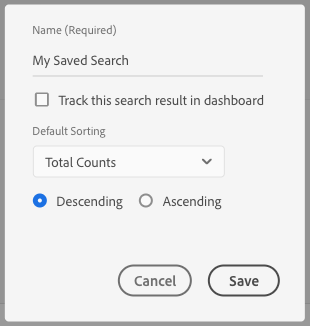
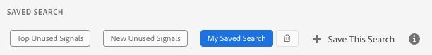

# Save Search Criteria{#save-search-criteria}

Optimize signal search efforts by saving up to 10 sets of search criteria to use whenever you need them, and track them on the Dashboard. Audience Manager reloads the saved searches every time you load the Dashboard.

1. Go to [!UICONTROL Audience Data > Signals > Search] and run a [!UICONTROL Signals Search] with the key-value pairs and/or the filters that you want to save for future searches.
1. Click **[!UICONTROL Save this Search]** once you get the search results.

   

1. Enter a suggestive name for the search, so you can identify it later.
1. (Optional) Enable the **[!UICONTROL Track this search result in the dashboard]** option if you want the signals dashboard to include the signals in the current search set.
1. Select the **[!UICONTROL Default Sorting]** criteria:

    * **[!UICONTROL Total Counts]**
    * **[!UICONTROL Key Name]**

1. Choose the **[!UICONTROL Default Sorting]** mode:

    * **[!UICONTROL Descending]**
    * **[!UICONTROL Ascending]**

1. Click **[!UICONTROL Save]**. You can see your saved search in the [!UICONTROL Saved Search] section, and use it whenever you need it.

   