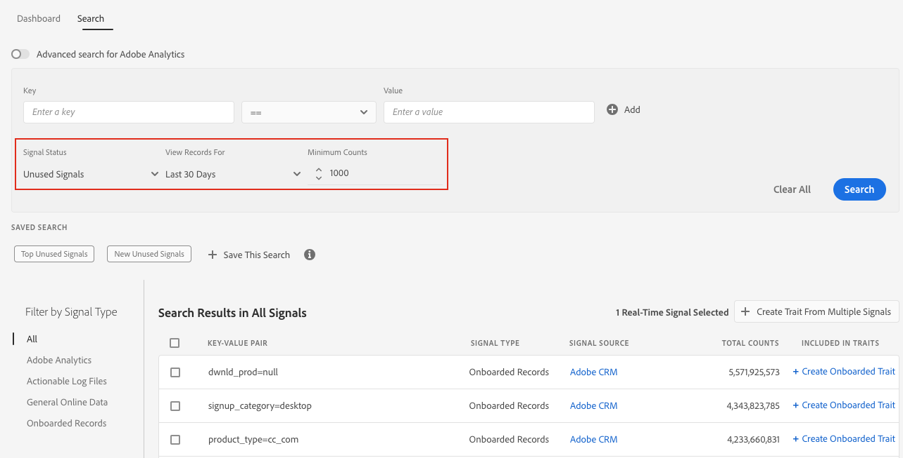

# Search Signals by Filters{#search-signals-by-filters}

Leave the key-value fields blank to search for a broader range of signals and use the available filters to narrow down the results.

Use this method when you don't have a specific key-value pair in mind, but want to see the evolution of multiple signals over a specific period of time.

In the example below, the filters are configured to show all the unused signals from the past 30 days with a minimum count of 1000.

