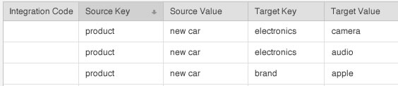

# Derived Signals {#derived-signals}

A [!UICONTROL derived signal] qualifies site visitors for additional traits based on a trait they've already seen. In other words, additional trait qualification can be derived from a currently exhibited trait even if a user has never seen the new trait before.

<!-- 
c_tb_derived_signal.xml
 -->

## Purpose of Derived Signals

In [!DNL Audience Manager], you can create a relationship between signals (or trait rules) passed in during an event call to other, specified signals or traits. For example, assume an event call passes in a signal composed of the key-value "product = new_car" ( `https://<domain alias>/event?product=new_car`). [!DNL Audience Manager] would connect that signal to any others created with the [!UICONTROL derived signals] tool. Although the associated signals can be any key-values you specify, they are most useful when linked to existing signals already set up as [!UICONTROL Trait Builder] rules. For example, in the illustration below, when a user action fires the signal "product = new car" that user can also qualify for traits defined by the target key and value signals.

## Location of [!UICONTROL Derived Signals]

Create and manage [!UICONTROL derived signals] in **[!UICONTROL Tools > Derived Signals]** from the sidebar navigation.

## Create a Derived Signal {#task_5F57826F8EA142C39A91F2FD2332035B}

<!-- 
t_tb_create_derived.xml
 -->

To create a [!UICONTROL derived signal]:

1. Select **[!UICONTROL Derived Signals]** from the [!UICONTROL Tools] menu.
1. Provide a:
    * *(Optional)* Integration Code
    * Source Key
    * Source Value
    * Target Key
    * Target Value
1. Click **[!UICONTROL Add Signal]**.

>[!MORE_LIKE_THIS]
>
>* [Edit a Derived Signal](../c-features/derived-signals.md#task_03A867938CD54F9F9A624C630CCDEC3E)
>* [Delete a Derived Signal](../c-features/derived-signals.md#task_956A182EC2A2487EB46A0EABC6768964)

## Edit a Derived Signal {#task_03A867938CD54F9F9A624C630CCDEC3E}

<!-- 
t_tb_edit_derived.xml
-->

To edit a [!UICONTROL derived signal]:

1. Hover over the signal, then click **[!UICONTROL Edit]**.
1. Make the required code, key, or value changes, then click **[!UICONTROL Save]**.

>[!MORE_LIKE_THIS]
>
>* [Create a Derived Signal](../c-features/derived-signals.md#task_5F57826F8EA142C39A91F2FD2332035B)
>* [Delete a Derived Signal](../c-features/derived-signals.md#task_956A182EC2A2487EB46A0EABC6768964)

## Delete a Derived Signal {#task_956A182EC2A2487EB46A0EABC6768964}

<!-- 
t_tb_delete_derived.xml
-->

To delete a [!UICONTROL derived signal], hover over the signal, then click **[!UICONTROL Delete]**.
