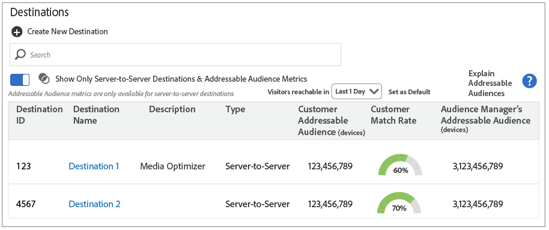

# Manage Destinations {#manage-destinations}

The Destination landing page lists all of your URL, cookie, and server-to-server destinations. It provides features that let you create, edit, search for, and report on destinations. The landing page is located in Audience Data > Destinations.

## Destinations Home Page {#concept_112CF0292676455592FC3A976D7B2F19}

The [!UICONTROL Destination] landing page lists all of your URL, cookie, and server-to-server destinations. It provides features that let you create, edit, search for, and report on destinations. The landing page is located in **[!UICONTROL Audience Data > Destinations]**.

## Default Landing Page {#section_6CD57AF083EC43C2BD3AA93D80441017}

<!-- destinations-home.xml -->

The default landing page lists and helps you manage all of your destinations. You can create, edit, and search for destinations here.

## Addressable Audiences Landing Page {#section_35CB44028A3B45B6B25FE1D05A5F16A5}

Slide the **[!UICONTROL Show Only Addressable Audience Metrics]** toggle to see audience data and match rates for your server-to-server destinations. When enabled, this feature:

* Lets you filter the report to return audience data and match rates for fixed time intervals.
* Returns data for server-to-server destinations only. Cookie and URL destinations are excluded from the list. Slide the toggle again to return to the default view.

>[!MORE_LIKE_THIS]
>
>* [Addressable Audiences](../../c-features/addressable-audiences.md#concept_8E0BAEF0978F4968B21482E79E601889)

## Destination Builder {#concept_4E07561F454E48DD986400E2B25A2224}

[!UICONTROL Destination Builder] lets you create cookie-based or URL destinations. You cannot create server-to-server (S2S) destinations with [!UICONTROL Destination Builder], but you can manage their segment mappings. Contact your consultant to set up a S2S destination. [!UICONTROL Destination Builder] is located in **[!UICONTROL Audience Data > Destinations]**.

## Destination Builder Settings {#section_CD7B38643BA34A4CABE50F24072A9DB3}

<!-- destination-builder.xml -->

[!UICONTROL Destination Builder] consists of the following sections and settings:  

<table id="table_64B5929CFEC84A308BBFC9FFCBAF1358"> 
 <thead> 
  <tr> 
   <th colname="col1" class="entry"> Destination Builder Section </th> 
   <th colname="col2" class="entry"> Purpose </th> 
  </tr>
 </thead>
 <tbody> 
  <tr> 
   <td colname="col1"><b>Basic Information</b> </td> 
   <td colname="col2"> Used to name the destination, describe it, and select destination type (URL or cookie), and platform (all, Android, browser, or iOS). </td> 
  </tr> 
  <tr> 
   <td colname="col1"><b>Configuration</b> </td> 
   <td colname="col2"> 
Includes controls for: 
 
    <ul id="ul_2E6AB51D5DEA44059CABDFA985E4C3D1"> 
     <li id="li_F8076EDA9D6243A4A4FF50BC3394FB3A">Passing in key-value data to URL destinations. You can send data as individual or serialized key-value pairs. For details see, <a href="../../c-features/destinations/key-value-pairs.md#concept_02436A7C6C574C799F079EB731A63262"> Destination Serialization</a> and <a href="../../c-features/destinations/key-value-pairs.md#concept_4CAA6E54ECFE4291B8626BEBEE98088A"> Standard and Serial Key-Value Pairs</a>. </li> 
     <li id="li_4DE7A032B315450CAE791D1A0C56774C">Elements of a cookie destination such as cookie name, domain, size, expiration interval, data format, etc. </li> 
    </ul> </td> 
  </tr> 
  <tr> 
   <td colname="col1"><b>Segment Mappings</b> </td> 
   <td colname="col2"> 
Lets you: 
     <ul id="ul_98A6E9B5C74341ACA00D807B728A88B7"> 
      <li id="li_578629E9962F46EC921EA75A2057FE95">Search for, add, and manage segments associated with <i>all</i> destination types. </li> 
      <li id="li_37BB2BDD6B2D4E4EA07B494CAE452CBF">Set delivery priorities on individual segments (for cookie-based segments only). </li> 
     </ul> 
 </td> 
  </tr> 
 </tbody>
</table>

## Data Delivery Methods {#section_EB5C0D945F7B46F3B860D22F0998F550}

Send information to a destination by passing it in through a URL string, by writing to a browser cookie, or through offline server-to-server data transfers.

* URL and cookie-based destinations transmit data synchronously, as a user takes action on a page.
* Server-to-server data transmission is asynchronous and can occur long after a user has left the page. The delivery type you select depends on your business requirements and how a particular data partner wants to, or can, receive data.

See [How to Choose a Destination Type](../../c-features/destinations/destinations.md#concept_88240D03005244DA91182932E9927003) for more information.

>[!MORE_LIKE_THIS]
>
>* [Create a Cookie Destination](../../c-features/destinations/manage-destinations.md#concept_2462AA1321984293A92CB174C41B3496)
>* [Create a URL Destination](../../c-features/destinations/manage-destinations.md#concept_51842672DFA943EA982B363E74D42DF8)

## Configure a Cookie Destination {#concept_2462AA1321984293A92CB174C41B3496}

A cookie destination returns and writes data to a cookie in the user's browser. The cookie contains data that can be read by other platforms that have access to the page. Follow these instructions to create a cookie destination with [!UICONTROL Destination Builder].

<!-- 
create-cookie-destination.xml
 -->

To create a new cookie destination, go to **[!UICONTROL Audience Data > Destinations > Create New Destination]** and complete the sections as described below.

## Basic Information {#section_2CA42BC9306E41D6B2CD310C35CB8F65}

This section contains fields and options that start the cookie destination creation process. To complete this section:

1. Click **[!UICONTROL Basic Information]** to expose the controls. 
1. Name the destination. Avoid abbreviations and special characters. 
1. *(Optional)* Describe the destination. A concise description is an effective way to define or provide more information about a destination. 
1. *(Optional)* In the **[!UICONTROL Platform]** list, leave the default set to **[!UICONTROL All]**. Currently, these options don't do anything. They're designed to support features that may be added at a later date. 
1. In the **[!UICONTROL Type]** list, click **[!UICONTROL Cookie]**. 
1. *(Optional)* Select an **[!UICONTROL Auto-fill Destination Mapping]**. Options include:
    * **[!UICONTROL Segment ID]**: Automatically adds and sends the segment ID to the destination. 
    * **[!UICONTROL Integration Code Value]**: Automatically adds and sends the segment integration code to the destination mapping. The integration code is a unique identifier created and used by the customer. It is limited to 255 characters, maximum.
1. Click **[!UICONTROL Next]** to go to the [!UICONTROL Configuration] settings or click **[!UICONTROL Data Export Labels]** to apply export controls to the destination.

## Data Export Labels {#section_DBA5FEE725E142AEA979BECBA7FE9DD5}

This section contains options that apply [data export controls](../../c-features/data-export-controls.md#concept_155AAFBA7D804467B6F8279D26C9D05C) to a cookie destination. Skip this step if you do not use data export controls. To complete this section:

1. Click **[!UICONTROL Data Export Labels]** to expose the controls. 
1. Select a label that corresponds to data export control applied to the destination (see [Add Export Labels to a Destination](../../c-features/destinations/manage-destinations.md#task_A4BA30472E6F4687AC3F1B33F51909D9) for details). 
1. Click **[!UICONTROL Save]**.

## Configuration {#section_51EDD4DAA8164DF996F21DD32485E62D}

This section contains fields and options that let you set up the cookie for your destination.

>[!NOTE]
>
>[!DNL Audience Manager] encodes data written to the destination cookie. For example, spaces are encoded as `%20` and semicolons are encoded as `%3B`. To complete this section:

1. Click **[!UICONTROL Configuration]** to expose the controls 
1. Name the cookie. Avoid abbreviations and special characters. 
1. Choose a data format option. These options let you choose the delimiters and separators for the key-value pairs that send segment data to a destination. Format options include:

    * **Single key:** Lets you set the key in a key-value pair. You'll set the value after you select a segment in the Segment Mappings section below. 
    * **Multi key:** Lets you set the key and value for a key-value pair. You'll create the key-value pair after you select a segment in the Segment Mappings section below.

   See [Standard and Serial Key-Value Pairs](../../c-features/destinations/key-value-pairs.md#concept_4CAA6E54ECFE4291B8626BEBEE98088A) for more information about these data elements.

1. Click **[!UICONTROL Save]**.

All other settings are optional. For more information about the **[!UICONTROL Cookie Domain]** and **[!UICONTROL Publish data to]** settings, see [Optional Settings for Cookie Destinations](../../c-features/destinations/manage-destinations.md#concept_DEF2E47F31D44BDA936BBB45EA5B136D).

## Segment Mappings {#section_E6CB4938AAB44C8C8EDD816516E6AE24}

This section lets you search for and add segments to your destination. To complete this section:

1. Click **[!UICONTROL Segment Mappings]** to expose the controls. 
1. In the **[!UICONTROL Search and Add Segments]** box, start typing the name of a segment or click **[!UICONTROL Browse All Segments]** to browse a list of available segments.

1. Click **[!UICONTROL Add Selected Segments]** when you find the segment you want to use. Adding a segment opens the [!UICONTROL Edit Mapping] window.

1. In the [!UICONTROL Edit Mapping] pop:

    * **[!UICONTROL Mapping]** lets you set a value for the key specified in the Configuration section above. 
    * **[!UICONTROL Publish from]** lets you set start and end date for the destination. If the end date is blank, the destination never expires.

1. Click **[!UICONTROL Save]**.
1. Click **[!UICONTROL Done]**.

## Configure a URL Destination {#concept_51842672DFA943EA982B363E74D42DF8}

A URL destination makes pixel calls from a page to your destination. Follow these instructions to create a URL destination with [!UICONTROL Destination Builder].

<!-- 
create-url-destination.xml
-->

To create a new URL destination, go to **[!UICONTROL Audience Data > Destinations > Create New Destination]** and complete the sections as described below.

## Basic Information {#section_7B13F3A2FD73432886D8FFCB377CBE8C}

This section contains fields and options that start the URL destination creation process. To complete this section:

1. Click **[!UICONTROL Basic Information]** to expose the controls. 
1. Name the destination. Avoid abbreviations and special characters. 
1. *(Optional)* Describe the destination. A concise description is an effective way to define or provide more information about a destination. 
1. *(Optional)* In the **[!UICONTROL Platform]** list, leave the default set to **[!UICONTROL All]**. Currently, these options don't do anything. They're designed to support features that may be added at a later date. 
1. In the **[!UICONTROL Type]** list, click **[!UICONTROL URL]**. 
1. *(Optional)* Select an **[!UICONTROL Auto-fill Destination Mapping]**. Options include:
    * **[!UICONTROL Segment ID]**: Automatically adds and sends the segment ID to the destination. 
    * **[!UICONTROL Integration Code Value]**: Automatically adds and sends the segment integration code to the destination mapping. The integration code is a unique identifier created and used by the customer. It is limited to 255 characters, maximum.
1. Click **[!UICONTROL Next]** to go to the [!UICONTROL Configuration] settings or click **[!UICONTROL Data Export Labels]** to apply export controls to the destination.

## Data Export Labels {#section_24858C4E36234493ABF33DF39501C1E9}

This section contains options that apply [data export controls](../../c-features/data-export-controls.md#concept_155AAFBA7D804467B6F8279D26C9D05C) to a URL destination. Skip this step if you do not use data export controls. To complete this section:

1. Click **[!UICONTROL Data Export Labels]** to expose the controls.
1. Select a label that corresponds to the data export control applied to the destination (see [Add Export Labels to a Destination](../../c-features/destinations/manage-destinations.md#task_A4BA30472E6F4687AC3F1B33F51909D9) for details).
1. Click **[!UICONTROL Save]**.

## Configuration {#section_A8AB50168B674B46BE80771B9BAF37DD}

This section contains options that let you set a base URL and data delimiters passed in by the URL string. This section is optional. To complete this section:

1. Click **[!UICONTROL Configuration]** to expose the controls. 
1. *(Optional)* Select the **[!UICONTROL Serialize]** check box.

   This lets you send segments to a destination sequentially rather than making separate calls for each segment. Serialization helps make data transfers efficient. Selecting this check box exposes the URL and delimiter fields. For more information, see [Standard and Serial Key-Value Pairs](../../c-features/destinations/key-value-pairs.md#concept_4CAA6E54ECFE4291B8626BEBEE98088A).

1. If you select **[!UICONTROL Serialize]**, then you must also configure the URL and delimiter fields described below.

<table id="table_6D14A180300B4EFA8324958CFE9854DA"> 
 <thead> 
  <tr> 
   <th colname="col1" class="entry"> Field </th> 
   <th colname="col2" class="entry"> Description </th>
  </tr>
 </thead>
 <tbody> 
  <tr> 
   <td colname="col1"> 
 Base URL 
 </td>
   <td colname="col2"> 
The base part of a standard HTTP URL that does not change. Also, you need to place the  %ALIAS% <a href="../../c-features/destinations/destination-macros.md#reference_B2F4AE643702440D879EFFE4A3FAAEDB"> placeholder macro</a> in the base URL. 
 
Example:  https://www.myCompany.com/?%alias%... 
 </td> 
  </tr> 
  <tr> 
   <td colname="col1"> 
 Secure URL 
 </td> 
   <td colname="col2"> 
The base part of a secure HTTPS URL that does not change. Also, you need to place the  %ALIAS% <a href="../../c-features/destinations/destination-macros.md#reference_B2F4AE643702440D879EFFE4A3FAAEDB"> placeholder macro</a> in the base URL. 
 
Example:  https://www.myCompany.com/?%alias%... 
 </td> 
  </tr> 
  <tr> 
   <td colname="col1"> 
 Delimiter 
 </td> 
   <td colname="col2"> 
The symbol that separates the segment variables in the URL string. This is usually a comma or semi-colon. Get this information from your destination partner. 
 </td> 
  </tr> 
 </tbody> 
</table>

## Segment Mappings {#section_45FF2A8E4EB648488578365DB5D15219}

This section lets you search for and add segments to your destination. To complete this section:

1. Click **[!UICONTROL Segment Mappings]** to expose the controls. 
1. In the **[!UICONTROL Search and Add Segments]**box, start typing the name of a segment or click **[!UICONTROL Browse All Segments]** browse a list of available segments.
1. Click **[!UICONTROL Add Selected Segments]** when you find the segment you want to use. Adding a segment opens the [!UICONTROL Edit Mapping] window. 
1. In [!UICONTROL Edit Mapping]:
    * **[!UICONTROL Mappings]**: Provide the key-value pairs used by the segment. 
    * **[!UICONTROL Start Date]** and **[!UICONTROL End Date]**: Choose a start and end date for the destination. If the end date is blank, the destination never expires.
1. Click **[!UICONTROL Done]**.

## Optional Settings for Cookie Destinations {#concept_DEF2E47F31D44BDA936BBB45EA5B136D}

In [!UICONTROL Destination Builder], the [!UICONTROL Configuration section] contains the [!UICONTROL Cookie Domain] and [!UICONTROL Publish Data To] fields. These let you create rules to determine if a destination sets a cookie or returns a cookie. [!UICONTROL Cookie Domain] and [!UICONTROL Publish Data To] work independently of each other and are optional. You can create a cookie destination without using either of them.

## Cookie Domain: Syntax and Examples {#section_FBCBE71119364EDCB7BDA5969BEB5845}

<!-- 
cookie-destination-options.xml
-->

<table id="table_4F4F7562AFEE49F8917AAE5712B5CCE4"> 
 <thead> 
  <tr> 
   <th colname="col1" class="entry"> Cookie Domain </th> 
   <th colname="col2" class="entry"> Description </th> 
  </tr>
 </thead>
 <tbody> 
  <tr> 
   <td colname="col1"> 
<b>Syntax</b> 
 </td> 
   <td colname="col2"> 
The  Cookie Domain field accepts a simple text string that lets you set cookies on a specified domain or all domains. When using this feature: 
 
 
     <ul id="ul_473CB59F2C0C4B358201BE5C8B27D73D"> 
      <li id="li_4E7F4691C1B54415963F7D5AA1558C9A">Set only one domain for each cookie destination. Do not type multiple domains in the  Cookie Domain field. Create another  Destination instead. </li> 
      <li id="li_AEBF5C5F3C264C5EA4A2A6063C3F377D">Do not use wildcard characters. </li> 
     </ul> 
 
 Leave the  Cookie Domain field blank to set a cookie on all domains. This is the default setting. 
 
To set cookies on a specific domain and sub-domains: 
 
 
     <ul id="ul_F25BC0D8C40641A2A5CA338E5C258435"> 
      <li id="li_E236D8DEE4F24F9BBA36074F7049C12C">Type the name of the domain in the  Cookie Domain field. </li> 
      <li id="li_0471C198EE344DE5963A3C2F70B9E78B">Start the domain name with a period. For example,  .somedomain.com. </li> 
      <li id="li_73D06F2BEF45487280C2245E1F6B8ED0">The  https://www prefix is not required. </li> 
     </ul> 
 </td> 
  </tr> 
  <tr> 
   <td colname="col1"> 
<b>Example</b> 
 </td> 
   <td colname="col2"> 
As a simple example, let's say we have a fictitious site called sports.com. Sports.com has domains for golf, baseball, and football. To set a cookie in all the sports domains, you would type that in the  Cookie Domain box as shown below: 
 
  
 
This tells  Audience Manager to set a cookie in any domain that contains the pattern  something.sports.com. See below for a more complex set of examples. 
 </td> 
  </tr> 
 </tbody> 
</table>

### Complex Cookie Domain Examples

These examples show you if [!DNL Audience Manager] will set a cookie based on how the [!UICONTROL Cookie Domain] option is configured.

<table id="table_3A7B9479CDA6493FA8104D8D9841E914"> 
 <thead> 
  <tr> 
   <th colname="col1" class="entry"> Website </th> 
   <th colname="col2" class="entry">Cookie Domain: .sports.com 
Cookie Set 
 </th> 
   <th colname="col3" class="entry">Cookie Domain: .golf.sports.com 
Cookie Set 
 </th> 
   <th colname="col4" class="entry">Cookie Domain: Blank 
Cookie Set 
 </th> 
  </tr> 
 </thead>
 <tbody> 
  <tr> 
   <td colname="col1"> 
 <b>sports.com</b> 
 </td> 
   <td colname="col2"> Yes </td> 
   <td colname="col3"> No </td> 
   <td colname="col4"> Yes </td> 
  </tr> 
  <tr> 
   <td colname="col1"> 
 <b>golf.sports.com</b> 
 </td> 
   <td colname="col2"> Yes </td> 
   <td colname="col3"> Yes </td> 
   <td colname="col4"> Yes </td> 
  </tr> 
  <tr> 
   <td colname="col1"> 
 <b>baseball.sports.com</b> 
 </td> 
   <td colname="col2"> Yes </td> 
   <td colname="col3"> No </td> 
   <td colname="col4"> Yes </td> 
  </tr> 
  <tr> 
   <td colname="col1"> 
 <b>sports.golf.com</b> 
 </td> 
   <td colname="col2"> No </td> 
   <td colname="col3"> No </td> 
   <td colname="col4"> Yes </td> 
  </tr> 
 </tbody> 
</table>

## Publish Data To {#section_EA7859C18BF641E18136E5FE84401B0C}

The [!UICONTROL Publish Data To] settings return a cookie if the domain meets the criteria set by the options you select. Options include:

* **[!UICONTROL All of our domains]**: (Default) Returns a cookie for any domain. 
* **[!UICONTROL Only the selected domains]**: Returns a cookie only for the domains selected in the domains list.
* **[!UICONTROL All of our domains except the selected domains]**: Prevents selected domains from receiving a cookie. All other domains can receive a cookie.

>[!MORE_LIKE_THIS]
>
>* [Create a Cookie Destination](../../c-features/destinations/manage-destinations.md#concept_2462AA1321984293A92CB174C41B3496)

## Add or Edit Segments for Server-to-Server Destinations {#task_1B9A6418E2F24C9CA5888F09679204C0}

You can only add or edit segments for a server-to-server (s2s) destination. You cannot create s2s destinations with [!UICONTROL Destination Builder]. Contact your consultant to set up s2s destinations. Follow these instructions to add or edit segments for a s2s destination.

<!-- 
destination-s2s-edit.xml
 -->

To add or edit segment mappings for an s2s destination: 

1. Go to **[!UICONTROL Audience Data > Destinations]** and find the s2s destination you want to work with.
2. In the [!UICONTROL Action] column, click the pencil icon to edit the destination.
   
   * In the **[!UICONTROL Search and Add Segments]** box, start typing the name of a segment or click **[!UICONTROL Browse All Segments]** browse a list of available segments.
   * Click **[!UICONTROL Add Selected Segments]** when you find the segment you want to use. Adding a segment opens the [!UICONTROL Edit Mapping] window.
   * In [!UICONTROL Edit Mapping]:
        * **[!UICONTROL Mappings]**: Set a value for the [key-value pair](../../c-features/destinations/key-value-pairs.md#concept_4CAA6E54ECFE4291B8626BEBEE98088A) used by this destination.
        * **[!UICONTROL Start Date]** and **[!UICONTROL End Date]**: Choose a start and end date for the destination. If the end date is blank, the destination never expires.
3. Click **[!UICONTROL Save]** and then click **[!UICONTROL Done]**.

## Add Data Export Labels to a Destination {#task_A4BA30472E6F4687AC3F1B33F51909D9}

[!DNL Data Export Labels] work with the [!DNL Export Controls] you set on a data source. [!DNL Data Export Labels] prevent you from adding restricted traits to a segment and from sending segment data to a destination. You can set multiple export labels to a new or existing cookie or URL destination.

>[!NOTE]
>
>To add an export label, you need administrator permissions *or* sufficient privileges to create or edit a destination.

<!-- 
t_export_labels.xml
-->

To add export labels to a destination:

1. Click **[!UICONTROL Audience Data]**:

    * For new destinations: Click **[!UICONTROL Create New Destination]**. Complete the [!UICONTROL Basic Information] section before you select a data export label. See [Create a Cookie Destination](../../c-features/destinations/manage-destinations.md#concept_2462AA1321984293A92CB174C41B3496) or [Create a URL Destination](../../c-features/destinations/manage-destinations.md#concept_51842672DFA943EA982B363E74D42DF8) for information.
    * For existing destinations: Use the [!DNL Search] box to find your destination or scroll through the list and click on the destination name to open it.

2. Select a [!DNL Data Export Label]. Leave the check boxes blank if you don't want to set any export restrictions. Export labels include the following options:

    * **[!UICONTROL This destination may enable a combination with personally identifiable information (PII)]**
    * **[!UICONTROL This destination may be used for on-site ad targeting]**
    * **[!UICONTROL This destination may be used for for off-site ad targeting]**
    * **[!UICONTROL This destination may be used for for on-site ad personalization**

   >[!IMPORTANT]
   >
   >Export restrictions will not work unless you set a [matching export control](../../c-features/data-export-controls.md#concept_155AAFBA7D804467B6F8279D26C9D05C) on a data source.

3. Click **[!UICONTROL Save]**.

>[!MORE_LIKE_THIS]
>
>* [Create a Data Source](../../c-features/manage-datasources.md#concept_3B7696B3EC77416492D3B99EBD79EA44)
