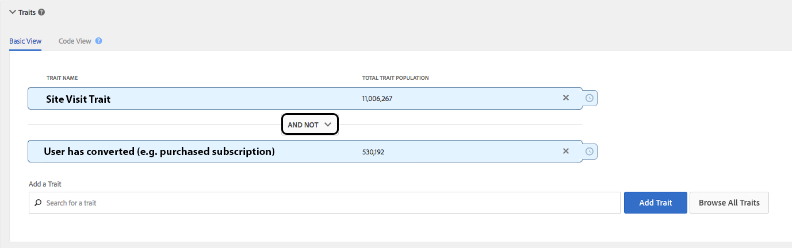
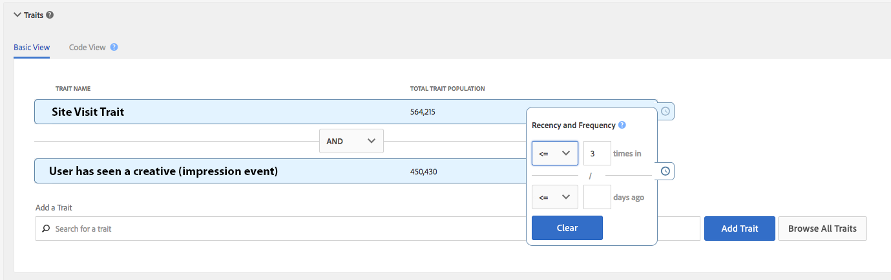

# [!UICONTROL Instant Cross-Device Suppression] {#instant-cross-device-suppression}

[!UICONTROL Instant Cross-Device Suppression] is the ability to suppress users across multiple devices connected to them when a particular experience occurs on any of these devices. Use the Instant Cross-Device Suppression capability to deliver a consistent experience across devices to your users. This experience is made possible by the real-time unsegment capabilities in Audience Manager.

## Overview {#section_FC781AE134C143B7B0E3146A536B14B5}

[!UICONTROL Instant Cross-Device Suppression] delivers two key use cases: improved user experience and media efficiency.

* **An improved user experience**: Users that already purchased your product or service will not see the same creatives as before the purchase. Instead, you could display upselling or cross-selling messages for products or services that you know they have not purchased.
* **Media efficiency**: Optimize your campaign spending by applying a global frequency cap across all DSPs. The frequency cap can be actioned in real-time for multiple devices belonging to a user.

The technical details of the real-time unsegmentation are described in length in [Profile Merge Rules and Device Un-Segmentation Processes](../../c-features/profile-merge-rules/merge-rule-unsegment.md#concept_E683A925C0854AF1A63479249734AEB4). Read on for the practical implementation of the use cases described above.

## Do Not Target Once Converted {#section_14BF16980B72499AB800B6B163368DBE}

Assure that your users that have already converted (purchased a product, acquired a subscription, etc.) will not see the same messaging as before the conversion. You can obtain this using the [!UICONTROL AND NOT] logic, as follows.

1. Create a segment using two traits, and use the [!UICONTROL AND NOT] logic, as shown in the image below. You must use a rule-based trait to define the conversion event for the unsegment to be triggered in real-time. Read more about how to [create rule-based traits](../../c-features/traits/create-onboarded-rule-based-traits.md#create-rules-based-or-onboarded-traits).

1. Map the segment to any number of real-time server-to-server destinations. Read on about how to add segments to [server-to-server destinations](../../c-features/destinations/manage-destinations.md#task_1B9A6418E2F24C9CA5888F09679204C0).

Your visitors qualify for the segment as long as they have not converted. As soon as they qualify for the conversion trait, they cease to follow the segment rule and are instantly removed from the segment.

## Do Not Target After x Impressions {#section_9A5343E4F9EA4E15B899281423BB1E9C}

You can make sure you are not flooding your users with the same creative by setting recency and frequency controls. In this scenario, create a segment with two traits, as outlined in the steps below.

1. Create a segment using two traits, and use the [!UICONTROL AND] logic, as shown in the image below. You must use a rule-based trait to define the impression event for the unsegment to be triggered in real-time. Read more about how to [create rule-based traits](../../c-features/traits/create-onboarded-rule-based-traits.md#create-rules-based-or-onboarded-traits).

   >[!NOTE]
   >
   >You can use [!UICONTROL Actionable Log Files] or [!UICONTROL Pixel Calls] to create traits based on user impressions. Read more about [Actionable Log Files](../../c-integration/media-data-integration/actionable-log-files.md#concept_464D49C698A04E26AFD8AA0F640E5EB3) and [Pixel Calls](../../c-integration/media-data-integration/impression-data-pixels.md#concept_83852AB68E344D4F8933665C895322C2).

1. Apply frequency controls to the second trait. If you wish, you can add recency controls, as well. Read more about [how to apply recency and frequency controls](../../c-features/c-segments/recency-and-frequency.md#concept_957D9E1977774D28A98ACEE6035E7B37).
1. Map the segment to any number of real-time server-to-server destinations. Read on about how to add segments to [server-to-server destinations](../../c-features/destinations/manage-destinations.md#task_1B9A6418E2F24C9CA5888F09679204C0).

In this scenario, once your users have accumulated more than three impressions, they will be removed from this segment and will not see this particular creative anymore.

## Important Aspects to Note - Processing {#section_594C7E6E2F7947ED9681214D0AF07287}

Keep in mind these aspects related to processing:

* For the real-time unsegment capability to work, you must map the desired segments to realtime server-to-server destinations.
* For devices connected to a device by a [device graph](../../c-features/profile-merge-rules/profile-link-use-case.md#section_88E3469E94E14453AF6891B8ADA0933B), we enforce a four-device limit regarding evaluation and unsegmentation. This limitation is described in [Device Graph Options and Device Unsegmentation](../../c-features/profile-merge-rules/merge-rule-unsegment.md#section_23A08D8D7E1541A8B0C701222D5032FC).​
* The unsegment command will be included in a batch file, that is sent to destinations every 24 hours, for multiple devices connected by the device graph. 
* The device must be seen in real-time (on the [Edge](../../reference/system-components/components-edge.md#concept_DD36E2B5A23D4CC5A91CA9808B908B8E)) to prompt segment evaluation. For traits that have a [!UICONTROL time-to-live (TTL)] value, even if a trait TTL is met, the device will *not* automatically be unsegmented until the device is next seen in real-time.​ Read more about how to [Set a Trait Expiration Interval](../../c-features/traits/create-onboarded-rule-based-traits.md#task_F17639E26C2744A0942461FCCD4D4DC7).
* If you are using the [!UICONTROL DCS API] to on-board rule-based traits in real-time, you can trigger the unsegment with the use of the [!UICONTROL AND NOT] logic. Read more about [sending data to the DCS API](../../c-api/dcs-intro/dcs-event-calls/dcs-url-send.md#concept_9F6C569C1E444002ADF2A43516A9F284).​

## Important Aspects to Note - Timing {#section_03B59052F4CA4706B8EF32B05C78A499}

Keep in mind these aspects related to timing:

* A segment will be stored on the [Edge](../../reference/system-components/components-edge.md#concept_DD36E2B5A23D4CC5A91CA9808B908B8E) for the same time period as a device profile is stored on the [!UICONTROL Edge], namely 14 days since last real-time interaction. Read more about data retention in our [Data Retention FAQ](../../faq/faq-privacy.md#section_20FF2BAAAA504153B36C420A5ECFB458).
* It takes approximately 24 hours for the unsegment operation to propagate across [!UICONTROL DCS] regions. Read more about our [!UICONTROL DCS] regions [here](../../reference/system-components/components-data-collection.md#concept_66CFFEBF5E8B41ED94082D562A93506E) and [here](../../c-api/dcs-intro/dcs-api-reference/dcs-regions.md#concept_01C1E017A6694D1EAF9BF65BFFA54091).