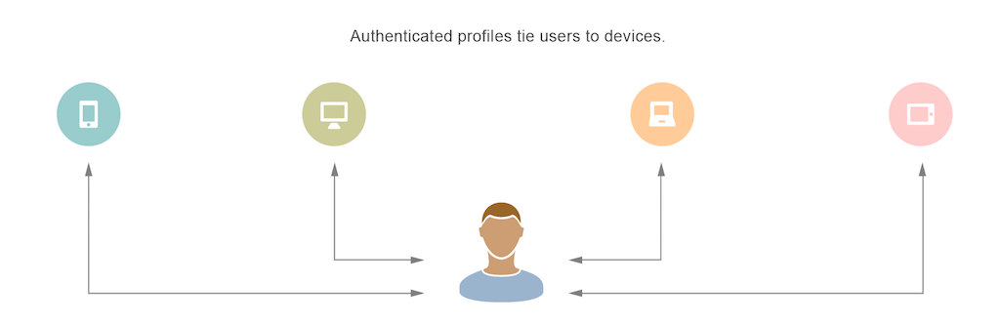

# [!UICONTROL Profile Merge Rules] Overview {#profile-merge-rules-overview}

With [!UICONTROL Profile Merge Rules] you get control over the data sets used for segmentation and can target a person accurately across multiple devices.

## Data collection and targeting with anonymous and authenticated profiles {#section_BD3D99245BE049CDA00FD0371C008407}

Typically, audience segmentation and targeting relies on data collected from all users on a device. Data collection and targeting based on device-level data has some disadvantages. For example, you cannot distinguish between multiple users who share a device or accurately target users across multiple devices. Device-centered data collection is no longer sufficient for digital marketing campaigns or cross-device targeting.

[!UICONTROL Profile Merge Rules] fundamentally changes how [!DNL Audience Manager] collects data and segments users for targeting. It lets you work with 2 distinct types of profiles, a device profile and an authenticated profile.

<table id="table_CE98C0E32A964B27804736A896233869"> 
 <thead> 
  <tr> 
   <th colname="col1" class="entry"> Profile type </th> 
   <th colname="col2" class="entry"> Description </th> 
  </tr> 
 </thead>
 <tbody> 
  <tr> 
   <td colname="col1"> Device profile </td> 
   <td colname="col2"> 
A device profile is tied to an ID for a given device such as a cookie ID or mobile device ID. It includes: 
 

     <ul id="ul_0420875DE65E44FFAC76E0DD205CFEC4"> 
      <li id="li_044AD85C644A41FB8EF48164BAC0CE34">Rule-based traits realized when a user is not authenticated. </li> 
      <li id="li_984D9790A6984139AFCFC2DFE4DF1BFC">Onboarded traits tied to a device ID such as cookie-based, third-party data. </li>
     </ul> 
 </td>
  </tr>
  <tr> 
   <td colname="col1"> Authenticated profile </td> 
   <td colname="col2"> 
The authenticated profile is tied to a user ID passed in when a person logs in to your site. It includes 

    <ul id="ul_18319CAA875148DBAE095134D42637B3"> 
     <li id="li_E24BD33E049849E5A594B0750F530475">Rule-based traits collected across devices when a user is authenticated. </li>
     <li id="li_531AC9E0EC9D45108457FEC8E8D4E66C">Onboarded traits in an offline file linked to the same user ID. </li>
    </ul> </td>
  </tr>
 </tbody>
</table>

These different profiles control the data you can use for segmentation. For example, with an authenticated profile, you can build accurate segments based on data from multiple devices for a single person. This means you can deliver a consistent brand experience to customers across multiple devices. Additionally, cross-device authentication allows [!DNL Audience Manager] to map the different platforms a person uses for their online activities. This is called the [!UICONTROL Profile Link Device Graph].

## Advantages {#section_F1435624BCBD478AACD13F11BB6A8840}

With [!UICONTROL Profile Merge Rules] you can:

* Target users based on authenticated profiles, anonymous profiles, or combinations of both.
* Target a specific customer across their devices.
* Build a device graph based on deterministic data.
* Fine tune the data in your segments based on different profiles.
* Gain additional insight into your audience.

## Getting started {#section_37AC1FDD30E74B1FB97367026FC72461}

See the following sections and the [FAQ](../../faq/faq-profile-merge.md#concept_C8E29A974E194B62B0BAC1CCDD0DF4FF) for more information about [!UICONTROL Profile Merge Rules].

>[!MORE_LIKE_THIS]
>
>* [Profile Merge Rules FAQ](../../faq/faq-profile-merge.md#concept_C8E29A974E194B62B0BAC1CCDD0DF4FF)
