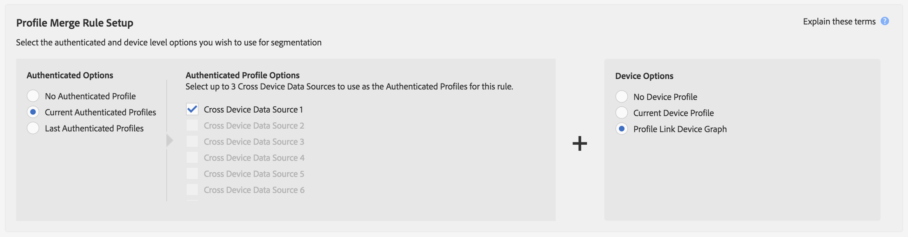

# Profile Link Device Graph Use Cases{#profile-link-device-graph-use-cases}

Recommendations and use cases for segment retargeting and personalized segment qualification with the Profile Link device graph.

Contents:

<ul class="simplelist"> 
 <li> <a href="../../c-features/profile-merge-rules/profile-link-use-case.md#section_88E3469E94E14453AF6891B8ADA0933B"> Recommendations </a> </li> 
 <li> <a href="../../c-features/profile-merge-rules/profile-link-use-case.md#section_2778EE45F23A4977811B74CDFCF100A9"> Retargeting Use Case and Profile Merge Rule Configuration </a> </li> 
 <li> <a href="../../c-features/profile-merge-rules/profile-link-use-case.md#section_D0479113B03347A0976AEE8617E9CCCB"> Personalization Use Case and Profile Merge Rule Configuration </a> </li> 
</ul>

## Recommendations {#section_88E3469E94E14453AF6891B8ADA0933B}

Consider the [!UICONTROL Profile Link] device graph for campaigns that:

* Have a high-level of authentication across their digital properties. Use an [external device graph option](../../c-features/profile-merge-rules/merge-rule-definitions.md#section_E83D68EC2ADA4030B1D0206AE6A6E8BF) if you have a small amount of authenticated users. 
* Require accurate targeting of known audiences. The [!UICONTROL Profile Link device graph] is built using first-party, authenticated data. 
* Target known audiences across their authenticated and unauthenticated states in real-time.

## Retargeting Use Case and Profile Merge Rule Configuration {#section_2778EE45F23A4977811B74CDFCF100A9}

Retarget audiences which have previously authenticated on-site and/or in-app across multiple devices. Segments can be composed of the following profiles:

* Last known authenticated device profile. 
* Anonymous activity across each device profile.

>[!NOTE]
>
>Trait information from either profile type can be used to create the segment.

**Retargeting Example**

Let's take a look at how this works with a sample credit card company. This example uses trait information collected from anonymous activity seen across 3 device profiles only.

<table id="table_8C5ABA47A0634EBA9B1AA1B5C2AABF07"> 
 <thead> 
  <tr> 
   <th colname="col1" class="entry"> Use Case </th> 
   <th colname="col2" class="entry"> Description </th> 
  </tr> 
 </thead>
 <tbody> 
  <tr> 
   <td colname="col1"> 
 <b>Conditions</b> 
 </td> 
   <td colname="col2"> 
This use case assumes these conditions: 
 
 
     <ul id="ul_72373D0F304044AE84E4CC055E3E8154"> 
      <li id="li_375DA786ED4D4F18A74C8FE42ABF8448">A user has 3 devices and has been the last person to authenticate on the credit card company site/app on all 3 devices. </li> 
      <li id="li_77FDBFAED21B4DE19AB2B6C112E0C64B">On the first device, a user in an unauthenticated state views an offer for a premium credit card. </li> 
      <li id="li_D3BE1B30BCCA49EA931AA9D97DD5F86D">On the second device, a user in an unauthenticated state views the premium credit card benefits page. </li> 
      <li id="li_39D894624FC44806B6DB2C77F459B39E">On the third device, a user in an unauthenticated state views the premium credit card fees and rates page. </li> 
     </ul> 
 </td> 
  </tr> 
  <tr> 
   <td colname="col1"> 
 <b>Results</b> 
 </td> 
   <td colname="col2"> 
Given these conditions,  Audience Manager: 
 
 
     <ul id="ul_1B6174F5C3AF4C32831D4217C5113789"> 
      <li id="li_98FE54696B604C3C8D93CC1C1FBB48D9">Merges the anonymous, unauthenticated activity collected from all 3 devices using the last authenticated profile on the current device. </li> 
      <li id="li_A73C7DCE36BA42B6BAD26D8A075416C1">Evaluates the anonymous user for segment qualification based on: 
       <ul id="ul_EF66EAFD12CA44F5ACCB66319606D937"> 
        <li id="li_541762056ECF4BC1ABF1F5116B5FED6C">A combination of anonymous activity across all 3 devices. </li> 
        <li id="li_C386CB62E5234E10AFEDE900ADC0E261">The last authenticated profile on the current device. </li> 
       </ul> </li> 
      <li id="li_5C9BDC8FF886494589F005C9658A923C">Sends the segment to any real-time destination for retargeting across all 3 devices. </li> 
     </ul> 
 </td> 
  </tr> 
 </tbody> 
</table>

**Retargeting Profile Merge Rule Example**

To set up retargeting with [!UICONTROL Profile Link], your [!UICONTROL Authenticated Options] and [!UICONTROL Device Options] should look like the rule configuration shown below. The [!UICONTROL Authenticated Profile] options will be different from this example because these settings use the names of your cross-device data sources.

## Personalization Use Case and Profile Merge Rule Configuration {#section_D0479113B03347A0976AEE8617E9CCCB}

Personalize the experience for authenticated audiences on-site and/or in-app based on activity across multiple devices. Segments can be composed of the following profiles:

* Currently authenticated device profile. 
* Anonymous device profiles.

>[!NOTE]
>
>A user must be in an authenticated state to qualify for a segment.

**Personalization Example**

Let's take a look at how this works with a sample credit card company.

<table id="table_D2F4D5D27EB54224BB2CC1D843DDEDA3"> 
 <thead> 
  <tr> 
   <th colname="col1" class="entry"> Use Case </th> 
   <th colname="col2" class="entry"> Description </th> 
  </tr> 
 </thead>
 <tbody> 
  <tr> 
   <td colname="col1"> 
 <b>Conditions</b> 
 </td> 
   <td colname="col2"> 
Our use case assumes these conditions: 
 
 
     <ul id="ul_C4D2108E7B1C4D3C89411A9CCCDA6DAC"> 
      <li id="li_2F10EB17466B4B91A94DF707C3CB6BE5">A user has 3 devices and has been the last person to authenticate on the credit card company site/app on all 3 devices. </li> 
      <li id="li_1559C4DA51254BCF95291133F32A4057">On the first device, a user in an unauthenticated state views an offer for a premium credit card. </li> 
      <li id="li_734465E5619C474291C42921160CEC6B">On the second device, a user in an unauthenticated state views the premium credit card benefits page. </li> 
      <li id="li_B96ABC0205384B59A1901708505B8BF8">On the third device, a user in an unauthenticated state views the premium credit card fees and rates page. </li> 
      <li id="li_1A7BDBD546BD4B8EACF4292D885127F2">On any of these devices, the customer authenticates (by signing in) to check their balance. </li> 
     </ul> 
 </td> 
  </tr> 
  <tr> 
   <td colname="col1"> 
 <b>Results</b> 
 </td> 
   <td colname="col2"> 
Given these conditions,  Audience Manager: 
 
 
     <ul id="ul_37DBF5FEABC5463D85C74AD9150EA177"> 
      <li id="li_B60FFA5CF3F64FB69997AA05595900D7">Merges the anonymous, unauthenticated activity collected from all 3 devices using the current authenticated profile. The authenticated profile provides a common identifier across each device. </li> 
      <li id="li_AB9FD87DD804474BA33805C364B7B92D">Evaluates the authenticated user for segment qualification based on: 
       <ul id="ul_EAF99E72159D4E329052B71344D9C69B"> 
        <li id="li_0B5E52BA6D8B493980291EA7B0AE235A">A combination of anonymous activity across all 3 devices. </li> 
        <li id="li_07588DEFBEF64F97850CB12CD62D0213">Their current authenticated profile. </li> 
       </ul> </li> 
      <li id="li_E7CFCEAD7610496189F4486000D7860A">Sends the segment to any real-time destination to create a personalized browsing experience for the user while authenticated on their current device. 
Note:  This qualifies all 3 devices for the segment, regardless of authentication state. This result may cause privacy concerns if these are shared devices. 
 </li> 
     </ul> 
 </td> 
  </tr> 
 </tbody> 
</table>

**Personalization Profile Merge Rule Example**

To set up personalization with [!UICONTROL Profile Link], your [!UICONTROL Authenticated Options] and [!UICONTROL Device Options] should look like the rule configuration shown below. The [!UICONTROL Authenticated Profile] options will be different from this example because these settings use the names of your cross-device data sources.

For more information about how these device graph processes work, download our PDF, [Audience Manager and External Device Graphs](https://marketing.adobe.com/resources/help/en_US/aam/downloads/AAM_Device_Graphs.pdf). 

>[!MORE_LIKE_THIS]
>
>* [External Device Graph Use Cases](../../c-features/profile-merge-rules/external-graph-use-cases.md#concept_7C0BDBFB3392415286B624F45E8883E5)
>* [General Use Cases for Profile Merge Rules](../../c-features/profile-merge-rules/merge-rule-targeting-options.md#concept_7F8EC9D100AE442185B2C3EE65814DD2)
>* [Profile Merge Rules FAQ](../../faq/faq-profile-merge.md#concept_C8E29A974E194B62B0BAC1CCDD0DF4FF)
