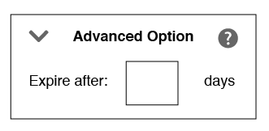

# Create Rules-Based or Onboarded Traits {#create-rules-based-or-onboarded-traits}

Describes set up steps and features specific to the rules-based and onboarded trait creation process.

## Create Rules-Based or Onboarded Traits {#concept_CFCB78FDF44A42BCA69C948A2C8EC3D5}

Describes set up steps and features specific to the rules-based and onboarded trait creation process.

<!-- 
c_tb_rules_traits.xml
-->

## Basic Information for Traits {#concept_D80233EF56764376B0F4C4FF882BAD2E}

In [!UICONTROL Trait Builder], the [!UICONTROL Basic Information] settings let you create new, or edit existing traits. The [!UICONTROL Basic Information] settings are the same for rules-based, onboarded and algorithmic traits. To create a new trait, provide a name (avoid special characters), a data source, and select a storage folder. Other [!UICONTROL Basic Information] fields are optional.

<!-- 
c_tb_basics.xml
-->

**Basic Information Fields Defined** 

<table id="table_42AEC7A5B22346C5BB996D2D36C56229"> 
 <thead> 
  <tr> 
   <th colname="col1" class="entry"> Interface Element </th> 
   <th colname="col2" class="entry"> Explanation </th> 
  </tr> 
 </thead>
 <tbody> 
  <tr> 
   <td colname="col1"> <b> Name</b> </td> 
   <td colname="col2"> 
The trait name. Required. 
 
Maximum length: 255 characters. 
 
 
Note: When naming traits, avoid these special characters: 
      <ul id="ul_AB38A333F21A4AA9B5656CBA69BA65E3"> 
       <li id="li_0E5033B540BC41E799075845388E85A7">Commas </li> 
       <li id="li_B1A6C3E3FB98473A91E4675EE09460F0">Dashes </li> 
       <li id="li_579302FE34B64FE0AE3C751012839229">Hyphens </li> 
       <li id="li_44890F738CC64E449CC2545D701ECBC7">Tabs </li> 
       <li id="li_C203837501A94342923C99A7DAD1ED61">Vertical bar or pipe symbol </li> 
      </ul> 
 
 
This helps reduce processing errors when you set up an <a href="../../c-integration/sending-audience-data/batch-data-transfer-explained/inbound-file-contents.md"> inbound data file transfer</a>. 
 </td> 
  </tr> 
  <tr> 
   <td colname="col1"> <b> Description</b> </td> 
   <td colname="col2"> A few words to help describe the trait's purpose or function. Optional. </td> 
  </tr> 
  <tr> 
   <td colname="col1"> <b> Event Type</b> </td> 
   <td colname="col2"> Assigns the trait to a type or category, usually according to function (e.g. conversion, site visitor, partner, page view, etc.). Optional. </td> 
  </tr> 
  <tr> 
   <td colname="col1"> <b> Data Source</b> </td> 
   <td colname="col2"> Associates the trait with a specific data provider. Required. </td> 
  </tr> 
  <tr> 
   <td colname="col1"> <b> Integration Code</b> </td> 
   <td colname="col2"> A field for an ID, SKU, or other value used by your internal business processes. Optional. </td> 
  </tr> 
  <tr> 
   <td colname="col1"> <b> Comments</b> </td> 
   <td colname="col2"> General notes about a trait. Optional. </td> 
  </tr> 
  <tr> 
   <td colname="col1"> <b> Stored In</b> </td> 
   <td colname="col2"> Determines which storage folder the trait belongs to. Required. </td> 
  </tr> 
  <tr> 
   <td colname="col1"> <b> Data Category</b> </td> 
   <td colname="col2"> Classifies traits according to commonly understood categories. 
Note:  Traits belong to a single category only. Optional. 
 </td> 
  </tr> 
 </tbody> 
</table>

## Set a Trait Expiration Interval {#task_F17639E26C2744A0942461FCCD4D4DC7}

In [!UICONTROL Trait Builder], the [!UICONTROL Advanced Options] lets you set a time-to-live (TTL) interval for a trait. TTL defines how many days a qualified visitor remains in a trait (120 days is default). When set to 0, trait membership never expires. 

<!--
t_tb_ttl.xml
-->

**To set the TTL for a trait** 

1. Expand the [!UICONTROL Advanced Options] section and enter a number to set a TTL value for the trait.
1. Click **[!UICONTROL Save]**.
    

>[!MORE_LIKE_THIS]
>
>* [Segment Time to Live Explained](../../c-features/traits/segment-ttl-explained.md#concept_2F85D4E738754EF387328A9754E125B3)
