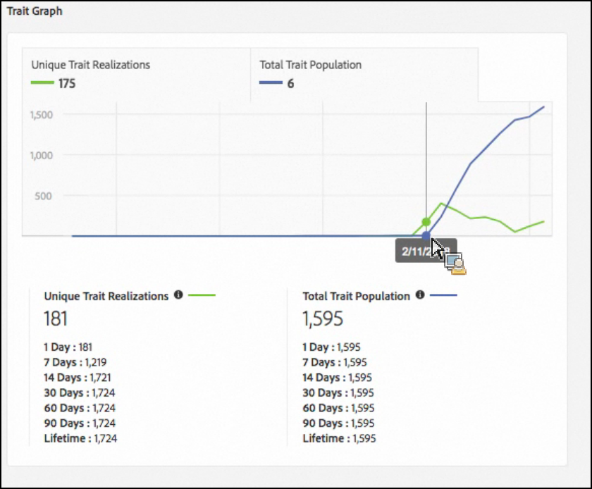

# Trait Qualification Reference {#trait-qualification-reference}

Trait qualification, or trait realization, is treated differently in Audience Manager, depending on trait type. See the table below for detailed information on trait qualification.

<ul class="simplelist"> 
 <li> <a href="../../c-features/traits/trait-qualification-reference.md#section_0659B10780B74120BCB41C01B0CDC7FF"> Trait Qualification by Trait Type </a> </li> 
 <li><a href="../../c-features/traits/trait-qualification-reference.md#section_37003E4C35A8484D8096C9970CB12E56"> Unique Trait Realizations and Total Trait Population</a> </li> 
 <li><a href="../../c-features/traits/trait-qualification-reference.md#section_CA54FECC85114000A1907C1D4535AB2D"> Trait Qualification Limit </a> </li> 
</ul>

## Trait Qualification by Trait Type {#section_0659B10780B74120BCB41C01B0CDC7FF}

<table id="table_14CD705F376B44EEA9A6C011984356F0"> 
 <thead> 
  <tr> 
   <th colname="col1" class="entry"> Trait type </th> 
   <th colname="col2" class="entry"> Qualification criteria </th> 
  </tr> 
 </thead>
 <tbody> 
  <tr> 
   <td colname="col1"> 
Rule-based Traits 
 </td> 
   <td colname="col2"> 
Trait qualification happens in real-time, as users qualify for a trait in their browser. Your users will start qualifying for a rule-based trait approximately 4 hours after you <a href="../../c-features/traits/create-onboarded-rule-based-traits.md#create-rules-based-or-onboarded-traits"> create the trait</a> in the UI. 
 
Rule-based traits allow you to use <a href="../../c-features/c-segments/recency-and-frequency.md#concept_957D9E1977774D28A98ACEE6035E7B37"> recency and frequency</a> controls for ad frequency capping and other use cases. 
 </td> 
  </tr> 
  <tr> 
   <td colname="col1"> 
Onboarded Traits 
 </td> 
   <td colname="col2"> 
Trait qualification happens after an inbound file is processed, i.e. the inbound file is <a href="../../faq/faq-inbound-data-ingestion.md#concept_CA81A40C5DD643F899490355C737CE9C"> imported into Audience Manager</a> and that is when the trait qualification happens. 
 
 For onboarded traits, the maximum number of qualifications for a user profile is 1. 
 </td> 
  </tr> 
  <tr> 
   <td colname="col1"> 
Algorithmic Traits 
 </td> 
   <td colname="col2"> 
For algorithmic traits, the maximum number of qualifications for a user profile is 1. 
 </td> 
  </tr> 
  <tr> 
   <td colname="col1"> 
Folder Traits 
 </td> 
   <td colname="col2"> 
A folder trait sums up the trait qualifications of the traits it contains. 
 
Read <a href="../../c-features/traits/about-folder-traits.md#concept_D68F33E7F99243CEB9D11D354ECB53AD"> Folder Traits: About</a> for more information. 
 </td> 
  </tr> 
  <tr> 
   <td colname="col1"> 
Active Audience Traits and Data Source Synced Traits 
 </td> 
   <td colname="col2"> 
An  Active Audience trait contains all of the devices under management in your  Audience Manager account. 
 
 Data Source Synced Traits track all of the users associated with a data source. 
 
Read more about <a href="../../c-features/traits/client-activity-synced-audience-traits.md#concept_7D3F4AF1FAD440509956632B8A51E64D"> Active Audience Traits and Data Source Synced Traits</a>. 
 </td> 
  </tr> 
 </tbody> 
</table>

## Unique Trait Realizations and Total Trait Population {#section_37003E4C35A8484D8096C9970CB12E56}

The **[!UICONTROL Unique Trait Realizations]** count the number of your visitors that have added the trait to their profile, within different time ranges.

The **[!UICONTROL Total Trait Population]** represents the number of your visitors that have this trait on their profile.

Think of the numbers this way. In the image above, from the [Trait Details](../../c-features/traits/trait-details-page.md#concept_1117822DC9D94E25888A9D41DE01B1D9) view, 181 represents the number of active devices, that visited your properties yesterday. The [!UICONTROL Total Trait Population] of 1,595 represents the amount of users currently qualified for this trait. The [!UICONTROL Total Trait Population] figure is meant to show the total amount of users who could be used for segmentation/targeting. Typically, users will remain part of a trait for 120 days.

Because we run two different computational jobs to calculate the two populations, the [!UICONTROL Total Trait Population] always lags behind the [!UICONTROL Unique Trait Realizations] by 24 hours. In the graph above, you can see 175 [!UICONTROL Unique Trait Realizations] and a [!UICONTROL Total Trait Population] of 6 for February 11. The 175 profiles are added to the [!UICONTROL Total Trait Population] on the following day.

To further drive the point home, if you experienced a spike of 10,000 visitors right now, they would show up in tomorrow's [!UICONTROL Unique Trait Realizations], but would only show up 24 hours later in the [!UICONTROL Total Trait Population].

## Trait Qualification Limit {#section_CA54FECC85114000A1907C1D4535AB2D}

We enforce a limit of 150,000 trait qualifications for each user profile, whether it is an authenticated profile ( [DPUUID](../../reference/ids-in-aam.md#reference_D55EC67D86664B7499F3257BB870FEC8)) or a device ID ( [UUID](../../reference/ids-in-aam.md#reference_D55EC67D86664B7499F3257BB870FEC8)). Note that while the DPUUIDs are unique to a specific instance of [!DNL Audience Manager], UUIDs are shared across the [!DNL Audience Manager] platform. For UUIDs, we impose a fairness policy when storing trait qualifications. An algorithm ensures that an equal share of the UUID profile is made available for every instance of [!DNL Audience Manager].
