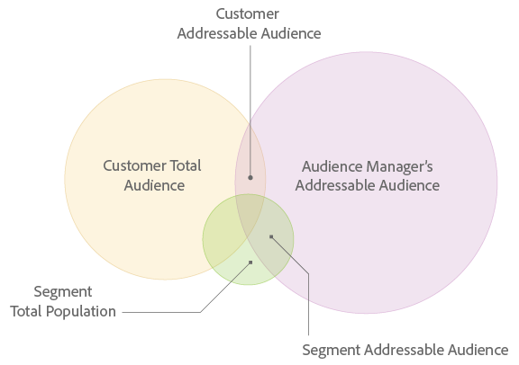

# Addressable Audiences

An overview of the Addressable Audience feature and use cases.

## Addressable Audiences {#concept_8E0BAEF0978F4968B21482E79E601889}

An overview of the 
<wintitle>
  Addressable Audience
</wintitle> feature and use cases.

## What is an Addressable Audience? {#section_A1A391DCEBEE4BB789D456CC68B73E88}

The [!UICONTROL Addressable Audiences] feature shows you the overlap between the audiences you see across all of your properties where [!DNL Audience Manager] collects data and your selected destination. To help you understand this concept, take a look illustration below. The overlap between each circle represents the different types of addressable audiences. 

 

## Addressable Audience Interface {#section_292E9D636EA340A28B5AAD25F9670B3B}

The [!UICONTROL Addressable Audience] feature turns this abstract concept into quantifiable data. In [!DNL Audience Manager], this feature displays audience overlap with data visualizations that provide at-a-glance information along with numeric data in tabular form. 

[!UICONTROL Addressable Audiences] is located in **[!UICONTROL Audience Data > Destinations]**. Click on the name of a server-to-server destination to view your addressable audience data. Note, this feature returns data for server-to-server destinations only and access requires administrator permissions. 

 

Reviewing this data can help you with: 

* **Forecasting and planning:** [!UICONTROL Segment Addressable Audience] data gives you more granularity into the segments you are planning to send to a destination for audience targeting and activation.
* **Performance reviews:** The [!UICONTROL Addressable Audiences] feature is also a troubleshooting tool. It lets you review campaign performance, understand campaign reach, and lets you cross-check with targeting/activation partners if you don't see the results you expect.

**Prospecting with Third-Party Data and Implications for Match Rates** 

Before purchasing third-party data for audience acquisition, customers can validate the overlap with other data providers. This can help you make an informed decision prior to buying new data. The ID syncs for purchased third-party data rely not only on the overlap of your data but also on third-party providers’ footprints with all other [!DNL Audience Manager] customers. Your [!DNL Adobe] consultant can help you identify additional relevant data sources to optimize prospecting campaigns. 

**Mobile Users and Match Rates** 

There are gaps when trying to connect Safari or mobile app users where there are no third-party cookies present. That makes it difficult to sync users with some partners because only those [!DNL Adobe] IDs for synced third-party cookies are provided in the media delivery logs. This is a reason why you might see [low match rates](../c_features/addressable-audiences.md#concept_E89224D00653469A933355160EE667CE) for your destinations. 

## Date Ranges in Addressable Audiences and Destinations {#concept_E7BFFFB2930D4E7091C1EF9C1FDB9FD0}

Describes the available date ranges and how data ages out of each interval in the reports for an 
<wintitle>
  Addressable Audience
</wintitle> or 
<wintitle>
  Destination
</wintitle>. 
<draft-comment otherprops="merge">
  addressable-audience-dates.xml 
</draft-comment>

## Available Date Ranges and Time Zones {#section_854A764AEC374F5D99DC8331CACFCAAF}

Reports for your [!UICONTROL Addressable Audiences] and [Destinations](../c_features/destinations/destinations.md#concept_5BDA346C376C4B719EA394108AB2735A) use the same date range intervals. The date range options include: 

* Last 1 Day (This interval runs from Midnight to Midnight of the previous 24-hour period. It is not a real- or current-time metric.)
* Last 7 Days
* Last 14 Days
* Last 30 Days
* Last 60 Days
* Last 90 Days
* Lifetime

All dates and date ranges are set in the UTC time zone. See [Time Zones in Audience Manager](../reference/aam-time-zones.md#concept_9E98F473CB1A4A81A68C68CA552D9507). 

## Data in Date Range Intervals {#section_E2A4667E701846E896E1003829C2FEDF}

The [!UICONTROL Addressable Audience] and [!UICONTROL Destination] metrics return a count of unique users for the selected time interval. For example, a visitor is only counted once, even if they come to your site multiple times. The first visit is the unique visit and gets recorded. The subsequent visits are returning visits and are not counted because they're not unique. 

Date ranges contain data for the selected time interval or older. And, the data ages out of each report interval as time passes. For example, let's assume you see 2 visitors after choosing the Last 30 Days option. In the reports, these visitors: 

* *Will be* included in the results returned by the longer time intervals (60-days, 90-days, and Lifetime).
* *Will not be* included in the shorter intervals that precede the Last 30 Day option (Current, 7-days, and 14-days).

And, on day 31, these visitors only show up in the 60-day, 90-day, and Lifetime results. They have aged out of the 30-day interval. Visitors do not age out of the Lifetime interval. 

## Addressable Audience Metrics {#reference_562FD922213844429A94518EEFCB93EB}

Lists and defines metrics provided by Addressable Audiences. 
<draft-comment otherprops="merge">
  addressable-audience-metrics.xml 
</draft-comment>

## Customer-Level Metrics {#section_0816B56BF5A14CEF8578674DB33D08F3}

These metrics return data for traits realized when visitors come to your site or when you send inbound data files to [!DNL Audience Manager]. These metric provide a comprehensive view of audience size for your account. 

<table id="table_6DC02E219B074BF782EAA0E9DB9495FB"> 
 <thead> 
  <tr> 
   <th colname="col1" class="entry"> Metric </th> 
   <th colname="col2" class="entry"> Description </th> 
  </tr> 
 </thead>
 <tbody> 
  <tr> 
   <td colname="col1"> 
 <b>Customer Addressable Audience</b> 
 </td> 
   <td colname="col2"> 
A count of overlap of devices that have realized either a rule-based trait or an onboarded trait during the look-back window and devices that we have an ID sync with the chosen destination regardless of the time of syncs. 
 </td> 
  </tr> 
  <tr> 
   <td colname="col1"> 
 <b>Customer Total Audience</b> 
 </td> 
   <td colname="col2"> 
A count of devices that have realized either a rule-based trait on your properties or an onboarded trait from your offline files during the look-back window. 
 </td> 
  </tr> 
  <tr> 
   <td colname="col1"> 
 <b>Customer Match Rate</b> 
 </td> 
   <td colname="col2"> 
Customer Addressable Audience ÷ Customer Total Audience expressed as a %. 
 </td> 
  </tr> 
 </tbody> 
</table>

## Segment-Level Match Metrics {#section_DDA700BBD12141D384E104E673E551D9}

These metrics return data on segment membership. They help provide a more granular and accurate view of the audience size for each of your segments. 

>[!NOTE]
>
>The way the look-back window is applied at the segment level is different from that at the customer level. Visitors can come to the site and realize a trait 10 days ago, and they could qualify for a segment since then and dropped out of the segment 2 days ago. When the 7-day look-back is applied, these visitors will be counted at the segment level but not at the customer level.

<table id="table_4185AA02CC774B6C93B02E45F88BBBD9"> 
 <thead> 
  <tr> 
   <th colname="col1" class="entry"> Metric </th> 
   <th colname="col2" class="entry"> Description </th> 
  </tr> 
 </thead>
 <tbody> 
  <tr> 
   <td colname="col1"> 
 <b>Segment Addressable Audience</b> 
 </td> 
   <td colname="col2"> 
The number of users who have belonged to the segment during the report look-back period and have an active ID sync on your site. 
 
 
Tip: When used with the 1-day look-back period, this metric can help you understand the current state of your segments. This is because the  Segment Addressable Audience metric represents the users who stayed in a segment throughout the previous day. Combine this with the fact that  Audience Manager refreshes  Addressable Audiences daily, combining this metric and lookback period provides the most up-to-date snapshot of your segments. 
 
 </td> 
  </tr> 
  <tr> 
   <td colname="col1"> 
 <b>Total Segment Population</b> 
 </td> 
   <td colname="col2"> 
A count of all the devices that were a member of your segment during the report look-back period. 
 </td> 
  </tr> 
  <tr> 
   <td colname="col1"> 
 <b>Segment Match Rate</b> 
 </td> 
   <td colname="col2"> 
Segment Addressable Audience ÷ Total Segment Population expressed as a %. 
 </td> 
  </tr> 
 </tbody> 
</table>

## Platform-Level Metrics {#section_DC2CD74AE4D645A7BCD8F90398D1A376}

This metric return data on activities collected across all Audience Manager customers. They can provide a broader view of the customer's audience compared with the aggregated Audience Manager customers. 

<table id="table_B6654D9858FF46AF95B1C181D4608D26"> 
 <thead> 
  <tr> 
   <th colname="col1" class="entry"> Metric </th> 
   <th colname="col2" class="entry"> Description </th> 
  </tr> 
 </thead>
 <tbody> 
  <tr> 
   <td colname="col1"> 
 <b>Audience Manager's Addressable Audience</b> 
 </td> 
   <td colname="col2"> 
A count of all devices that have interacted with all Audience Manager customers at the platform-level during the report look-back period and that could be matched with your chosen destination. 
 
This metric is useful because it shows you: 
 
 
     <ul id="ul_67A82A40C7A64457822272B45D2817FC"> 
      <li id="li_DAEFB565CE774F68AA29274A021F1E5A"> The size of the total addressable audience that  Audience Manager can reach. </li> 
      <li id="li_AF26F88068CA44F7B5C4C42DE5E21055">How big the  Audience Manager profile pool is for a targeting platform and the size of their audiences. </li> 
     </ul> 
 </td> 
  </tr> 
 </tbody> 
</table>

## Avoid Customer and Segment Addressable Audience Comparisons {#section_A7178ED5709646C1BBC0A19114E8B1E7}

You shouldn't compare the [!UICONTROL Customer Addressable Audience] and [!UICONTROL Segment Addressable Audience] metrics to determine if one is more significant than the other. These are separate, different, and independent metrics. As described in the definitions above, each of these is derived from different data sets. Given this, you should avoid deriving any conclusions if one metric is larger than the other. All you can say when comparing these is that: 

* [!UICONTROL Customer Addressable Audiences] is based on trait realizations for your own, first-party data. This metric provides a broad, comprehensive view of your integration with a data partner.
* [!UICONTROL Segment Addressable Audiences] is based on segment qualifications for your own first-party data and third-party data. This metric provides a granular, more accurate view of your addressable audiences in a targeting platform.

## Causes of Low Match Rates for Addressable Audiences {#concept_E89224D00653469A933355160EE667CE}

Common elements responsible for low Addressable Audience match rates or discrepancies in reported numbers. 
<draft-comment otherprops="merge">
  addressable-audiences.xml 
</draft-comment>

<table id="table_895D536F69134330A4F13887ECAFD4F5"> 
 <thead> 
  <tr> 
   <th colname="col1" class="entry"> Cause </th> 
   <th colname="col2" class="entry"> Description </th> 
  </tr> 
 </thead>
 <tbody> 
  <tr> 
   <td colname="col1"> 
 <b>Mobile Traffic</b> 
 </td> 
   <td colname="col2"> 
Most server-to-server integrations rely on synchronization processes facilitated by third-party cookies. However, mobile environments do not use third-party cookies. As a result, your Addressable Audience numbers may seem low compared to segment size. 
 
As of January 2018, you can activate mobile audiences in the same Google and Adobe Advertising Cloud destinations set up for cookie-based audiences. While this means that you can send segments with combined cookie and mobile ID membership to your Google and Advertising Cloud destinations, keep in mind that Addressable Audiences only display the overlap between cookie IDs and destinations. Audience Manager sends 100% of mobile audiences to destinations, but mobile audiences are not measured by the Addressable Audience metric. 
 
 
Note:  For example, take a segment with a population of 1,000,000. If you map this segment to a Google or Adobe Advertising Cloud destination, you might see an Addressable Audience of 700,000 devices and a Match Rate of 70%. The membership of 700,000 consists of cookie IDs which have an ID sync with the destination. Your Addressable Audience might, in fact, be much higher, because addressable mobile IDs do not appear in this metric. 
 
 </td> 
  </tr> 
  <tr> 
   <td colname="col1"> 
 <b>Safari Traffic</b> 
 </td> 
   <td colname="col2"> 
Safari blocks third-party cookies. This prevents Audience Manager from synchronizing with the destination. 
 </td> 
  </tr> 
  <tr> 
   <td colname="col1"> 
 <b>Tracked Media Impressions</b> 
 </td> 
   <td colname="col2"> 
Due to ad server best practices, ID syncs are not made within ad tags. Customers who do a large amount of offsite advertising will not synchronize users to third-party integrations in those environments. Also, a large amount of collected media impression data could reduce addressable audience numbers. 
 </td> 
  </tr> 
 </tbody> 
</table>

## Troubleshooting with Addressable Audiences {#concept_22DACEC796894D04B94D6BF047F94EB4}

In addition to surfacing match rates, you can also use Addressable Audiences as a troubleshooting tool. 
<draft-comment otherprops="merge">
  addressable-audiences-troubleshooting.xml 
</draft-comment>

For example, let's say you send a segment to a destination and that destination shows low reporting numbers. Checking the Addressable Audience results will show you if this is a technical problem or just a case of low match rates. A low match rate shows your destination isn't all that great for your selected segments. However, a difference in the total addressable audience numbers between Audience Manager and the destination indicates an integration, synchronization, or other technical problem. In these cases, contact your account manager. 
