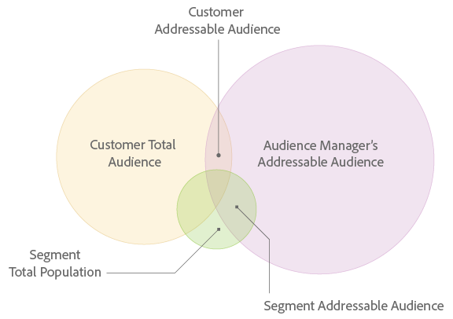

# Addressable Audiences

Contents: 

<ul class="simplelist"> 
 <li> <a href="../../c_features/addressable-audiences/addressable-audiences.md#section_A1A391DCEBEE4BB789D456CC68B73E88" format="dita" scope="local"> What is an Addressable Audience? </a> </li> 
 <li> <a href="../../c_features/addressable-audiences/addressable-audiences.md#section_292E9D636EA340A28B5AAD25F9670B3B" format="dita" scope="local"> Addressable Audience Interface </a> </li> 
 <li> <a href="../../c_features/addressable-audiences/addressable-audiences.md#section_AB7AFD357E1C49AE822A6056A115DF32" format="dita" scope="local"> Other Addressable Audience Topics </a> </li> 
</ul>

## What is an Addressable Audience? {#section_A1A391DCEBEE4BB789D456CC68B73E88}

The Addressable Audiences feature shows you the overlap between the audiences you see across all of your properties where Audience Manager collects data and your selected destination. To help you understand this concept, take a look illustration below. The overlap between each circle represents the different types of addressable audiences. 

 

## Addressable Audience Interface {#section_292E9D636EA340A28B5AAD25F9670B3B}

The [!UICONTROL  Addressable Audience] feature turns this abstract concept into quantifiable data. In [!DNL  Audience Manager], this feature displays audience overlap with data visualizations that provide at-a-glance information along with numeric data in tabular form. 

[!UICONTROL  Addressable Audiences] is located in **[!UICONTROL  Audience Data > Destinations]**. Click on the name of a server-to-server destination to view your addressable audience data. Note, this feature returns data for server-to-server destinations only and access requires administrator permissions. 

 

Reviewing this data can help you with: 

* **Forecasting and planning:** [!UICONTROL  Segment Addressable Audience] data gives you more granularity into the segments you are planning to send to a destination for audience targeting and activation.
* **Performance reviews:** The [!UICONTROL  Addressable Audiences] feature is also a troubleshooting tool. It lets you review campaign performance, understand campaign reach, and lets you cross-check with targeting/activation partners if you don't see the results you expect.
**Prospecting with Third-Party Data and Implications for Match Rates** 

Before purchasing third-party data for audience acquisition, customers can validate the overlap with other data providers. This can help you make an informed decision prior to buying new data. The ID syncs for purchased third-party data rely not only on the overlap of your data but also on third-party providers’ footprints with all other [!DNL  Audience Manager] customers. Your [!DNL  Adobe] consultant can help you identify additional relevant data sources to optimize prospecting campaigns. 

**Mobile Users and Match Rates** 

There are gaps when trying to connect Safari or mobile app users where there are no third-party cookies present. That makes it difficult to sync users with some partners because only those [!DNL  Adobe] IDs for synced third-party cookies are provided in the media delivery logs. This is a reason why you might see [ low match rates ](../../c_features/addressable-audiences/addressable-audiences-match-rates.md#concept_E89224D00653469A933355160EE667CE) for your destinations. 

## Other Addressable Audience Topics {#section_AB7AFD357E1C49AE822A6056A115DF32}

