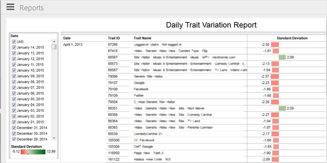

# Daily Trait Variation Report

Standard deviation measures the amount of variation or dispersion from the mean (or average/expected value). A low standard deviation indicates that the data points tend to be very close to the mean. A high standard deviation indicates that the data points are spread out over a large range of values. 

 

Use the [!UICONTROL  Date] list to select one or more dates for your report. A color-coded bar chart displays at the bottom of the list that provides a visual representative of the range of standard deviation for all traits across all selected dates. The black vertical line indicates the mean. 

The middle column contains a list of traits, identified by [!UICONTROL  Trait ID] and [!UICONTROL  Trait Name]. Click any trait to access a pop-up dialog box that lets you select from the following options: 

* **Keep Only: **Removes all other traits from the report and displays data for this trait only. 

* **Exclude: **Removes this trait from the report and displays data for all other traits. You can exclude multiple traits. 

* **View Data: **Lets you display data for that row. You can also download all rows as a text file. 

The [!UICONTROL  Standard Deviation] column displays color-coded bar charts that display the standard deviation for each trait over the selected interval. Red bars indicate traits with a negative standard deviation (data points tend to be below the mean). Green bars indicate traits with a positive standard deviation (data points tend to be above the mean). Mouse over any bar to display a pop-up dialog box with more information and options to keep or exclude that trait and view more information. 

Icons display at the bottom of the report that let you export data in various formats, revert any changes you might have made to the report (such as excluding traits), enable or disable automatic updates, and refresh the report's data. See [ Report Icons and Tools Explained ](../../../c_features/c_analytics/c_dynamic_reports/r_icons.md#reference_8D90E6C1F0AE46D4AC0911707395BED6). 
