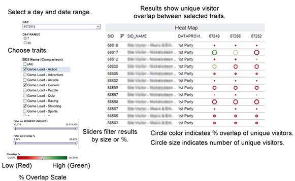

# Trait-to-Trait Overlap Report

**Overview** 

The [!UICONTROL  Trait-to-Trait Overlap] report returns data on the % of unique users shared between all your own traits and your third-party traits. As an optimization tool, this report helps you: 

* Create segments with high or low overlap, depending on your needs. Traits with high overlap give you a targeted audience, but fewer unique visitors. Traits with low overlap can be useful to reach a larger, unique visitor set.
* Validate third-party trait data: Strong overlap between similar first and third-party traits suggests that the trait from your data partner is accurate and trustworthy. Conversely, low overlap can indicate that a third-party trait may not actually contain the same information as your own, similar first-party trait.
* Find unexpected overlap between traits and use that information to build innovative segments.
**Sample Report** 

The following illustration provides a high-level overview of elements in the [!UICONTROL  Trait-to-Trait Overlap] report. 
>[!NOTE]
>
>The [!UICONTROL  Trait-to-Trait Overlap] report returns an empty field when it compares the same trait to itself. 

 

**Drill Down on Individual Data Points** 

Select an individual point to view data details in a pop up window. Your click actions automatically update data displayed in the report. 
>[!MORE_LIKE_THIS]
>
>* [ Filter Report Results With the Data Sliders ](c_reach_slider.md#concept_00E60A0BDB274B07A1DD342EE5554C37)
>* [ Shapes, Colors, and Sizes Used in Dynamic Reports ](r_legend.md#reference_25F1411379B34946B5AB8156A0F87626)
>* [ Report Icons and Tools Explained ](r_icons.md#reference_8D90E6C1F0AE46D4AC0911707395BED6)
>* [ Overlap Reports: Update Schedule and Minimum Segment Size ](overlap-minimum-segment-size.md#concept_6C439B845E684C40A726C546F9AF0AFD)
>* [ Data Sampling and Error Rates in Selected Audience Manager Reports... ](report-sampling.md#concept_624BB1069F8A4CBD948ABD87105329E4)
>* [ CSV Files for Overlap Reports ](overlap-csv-files.md#concept_440C76BFFAC74669972CE538F8B5040F)
