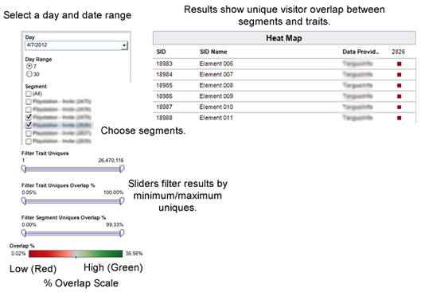

# Segment-to-Trait Overlap Report

**Overview** 

As an optimization tool, the Segment to Trait Overlap reports helps you build highly focused segments or expand segment reach. For example, you can create focused segments and traits with high overlap to reach a particular audience. However, a lot of overlap may mean fewer unique users (less reach). Running this report to help expand reach by removing traits with a lot of segment overlap and replacing them with traits that have less overlap. 

**Sample Report** 

The following illustration provides a high-level overview of the [!UICONTROL  Segment-to-Trait Overlap] report. 

 

**Drill Down on Individual Data Points** 

Select an individual point to view data details in a pop up window. Your click actions automatically update data displayed in the report. 
>[!MORE_LIKE_THIS]
>
>* [ Filter Report Results With the Data Sliders ](c_reach_slider.md#concept_00E60A0BDB274B07A1DD342EE5554C37)
>* [ Shapes, Colors, and Sizes Used in Interactive Reports ](r_legend.md#reference_25F1411379B34946B5AB8156A0F87626)
>* [ Report Icons and Tools Explained ](r_icons.md#reference_8D90E6C1F0AE46D4AC0911707395BED6)
>* [ Overlap Reports: Update Schedule and Minimum Segment Size ](overlap-minimum-segment-size.md#concept_6C439B845E684C40A726C546F9AF0AFD)
>* [ Data Sampling and Error Rates in Selected Audience Manager Reports... ](report-sampling.md#concept_624BB1069F8A4CBD948ABD87105329E4)
>* [ CSV Files for Overlap Reports ](overlap-csv-files.md#concept_440C76BFFAC74669972CE538F8B5040F)
