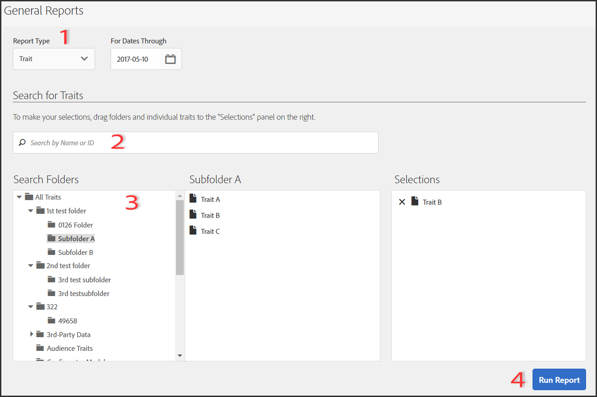

# General Reports

[!DNL  Audience Manager] uses Role Based Access Control (RBAC) to extend user-group permissions to the [!UICONTROL  General] reports. Users can see only those traits and segments in reporting that they have permissions to view. RBAC functionality lets you control what reporting data internal teams are able to view. For example, an agency that manages different advertiser accounts can configure user-group permissions so that a team that manages Advertiser A's account cannot see Advertiser B's reporting data. 

Run a [!UICONTROL  General] report when you need to: 
* Review performance by trait, segment, or destination.
* Track impressions (total and unique) at 1, 7, 14, 30, 60, 90-day and lifetime intervals.
* Review total and unique load counts.
* Compare trait and segment performance.
* Identify strong or poor performance traits and segments, analyze demand, or compare load/fire data with third-party reports.
* Export data (.csv format) for further analysis and sharing.

The following illustration provides a high-level overview of key elements in the [!UICONTROL  General] report. 

 

1. Configure the following options: 

   **Report Type:** Select the desired report type (Trait, Segment, or Destination). 

   **For Dates Through:** Specify the date range for the report. 

1. Search for a trait, segment, or destination by name or ID.
1. From the folder list, drag and drop the traits, segments, or destinations you want to report to the [!UICONTROL  Selections] panel on the right side.
1. Generate the report to display in an exportable table.

## General Reports Results Explained {#section_7169BE04E8FB47C9BE9C6651C45D4C8B}

The numbers in the [!UICONTROL  General Reports] are generated directly from our User Profile Store. The results reflect the number of users that [!DNL  Audience Manager] contained in the backend at the time these reporting numbers were generated. 

* These numbers do not include visitor IDs with excessive traffic. Traffic from bots is filtered prior to reaching our backend system. Also, some bot traffic is discarded during a weekly cleanup job run in the backend. 

* If you onboard data via inbound processing keyed off the [!DNL  Audience Manager] UUID, and these IDs include users that are no longer active in our system, these inactive [!DNL  Audience Manager] UUIDs never reach the User Profile Store and are not reported. 

* Total Trait Realizations are calculated for Rule-based Traits only. 

