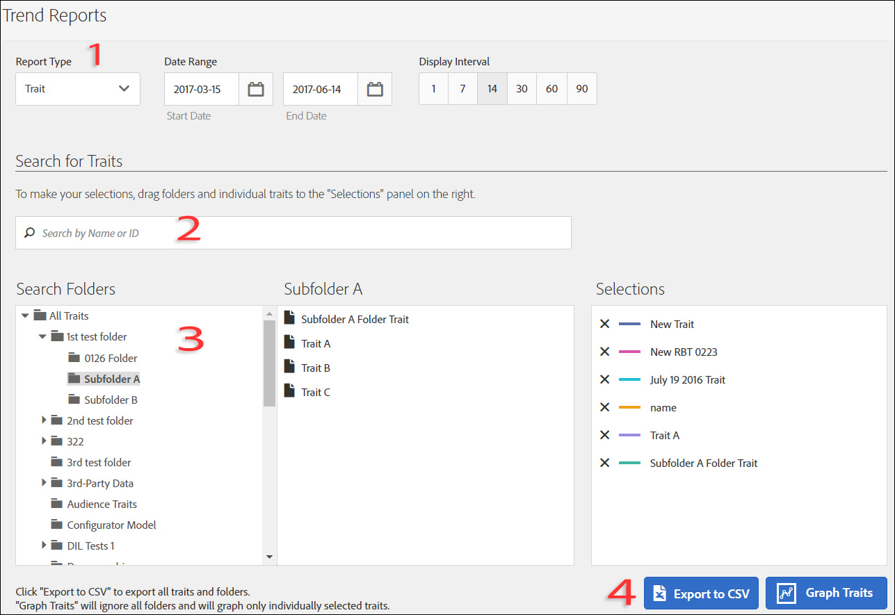

# Trend Reports

[!DNL  Audience Manager] uses Role Based Access Control (RBAC) to extend user-group permissions to the [!UICONTROL  Trend] reports. Users can see only those traits and segments in reporting that they have permissions to view. RBAC functionality lets you control what reporting data internal teams are able to view. For example, an agency that manages different advertiser accounts can configure user-group permissions so that a team that manages Advertiser A's account cannot see Advertiser B's reporting data. 

Run a [!UICONTROL  Trend] report when you need to: 
* Review trend data by traits and segments.
* Track trends by 1, 7, 14, 30, 60, and 90-day intervals.
* Compare trait and segment trends over time.
* Identify strong or poor performance traits and segments.
* Export data (.csv format) for further analysis and sharing.

The following illustration provides a high-level overview of key elements in the [!UICONTROL  Trend] report. 

 

1. Configure the following options: 

   **Report Type:** Select the desired report type (Trait or Segment). 

   **Date Range:** Specify the date range for the report (start date and end date). 

   **Display Interval: **Specify the display interval (1, 7, 14, 30, 60, and 90-day intervals). 

1. Search for a trait or segment by name or ID.
1. From the folder list, drag and drop the traits or segments you want to report to the [!UICONTROL  Selections] panel on the right side.
1. Generate the report to display in data in graphical format or export the report to CSV format.

