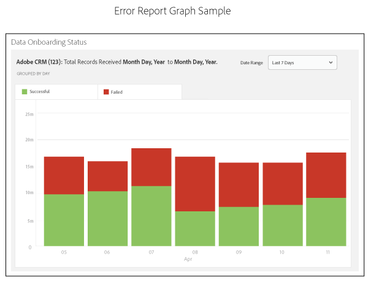

# Onboarding Status Report: About

Contents: 

<ul class="simplelist"> 
 <li> <a href="../../../c_features/c_analytics/onboarding-status-report/onboarding-status-report.md#section_9DCD3EA6E38E4206A81196512C632627" format="dita" scope="local"> Error Reporting and Error Sampling </a> </li> 
 <li> <a href="../../../c_features/c_analytics/onboarding-status-report/onboarding-status-report.md#section_73F30DCBD44E43D8999E13A407A7D64E" format="dita" scope="local"> Error Report Bar Chart </a> </li> 
 <li> <a href="../../../c_features/c_analytics/onboarding-status-report/onboarding-status-report.md#section_BA5FE52E2D664CD8826234EF0A7BBDF5" format="dita" scope="local"> Error Report Tables </a> </li> 
 <li> <a href="../../../c_features/c_analytics/onboarding-status-report/onboarding-status-report.md#section_996F57B843054F19A2EA928D7873FD51" format="dita" scope="local"> 14-Day Error Sampling Report </a> </li> 
 <li> <a href="../../../c_features/c_analytics/onboarding-status-report/onboarding-status-report.md#section_5C4F7330AD494F1D823ADC9D25788AA3" format="dita" scope="local"> Receive E-mail Notifications </a> </li> 
 <li> <a href="../../../c_features/c_analytics/onboarding-status-report/onboarding-status-report.md#section_4F2946917C304741911796280AA4BF80" format="dita" scope="local"> Related Content </a> </li> 
</ul>

## Error Reporting and Error Sampling {#section_9DCD3EA6E38E4206A81196512C632627}

Error reporting and error sampling are 2 separate features of the [!UICONTROL  Onboarding Status] report. 

<table id="table_4706D891D4C545E8BF9D8A0CC052CC48"> 
 <thead> 
  <tr> 
   <th colname="col1" class="entry"> Feature </th> 
   <th colname="col2" class="entry"> Description </th> 
  </tr> 
 </thead>
 <tbody> 
  <tr> 
   <td colname="col1"> 
 <b>Error Reporting</b> 
 </td> 
   <td colname="col2"> 
Error reporting shows you the success and failure rates for the number of records processed in an inbound data source. It returns data in an interactive, stacked bar graph and as summary metrics in tables below the graph. 
 
Error reporting is automatic. It runs continuously for all of your inbound data sources. It returns data based on range of preset time intervals or a customized time interval that you set with a calendar widget. 
 </td> 
  </tr> 
  <tr> 
   <td colname="col1"> 
 <b>Error Sampling</b> 
 </td> 
   <td colname="col2"> 
Error sampling parses the contents of your data files and returns the 10 most common errors for each error type. The errors in your inbound data files prevent individual records from being processed. Use this report as a troubleshooting tool to help reduce the number of file errors and improve processing rates. 
 
You must activate error sampling manually. It runs for 14-days from the day of activation and then turns itself off. You can turn error sampling back on after the 14-day interval expires. You activate error sampling when you <a href="../../../c_features/c_datasources/create-datasource.md#concept_3B7696B3EC77416492D3B99EBD79EA44" format="dita" scope="local"> create an inbound data source </a> or by checking the  Error Sampling  check box from the  Data Source Settings  section of an existing inbound data source. 
 
Error sampling is a computationally demanding process. As a result, it only returns first 10 errors for each error category. It is not designed to return every error contained in an inbound data source. These errors are a representative sample of a potentially larger group of similar errors. Review your entire file for the types of errors this report flags, reformat the file, and send it in again. 
 
See <a href="../../../c_integration/c_onboarding_data/c_async/c_inbound_async_intro/inbound-file-contents.md#concept_49E6F0740E794B07ACD115D10EDEB5AC" format="dita" scope="local"> Inbound Data File Contents: Syntax, Variables, and Examples </a> for more information about how to properly format an data file for an inbound data source. 
 </td> 
  </tr> 
 </tbody> 
</table>

## Error Report Bar Chart {#section_73F30DCBD44E43D8999E13A407A7D64E}

The error report graphs the success and failure rates for record processing in a stacked bar graph as shown in the following example. The graph is interactive. Clicking on a bar shows summary metrics for that day in a table below the graph. 

 

## Error Report Tables {#section_BA5FE52E2D664CD8826234EF0A7BBDF5}

The error report displays tabular data below the bar graph. The table shows success and failure rates along with totals and percentages. 

**Successful and Failed Records** 

This default view shows you a frequency count of the total records in your report and includes a breakdown of the errors by error type. 

 

**Totals &amp;amp; Percentages** 

Click **[!UICONTROL  Totals &amp; Percentages]** to see what % of your files were processed successfully. 

 

## 14-Day Error Sampling Report {#section_996F57B843054F19A2EA928D7873FD51}

With error sampling active, the report will show you the top 10 errors for each error type. Click on an error type button at the top of the report to see each set of sampled data. 

>[!NOTE]
>
>The report does not highlight record errors with this current release. To find and fix file errors, you should review the results and compare those to the specifications in the[ Inbound Data File Contents ](../../../c_integration/c_onboarding_data/c_async/c_inbound_async_intro/inbound-file-contents.md#concept_49E6F0740E794B07ACD115D10EDEB5AC) documentation. 

 

## Receive E-mail Notifications {#section_5C4F7330AD494F1D823ADC9D25788AA3}

You can add the e-mail addresses of recipients that you want to be notified of the uploaded inbound files' status. Note that you can select different recipients for different data sources. 

 

## Related Content {#section_4F2946917C304741911796280AA4BF80}

