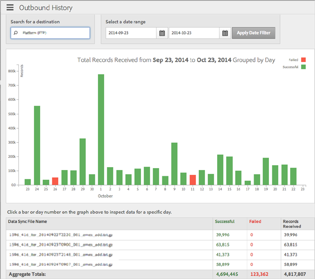

# Outbound History Report

>1. Click **[!UICONTROL  Analytics]** > **[!UICONTROL  Outbound History]**.

>        
>1. In the **[!UICONTROL  Search for a Destination]** box, start typing and select the desired destination.
>1. In the **[!UICONTROL  Select a Date Range]** box, specify the start and end dates for your report, then click **[!UICONTROL  Apply Date Filter]**.

>        

>       The following table contains information corresponding to columns in the report: 

>    <table id="table_93076D46AC50411395E72B9B987E99BE"> 
 <thead> 
  <tr> 
   <th colname="col1" class="entry"> Line </th> 
   <th colname="col2" class="entry"> Description </th> 
  </tr> 
 </thead>
 <tbody> 
  <tr> 
   <td colname="col1"> Data Sync File Name </td> 
   <td colname="col2"> 
List of all outbound files that Adobe generated for this destination that were processed together. 
 </td> 
  </tr> 
  <tr> 
   <td colname="col1"> Successful </td> 
   <td colname="col2"> 
Number of records that were successfully sent from  Audience Manager to the destination. 
 </td> 
  </tr> 
  <tr> 
   <td colname="col1"> Failed </td> 
   <td colname="col2"> 
Number of records that could not be sent to the destination. 
 </td> 
  </tr> 
  <tr> 
   <td colname="col1"> Records Received </td> 
   <td colname="col2"> 
Total number of records Adobe generated in the files and attempted to send to the destination. In most cases, this should be the total number of successful files and failed files. 
 </td> 
  </tr> 
 </tbody> 
</table>

