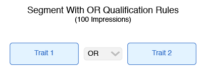
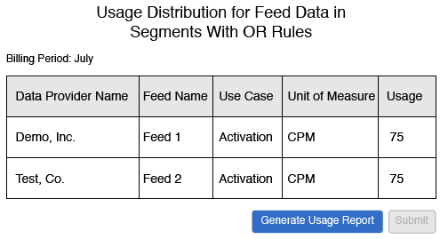
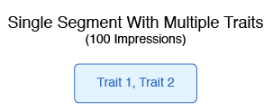
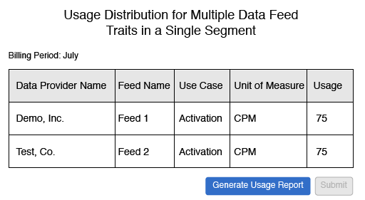

# Billing and Impression Allocation for CPM Data Feeds

Contents: 

<ul class="simplelist"> 
 <li> <a href="../../../c_features/c_audience_marketplace/c_marketplace_buyer/marketplace_cpm_billing.md#section_E49C2B4663DB4016B594DB596B66E4E1" format="dita" scope="local"> Billing Summary </a> </li> 
 <li> <a href="../../../c_features/c_audience_marketplace/c_marketplace_buyer/marketplace_cpm_billing.md#section_F457C3B07044474CAE3DCEB339D8E120" format="dita" scope="local"> Assign Impressions Based on Trait Qualification Rules or Type </a> </li> 
 <li> <a href="../../../c_features/c_audience_marketplace/c_marketplace_buyer/marketplace_cpm_billing.md#section_61B684C354944A5CA3BE1A01007B9577" format="dita" scope="local"> Billing Examples </a> </li> 
</ul>

## Billing Summary {#section_E49C2B4663DB4016B594DB596B66E4E1}

For a CPM data feed, you must submit impression amounts by the 5 day of each calendar month. To do this properly, you must: 

* Compile all advertising impressions delivered for each feed in the previous calendar month.
* Report CPM usage in **[!UICONTROL  Audience Marketplace > Payables]**. See [ How to Report CPM Usage ](../../../c_features/c_audience_marketplace/c_marketplace_buyer/t_marketplace_report_cpm_usage.md#task_22D86C3A39544CA8A4BC2360DC115877) for instructions.
After you report CPM number for the previous calendar month, [!DNL  Adobe] will do the following: 

* Create an invoice and bill you based on the CPM rate for each subscribed data feed.
* Pay data providers (sellers) fees owed based on your reported CPM use.

>[!IMPORTANT]
>
>As a buyer, all reported impression totals must be true and accurate. If you fail to report impression totals by the 5 day of each month, you must include totals for the unreported month in the following month. 

## Assign Impressions Based on Trait Qualification Rules or Type {#section_F457C3B07044474CAE3DCEB339D8E120}

The Activation use case lets you use traits in the corresponding Data Feed to create segments in [ Segment Builder ](../../../c_features/c_segments/c_segment_builder/c_segment_builder.md#concept_FABA1F399CFD4E83B874043638D0FA54) and map those segments to a destination. The Boolean operators AND, OR, and NOT let you set the conditions for trait and segment qualification. For billing purposes, you must allocate impression proportionally for segments that use data feed traits. Proportional distribution depends on the Boolean operators you use to create qualification rules. The following table lists how to properly allocate impressions by Boolean rule or trait type. 

<table id="table_BF00FE6740D2459DAFA62F2478492586"> 
 <thead> 
  <tr> 
   <th colname="col1" class="entry"> Rule Qualification Logic or Type </th> 
   <th colname="col2" class="entry"> Billing Distribution </th> 
  </tr> 
 </thead>
 <tbody> 
  <tr> 
   <td colname="col1"> 
AND 
 </td> 
   <td colname="col2"> 
Apply 100% of the delivered impression totals to all the provider feeds in a rules-based segment that uses a Boolean AND condition. 
 </td> 
  </tr> 
  <tr> 
   <td colname="col1"> 
OR 
 </td> 
   <td colname="col2"> 
Apply 75% of the delivered impression totals to all of the providers feeds in a rules-based segment that uses a Boolean OR condition. 
 
 
Note:   Audience Marketplace  reports impressions at the  Data Feed  level, not the trait level. Segments built from traits with a Boolean OR from multiple traits from different feeds, allocate 75% of impressions to each feed in the segment, not each Trait. See the <a href="../../../c_features/c_audience_marketplace/c_marketplace_buyer/marketplace_cpm_billing.md#section_61B684C354944A5CA3BE1A01007B9577" format="dita" scope="local"> billing examples </a> below. 
 
 </td> 
  </tr> 
  <tr> 
   <td colname="col1"> 
NOT 
 </td> 
   <td colname="col2"> 
Apply 100% of the delivered impression totals to all the provider feeds in a rules-based segment that uses a Boolean NOT condition. 
 </td> 
  </tr> 
  <tr> 
   <td colname="col1"> 
Algorithmic segments 
 </td> 
   <td colname="col2"> 
Apply 100% of the delivered impression totals to all the provider feeds in an algorithmic segment. 
 </td> 
  </tr> 
 </tbody> 
</table>

## Billing Examples {#section_61B684C354944A5CA3BE1A01007B9577}

These example can help you understand how to allocate impressions when you create segments from traits in a data feed. For simplicity, each example assumes 100 impressions for a one month billing period. 

**Case 1: Segments With AND Qualification Rules** 

This segment contains 2 traits from separate data providers. Because segment qualification is based on an AND condition, visitors have to realize the traits from both feeds to qualify for the segment. 

 

With an AND condition, you must assign 100% of the impressions received during the month to both data providers. In the [!UICONTROL  Audience Marketplace] [!UICONTROL  Payables] section, you credit each provider with 100 impressions. 

 

This example applies to segments that use Boolean NOT operators or for segments that contain algorithmic traits. 

**Case 2: Segments With OR Qualification Rules** 

This segment contains 2 traits from separate data providers. Because segment qualification is based on an OR condition, visitors have to realize either Trait 1 or Trait 2 to qualify for the segment. 

 

We cannot tell which trait is responsible for an impression because qualification is based on an OR condition. As a result, in the [!UICONTROL  Audience Marketplace] [!UICONTROL  Payables] section you credit each provider with 75% of the total impressions. 

 

**Case 3: Single Segment With Multiple Traits** 

In this example, we have a single segment that contains 2 traits from separate data providers. Segment qualification in this case is based on an implied Boolean OR condition. The OR is not set explicitly by a menu option selection when you create the segment. Because segment qualification is an implied OR condition, visitors have to realize either Trait 1 or Trait 2 to qualify for the segment. 

 

The bill result in this case is identical to example 2 above. We cannot tell which trait is responsible for an impression because qualification is based on an implied OR condition. As a result, in the [!UICONTROL  Audience Marketplace] [!UICONTROL  Payables] section you credit each provider with 75% of the total impressions. 

 
>[!MORE_LIKE_THIS]
>
>* [ Billing and Impression Allocation for Flat Fee Data Feeds ](marketplace_flat_billing.md#concept_FE781C4C5C044C1F986F1AB6BA4E328F)
